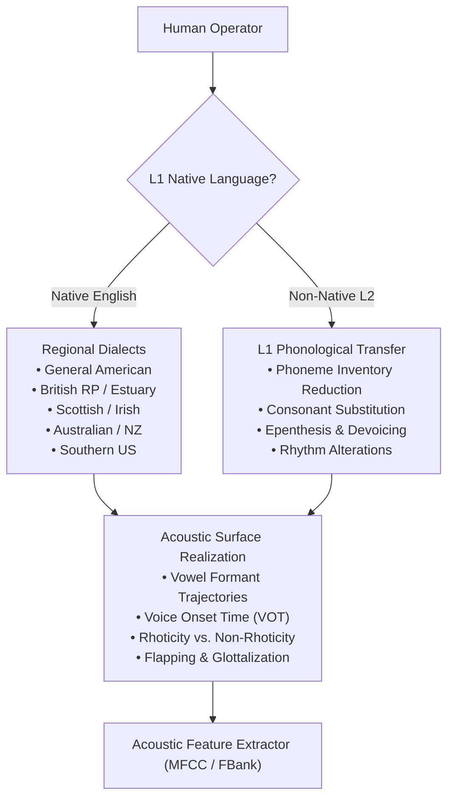
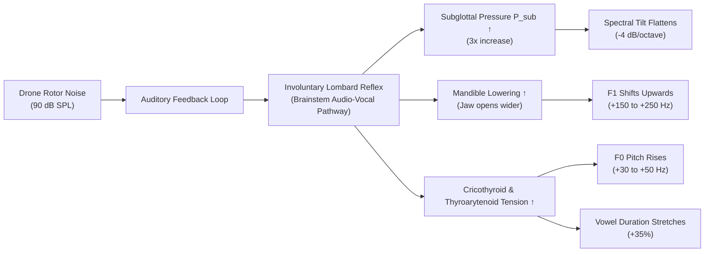

# Inter-Speaker Variability, Accents, Dialects, and Prosody in Wake-Word Spotting

---

## 1. Executive Summary

A primary failure mode of embedded wake-word and keyword spotting (KWS) models is acoustic mismatch between training data and real-world operators. In field operations, human operators are not standardized acoustic generators: they vary across gender, age, anatomy, native language (L1 transfer), regional dialects, speaking rate, emotional stress, and involuntary bioacoustic adaptations to background noise (the Lombard effect).

This document provides a comprehensive, mathematically rigorous analysis of every biological, sociolinguistic, and psychological factor influencing speech realization, and explains how these factors affect feature extraction and pattern recognition in compact wake-word engines.

---

## 2. Anatomical & Physiological Speaker Variability

### 2.1 Vocal Tract Length Scaling Laws & Formant Shifts
The length of the human vocal tract ($L_{\text{tract}}$) is anatomically determined by craniomandibular dimensions and cervical spine height:
- **Adult Male**: Mean $L_{\text{tract}} \approx 17.5\text{ cm}$ (range: $16.0\text{ - }19.5\text{ cm}$).
- **Adult Female**: Mean $L_{\text{tract}} \approx 14.5\text{ cm}$ (range: $13.5\text{ - }16.0\text{ cm}$, $\sim 17\%$ shorter).
- **Children (age 6-12)**: Mean $L_{\text{tract}} \approx 10.0\text{ - }12.5\text{ cm}$ ($\sim 30\text{-}45\%$ shorter).

From acoustic waveguide theory, the formant frequencies $F_n$ of a tube are inversely proportional to its length:

$$F_n \propto \frac{1}{L_{\text{tract}}}$$

Therefore, for an identical phonetic vowel, formant frequencies scale systematically by a warping factor $\alpha$:

$$\alpha = \frac{L_{\text{tract, ref}}}{L_{\text{tract, speaker}}}$$

$$\tilde{F}_n = \alpha F_n$$

For adult females relative to adult males, $\alpha \approx 1.15\text{ - }1.20$ ($15\text{-}20\%$ higher formants). For children, $\alpha \approx 1.40\text{ - }1.60$ ($40\text{-}60\%$ higher formants).

```
Vocal Tract Length vs. Formant Frequency Scale:
Tract Length L (cm)   Scale Factor alpha    Average F1 (/i/)    Average F2 (/i/)
Male:   17.5 cm       1.00                  270 Hz              2290 Hz
Female: 14.5 cm       1.21 (+21%)           310 Hz              2790 Hz
Child:  11.0 cm       1.59 (+59%)           430 Hz              3400 Hz
```

#### Impact on Fixed Mel Filterbanks:
If a wake-word engine uses fixed triangular filterbanks, a female or child saying the command "land" (/lænd/) will project energy into Mel bins 2 to 4 channels higher than an adult male. In unnormalized templates or non-invariant classifiers, this produces severe Euclidean or DTW distance penalties, causing false rejections.

#### Mathematical Mitigation: Vocal Tract Length Normalization (VTLN)
VTLN applies a piecewise linear or bilinear frequency warping function to the frequency axis before Mel filterbank integration:

$$f' = \begin{cases}
\alpha f & f \le f_{\text{split}} \\
\frac{f_{\text{Nyq}} - \alpha f_{\text{split}}}{f_{\text{Nyq}} - f_{\text{split}}} (f - f_{\text{split}}) + \alpha f_{\text{split}} & f > f_{\text{split}}
\end{cases}$$

Where $\alpha \in [0.85, 1.25]$ is the speaker-specific warping factor, estimated via maximum likelihood or grid search over the utterance.

---

### 2.2 Glottal Excitation Diversity & Micro-Perturbations
Even within speakers of identical vocal tract length, glottal dynamics differ across multiple physical dimensions:

#### 1. Fundamental Frequency ($F_0$) Distribution
- Male distribution: Gaussian with $\mu \approx 120\text{ Hz}, \sigma \approx 20\text{ Hz}$.
- Female distribution: Gaussian with $\mu \approx 210\text{ Hz}, \sigma \approx 30\text{ Hz}$.
- Total span: $80\text{ Hz} \to 450\text{ Hz}$.
- Wide pitch spreads alter the harmonic spacing $\Delta f = F_0$. When $F_0 > B_1$ (formant bandwidth, typically $50\text{-}80\text{ Hz}$), individual harmonics skip past formant center frequencies, altering the observed envelope amplitude.

#### 2. Jitter (Frequency Perturbation)
Cycle-to-cycle variation in the glottal period $T_0$:

$$\text{Jitter}(\%) = \frac{\frac{1}{N-1} \sum_{i=1}^{N-1} |T_i - T_{i+1}|}{\frac{1}{N} \sum_{i=1}^N T_i} \times 100\%$$

- Normal voice: $\text{Jitter} < 1.0\%$.
- Strained, fatigued, or pathological voice: $\text{Jitter} > 2.5\%$, introducing aperiodic roughness and broadening harmonic spectral peaks into noise-like sidebands.

#### 3. Shimmer (Amplitude Perturbation)
Cycle-to-cycle variation in peak-to-peak glottal flow amplitude $A_i$:

$$\text{Shimmer}(\text{dB}) = \frac{1}{N-1} \sum_{i=1}^{N-1} \left| 20 \log_{10}\left(\frac{A_{i+1}}{A_i}\right) \right|$$

- Normal voice: $\text{Shimmer} < 0.35\text{ dB}$.
- High shimmer broadens the baseline noise floor of the power spectrum.

#### 4. Harmonics-to-Noise Ratio (HNR)
The ratio of acoustic energy in periodic harmonics to turbulent aperiodic noise:

$$\text{HNR} = 10 \log_{10}\left( \frac{\int |S_{\text{harmonic}}(f)|^2 df}{\int |S_{\text{noise}}(f)|^2 df} \right) \quad (\text{dB})$$

- Normal speech: $\text{HNR} \approx 20\text{ - }25\text{ dB}$.
- Breathy speech: $\text{HNR} < 12\text{ dB}$, which can cause Energy VAD to misclassify voice frames as background noise.

---

### 2.3 Phonation Regimes
Human operators spontaneously switch between different biomechanical phonation modes:

1. **Modal Voice (Normal)**:
   - Symmetrical vocal fold vibration with complete glottal closure during $40\text{-}50\%$ of the cycle.
   - Spectral tilt: $-12\text{ dB/octave}$.
2. **Breathy Voice (Hypoadduction)**:
   - Incomplete glottal closure at the posterior arytenoid cartilages.
   - Continuous DC air leakage generating turbulent aspiration noise across $2\text{-}5\text{ kHz}$.
   - Spectral tilt: steep ($-18\text{ dB/octave}$), weak higher formants.
3. **Creaky Voice / Vocal Fry (Glottal Fry)**:
   - Extremely low subglottal pressure, high adduction, massive tissue relaxation.
   - Frequency: $20\text{ - }50\text{ Hz}$.
   - Vibration occurs in irregular double- or triple-burst pulses per cycle, completely destroying standard pitch trackers and generating sub-harmonic acoustic chaos.
4. **Tense / Pressed Voice (Hyperadduction)**:
   - Excessive lateral compression of vocal folds.
   - Glottal closing phase is violently fast; closed quotient $> 70\%$.
   - Spectral tilt flattens to $-6\text{ dB/octave}$, injecting intense high-frequency harmonics. Common in high-urgency military or drone emergency commands.

---

## 3. Sociolinguistic, Dialectal, and Accent Factors

A wake-word model trained primarily on standard General American (GenAm) English will severely degrade when deployed with operators from diverse regional or international backgrounds.



### 3.1 Systematic English Dialectal Shifts

#### 1. Rhoticity vs. Non-Rhoticity
- **Rhotic Dialects (General American, Scottish, Irish, Canadian)**:
  Post-vocalic /r/ is strongly articulated. American English /r/ is characterized by an extremely low third formant ($F_3$ drops from $2500\text{ Hz}$ down to $< 1700\text{ Hz}$, approaching $F_2$).
- **Non-Rhotic Dialects (Received Pronunciation UK, Australian, South African)**:
  Post-vocalic /r/ in words like "abort" (/əˈbɔːt/) or "hover" (/ˈhɒvə/) is completely deleted and replaced with a lengthened pure vowel or schwa [ə]. A detector trained on rhotic /r/ expecting a drop in $F_3$ will fail to match non-rhotic pronunciation.

#### 2. Vowel Mergers & Shifts
- **Cot-Caught Merger (Low Back Merger)**:
  Merger of /ɑ/ ("cot") and /ɔ/ ("caught") into a single vowel. In Western US, Canada, and Scotland, these vowels are identical, whereas in Eastern US and UK they occupy distinct $F_1/F_2$ coordinate spaces.
- **Pin-Pen Merger (Southern US)**:
  Neutralization of /ɪ/ and /ɛ/ before nasal consonants (/m, n, ŋ/). "Send" and "sin" become homophones.
- **Northern Cities Vowel Shift (US Great Lakes)**:
  Rotational chain shift: TRAP vowel /æ/ raises and diphthongizes to [eə] or [iə] ($F_1$ drops, $F_2$ rises), while LOT /ɑ/ fronts toward [a].
- **TRAP-BATH Split (Southern British English)**:
  Words like "fast", "path", "command" utilize long back [ɑː] instead of short front [æ], shifting $F_2$ downward by more than $800\text{ Hz}$.

#### 3. Consonantal Transformations
- **Alveolar Flapping**: In General American and Australian, intervocalic /t/ and /d/ become an alveolar flap [ɾ] (e.g. "abort it" $\to$ [əˈbɔːɾɪt], duration $< 30\text{ ms}$). In British RP, it remains a fully aspirated plosive [tʰ] with an explicit silence and burst transient.
- **T-Glottalization**: In modern British dialects (Estuary, Cockney, Glaswegian), syllable-coda /t/ is realized as a glottal stop [ʔ] (e.g., "abort" $\to$ [əˈbɔːʔ]). The complete absence of high-frequency plosive burst energy eliminates the expected acoustic cue.

---

### 3.2 Non-Native (L2) Phonological Transfer Matrix

Non-native speakers unconsciously project the phonetic inventory and phonotactic rules of their native language (L1) onto English (L2):

| L1 Background | Acoustic / Phonetic Realization | Impact on Common Wake Words ("Take off", "Land", "Abort", "Halt") |
| :--- | :--- | :--- |
| **Spanish / Italian** | • 5-vowel inventory (no tense/lax distinction between /i/ and /ɪ/, or /u/ and /ʊ/)<br/>• Dental stops [t̪, d̪] instead of alveolar [t, d]<br/>• Unaspirated voiceless stops ($\text{VOT} < 15\text{ ms}$)<br/>• Trilled or tapped /r/ [r, ɾ] | • "take" /teɪk/ pronounced as pure monophthong [tek]<br/>• "land" /lænd/ pronounced with open [a] instead of [æ]<br/>• Voice Onset Time of /t/ in "take" is near zero, resembling English /d/ |
| **Indian English (Hindi/Tamil/Telugu)** | • Retroflex plosives [ʈ, ɖ] (tongue tip curled back against palate)<br/>• Dental stops for fricatives (/θ/ $\to$ [t̪ʰ], /ð/ $\to$ [d̪ʱ])<br/>• Syllable-timed rhythm with non-reduced vowels in unstressed syllables<br/>• /v/ and /w/ merge into labiodental approximant [ʋ] | • Retroflexion of /t/ and /d/ severely lowers $F_3$ and $F_4$<br/>• Unstressed vowels in "abort" maintain full energy instead of reducing to schwa [ə]<br/>• Acoustic duration of syllables is uniform |
| **East Asian (Mandarin)** | • Tone contours applied to English syllables<br/>• Lack of syllable-final stop consonants (coda stops dropped or glottalized)<br/>• /r/ and /l/ confusion / approximation<br/>• Final consonant epenthesis (adding [ə] or [i] to preserve open syllables) | • "take off" $\to$ [tʰeɪkə ɒf]<br/>• "hold" $\to$ [xoʊldə]<br/>• "halt" final /t/ omitted or unreleased |
| **Japanese** | • Strict mora-timed structure<br/>• Extensive vowel epenthesis after consonant codas (no codas allowed except moraic nasal /ɴ/)<br/>• Neutralization of /r/ and /l/ to alveolar lateral flap [ɺ] | • "stop" $\to$ [su̥toppɯ]<br/>• "land" $\to$ [ɾando]<br/>• Syllable count expands by 2x-3x, destroying template length assumptions |
| **Germanic / Scandinavian** | • Word-final devoicing of obstruents (/d/ $\to$ [t], /z/ $\to$ [s], /v/ $\to$ [f])<br/>• Glottal stop [ʔ] inserted before vowel-initial words<br/>• Front rounded vowels ([y, ø]) | • "land" $\to$ [lant] (voiced stop becomes voiceless)<br/>• "hold" $\to$ [hɔlt]<br/>• Pre-vocalic glottal transient spikes |
| **Arabic** | • Only 3 vowel qualities (/a, i, u/) with phonemic length<br/>• /p/ and /b/ merger (/p/ $\to$ [b])<br/>• Consonant cluster breakdown via epenthesis (e.g., #CC $\to$ #CVC) | • "stop" $\to$ [sɪtɒb] or [ʔɪstɒb]<br/>• "take off" /p/ $\to$ [b] in "protocol" |

---

## 4. Prosody, Speech Rate, and Articulatory Dynamics

### 4.1 Speech Rate Variation & Hypo/Hyper-Articulation (Lindblom's H&H Theory)
Speech rate varies by more than a factor of $3\times$ across operational conditions:
- Deliberate / careful speech: $2.5\text{ - }3.5\text{ syllables/second}$.
- Conversational speech: $4.0\text{ - }5.5\text{ syllables/second}$.
- Rapid / urgent flight command: $7.0\text{ - }9.5\text{ syllables/second}$.

#### Articulatory Undershoot:
When speech rate accelerates, mechanical articulators (tongue body, jaw, lips) cannot reach their extreme target physical geometries due to muscular inertia. This causes **articulatory undershoot**:
- Formant targets are not reached; formant tracks centralize toward the neutral vocal tract configuration ($F_1 \to 500\text{ Hz}, F_2 \to 1500\text{ Hz}$).
- High vowels (/i, u/) lower; low vowels (/a, æ/) raise.
- Vowel durations compress by up to $60\%$, while plosive closure durations compress by up to $40\%$.

### 4.2 Stress, Intonation Contours, and Rhythm
English is a **stress-timed language**: the duration between stressed syllables is roughly constant, causing unstressed syllables to undergo extreme duration compression and vowel reduction to schwa [ə].

In contrast, French, Spanish, Hindi, and Mandarin are **syllable-timed or mora-timed**: each syllable receives approximately equal duration. When non-native operators speak English wake words, they do not compress unstressed syllables, resulting in distinct temporal cadence and acoustic duration profiles.

---

## 5. The Lombard Effect in Hostile Noise Fields

First documented by French otolaryngologist Etienne Lombard (1911), the **Lombard Effect** is an involuntary neuro-physiological audio-vocal reflex triggered when a speaker hears ambient noise through bone and air conduction.

When an operator commands a drone in close proximity to spinning propellers (ambient sound level $> 85\text{ - }100\text{ dB SPL}$), the operator's speech undergoes radical acoustic transformations:

```
Lombard Acoustic Shifts (Noise Level: 90 dB SPL vs. Quiet 45 dB SPL):
+-------------------------------+-----------------------------------+-----------------------------------+
| Parameter                     | Quiet Baseline                    | Lombard Speech                    |
+-------------------------------+-----------------------------------+-----------------------------------+
| Sound Pressure Level (SPL)    | 65 dB                             | 82 dB (+17 dB gain)               |
| Fundamental Frequency (F0)    | 120 Hz (Male)                     | 165 Hz (+45 Hz elevation, +37%)   |
| First Formant (F1)            | 500 Hz                            | 680 Hz (+180 Hz shift, wider jaw) |
| Spectral Tilt                 | -12 dB/octave (glottal source)    | -4 to -6 dB/octave (flattened)    |
| Vowel Duration                | 180 ms                            | 245 ms (+36% lengthening)         |
| Consonant-to-Vowel Ratio      | 0.35                              | 0.18 (Vowels overpower consonants)|
| Glottal Closing Quotient      | 45%                               | 72% (Hyperadducted, abrupt cutoff)|
+-------------------------------+-----------------------------------+-----------------------------------+
```



### 5.1 Mathematical Breakdown of Lombard Shifts

#### 1. Sound Pressure Level (SPL) Growth
The vocal effort compensation follows a power law:

$$\Delta \text{SPL}_{\text{voice}} = k \cdot (\text{SPL}_{\text{noise}} - \text{SPL}_{\text{threshold}})$$

Where $k \approx 0.3\text{ to }0.6\text{ dB/dB}$. For every $10\text{ dB}$ increase in drone rotor noise, human vocal amplitude automatically rises by $3\text{ to }6\text{ dB}$.

#### 2. Glottal Spectral Tilt Flattening
Higher subglottal pressure drives vocal fold closing speed to extreme levels. The maximum negative derivative of the glottal flow, $\max(-\dot{u}_g(t))$, increases four-fold, flattening the glottal spectral roll-off from $-12\text{ dB/octave}$ to $-4\text{ dB/octave}$.
- High-frequency harmonics ($2\text{ - }5\text{ kHz}$) gain up to $+15\text{ dB}$ more energy relative to low-frequency harmonics.

#### 3. $F_1$ Elevation via Mandibular Expansion
Speakers instinctively open their mouth and jaw wider when speaking loudly. From perturbation theory (Section 5.3 of Paper 01), jaw lowering expands the oral cavity and narrows the pharynx near the glottis, **raising $F_1$ across all vowels by $100\text{ to }250\text{ Hz}$**.

#### 4. Vowel Stretching vs. Consonant Preservation
Vowels are durationally extended by $20\text{-}40\%$, while voiceless consonants (/s, t, k, p, f/) show minimal duration change. As a result, the temporal ratio of phonemes within a wake word like "abort" changes non-linearly: the /ɔː/ vowel stretches, while the /b/ closure and final /t/ burst remain short, distorting linear template matchers.

---

## 6. Operator Stress & Cognitive Load Under Emergency Scenarios

In critical robotics scenarios (e.g. drone flyaway, obstacle collision trajectory), the operator experiences acute psychological stress, activating the sympathetic nervous system:

1. **Somatic Manifestations**:
   - Respiratory rate accelerates; breath support becomes irregular.
   - Cricothyroid muscle exhibits micro-tremors (acoustic tremor frequency: $8\text{ - }12\text{ Hz}$).
   - Salivary secretions diminish (xerostomia / dry mouth), causing articulatory clicks and lip-smack acoustic artifacts.
2. **Acoustic Consequences**:
   - $F_0$ shifts dramatically higher (can exceed $+100\text{ Hz}$ above baseline, reaching $250\text{ Hz}$ in males and $> 350\text{ Hz}$ in females).
   - High jitter and shimmer due to erratic vocal fold tension.
   - Breathy phonation breaks as the operator gasps for breath between syllables.
   - Wake-word models trained strictly on calm, studio-recorded voices fail completely during high-stress emergency triggers.

---

## 7. Architectural Requirements for Resilient KWS Classifiers

To overcome speaker variability, accents, and Lombard dynamics, compact embedded wake-word engines must incorporate:

1. **Vocal Tract Length Invariance**: Feature representations must rely on cepstral envelope shapes (e.g. higher-order DCT decorrelation) rather than static bin frequencies.
2. **Temporal Non-Linearity Handling**: DTW with elastic slope constraints or multi-frame temporal convolutional networks (TC-ResNet / Conformer) that natively absorb $3\times$ duration stretching and non-uniform consonant/vowel ratio shifts.
3. **Data Augmentation via Acoustic Perturbation**:
   - **VTLN Warping**: Training data augmented with random frequency warping $\alpha \in [0.8, 1.25]$.
   - **Pitch Shift Perturbation**: Pitch modified by $\pm 4$ semitones.
   - **Lombard Simulation**: Synthetic spectral tilt flattening (+6 dB high-shelf boost) and formant $F_1$ shifting applied to training sets.
   - **Speed Perturbation**: Utterance resampled to $0.85\times, 1.0\times, 1.15\times$ original tempo.
