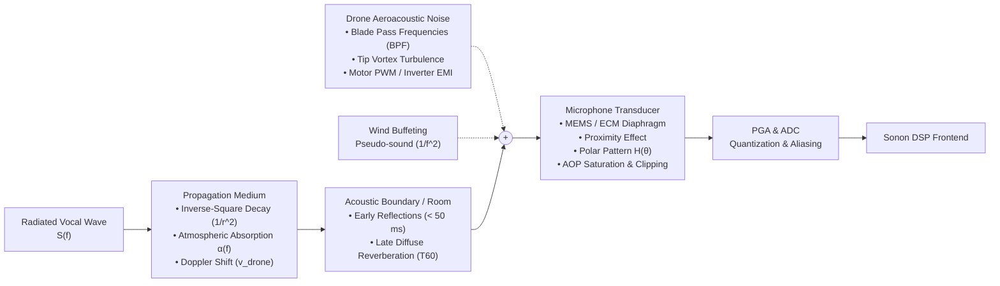
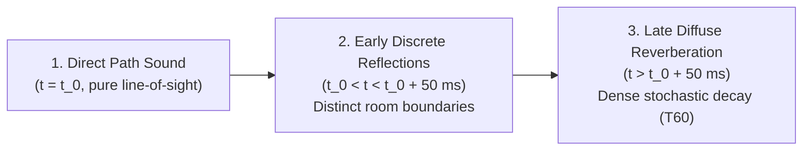

# Acoustic Environmental, Aeroacoustic, and Hardware Transduction Factors

---

## 1. Executive Summary

Wake-word and acoustic keyword spotting algorithms evaluated exclusively on clean, close-talk benchmark datasets (e.g. Google Speech Commands) systematically fail in real-world aerospace and robotics deployments. The physical sound wave arriving at the analog-to-digital converter (ADC) is not pure vocal audio; it is the compound convolution of the speaker's voice with the physical propagation medium, room reverberation, high-intensity drone aeroacoustics, wind-induced pseudo-sound, and electro-mechanical transducer non-linearities.

This document systematically models every physical, aeroacoustic, and hardware factor in the acoustic path between the operator's vocal tract and the digital DSP pipeline.



---

## 2. Electro-Acoustic Hardware & Transduction Factors

### 2.1 Microphone Transducer Physics

#### 1. MEMS (Micro-Electro-Mechanical Systems) Microphones
MEMS microphones are the industry standard for robotics and avionics companion computers due to their miniature footprint, high shock tolerance ($> 10,000\text{ g}$), and temperature stability.
- **Physical Construction**: A silicon backplate with perforations paired with a free-floating flexible polysilicon diaphragm forming a variable capacitor:
  $$C = \frac{\varepsilon_0 \varepsilon_r A}{d_0 - x(t)}$$
  Where $d_0$ is the equilibrium air gap ($1\text{ - }3\text{ }\mu\text{m}$) and $x(t)$ is diaphragm displacement driven by acoustic sound pressure $p(t)$.
- **Integrated ASIC**: Converts capacitive variations to voltage via an internal charge pump and outputs either analog differential signals or Pulse Density Modulation (PDM) over a 1-bit high-rate clock ($1.0\text{ - }3.2\text{ MHz}$).
- **Resonance & Bandwidth**: MEMS mechanical diaphragms exhibit an acoustic resonance peak in the ultrasonic spectrum ($25\text{ - }40\text{ kHz}$), ensuring flat phase and amplitude response across the audible spectrum ($20\text{ Hz} \to 20\text{ kHz}$).

#### 2. Electret Condenser Microphones (ECM)
- Utilize a permanently polarized Teflon/mylar electret film.
- Require an external JFET or op-amp buffer.
- Subject to polarization charge decay over time and phase drift under high temperature or mechanical vibration.

#### 3. Dynamic (Moving Coil) Microphones
- Diaphragm coupled to a copper coil suspended in a permanent magnetic field.
- **Vulnerability**: Highly susceptible to strong stray magnetic fields radiated by drone brushless DC (BLDC) motors (14-pole to 28-pole neodymium magnets rotating at high RPM), which induce electromagnetic hum directly into the coil.

---

### 2.2 Directionality, Polar Patterns, and Spatial Sensitivity
The spatial pickup pattern $H(\theta)$ determines the attenuation of sound arriving from off-axis angles $\theta$:

$$\text{Cardioid}: \quad H(\theta) = \frac{1 + \cos(\theta)}{2}$$
$$\text{Supercardioid}: \quad H(\theta) = \frac{1 + \sqrt{3}\cos(\theta)}{1 + \sqrt{3}} \approx 0.37 + 0.63\cos(\theta)$$
$$\text{Hypercardioid}: \quad H(\theta) = \frac{1 + 3\cos(\theta)}{4}$$
$$\text{Omnidirectional}: \quad H(\theta) = 1.0$$

```
Polar Attenuation vs. Direction (Cardioid):
    0 deg (On-Axis / Operator):    0 dB attenuation
   45 deg:                        -1.5 dB
   90 deg (Side):                 -6.0 dB
  135 deg:                       -14.0 dB
  180 deg (Rear / Drone Motors): -&infin; dB (theoretical null, ~ -20 to -25 dB practical)
```

**Drone Design Directive**: Omnidirectional microphones mounted near drone arms capture 100% of motor noise from all directions. Utilizing a backward-facing cardioid or spatial beamforming array steered away from the vehicle center of gravity (CG) provides $15\text{ to }25\text{ dB}$ of passive acoustic noise rejection before any digital filtering.

---

### 2.3 The Proximity Effect in Gradient Microphones
Any directional (pressure-gradient) microphone exhibits a dramatic low-frequency boost when the sound source is placed within the acoustic near-field ($r \ll \lambda / 2\pi$):

$$\Delta \text{SPL}_{\text{bass}}(\omega, r) = 20 \log_{10}\left( \sqrt{1 + \left( \frac{c}{\omega r} \right)^2} \right) \quad (\text{dB})$$

Where:
- $c \approx 343\text{ m/s}$ is the speed of sound.
- $\omega = 2\pi f$ is angular frequency.
- $r$ is source-to-diaphragm distance.

#### Quantitative Proximity Magnitudes:
For an operator speaking at distance $r$:
- At $r = 1.0\text{ m}$ (Far-Field): $\frac{c}{\omega r} \ll 1 \implies 0\text{ dB}$ bass boost.
- At $r = 5.0\text{ cm}$ (Close-Talk Headset): At $f = 100\text{ Hz}$, $\frac{c}{\omega r} = \frac{343}{2\pi \cdot 100 \cdot 0.05} \approx 10.9 \implies +20.8\text{ dB}$ boost!
- At $r = 2.0\text{ cm}$: At $f = 100\text{ Hz}$, boost exceeds $+28.7\text{ dB}$.

#### Consequence for Wake-Word Classification:
If a model is trained on headset data ($r = 3\text{ cm}$), the feature vectors will be dominated by exaggerated low-frequency energy ($F_0, F_1$). If an operator subsequently shouts at a drone from a distance of $r = 3\text{ m}$, this low-frequency boost disappears completely, severely altering the spectral envelope and causing recognition failure unless high-pass filtered or normalized.

---

### 2.4 Acoustic Overload Point (AOP), THD, and Clipping
- **Acoustic Overload Point (AOP)**: The input sound pressure level at which total harmonic distortion (THD) reaches $10\%$.
  - Standard consumer MEMS: $\text{AOP} \approx 120\text{ - }122\text{ dB SPL}$.
  - High-performance industrial MEMS (e.g. Knowles SPH0645LM4H, Infineon IM69D130): $\text{AOP} \approx 130\text{ - }135\text{ dB SPL}$.
- **Near-Field Drone Propeller Pressure**: In close proximity ($< 10\text{ cm}$) to high-thrust propellers (e.g. 5-inch 4S racing drone or 15-inch heavy-lift multirotor), local acoustic sound pressure combined with turbulent airflow spikes can exceed $125\text{ - }130\text{ dB SPL}$.
- **Clipping Artifacts**: If acoustic pressure exceeds the AOP, the diaphragm hits the physical backplate stops, resulting in hard clipping. In the frequency domain, hard clipping generates infinite odd harmonics:
  $$x_{\text{clip}}(t) \implies \sum_{n=1, 3, 5, \dots} \frac{1}{n} \sin(n \omega t)$$
  This folds acoustic energy uniformly across all Mel filterbank bins, completely masking the formants of legitimate human speech.

---

## 3. Drone Aeroacoustic Noise Mechanics

The acoustic environment of an operating UAV is one of the most hostile soundscapes for speech recognition in existence, dominated by four distinct physical noise generation mechanisms:

```
Total Drone Noise Spectrum = BPF Tonals + Tip Turbulence + Motor PWM + Wind Buffeting
Energy (dB)
  ^
  |  [Motor BPF Harmonics: 200 Hz, 400 Hz, 600 Hz...]
  |   |    |    |
  |  |||  |||  |||    [Broadband Rotor Vortex Shedding]
  |  |||  |||  |||   ~~~~~~~~~~~~~~~~~~~~~~~~~~~~~~~~~
  |  |||  |||  |||  ~                                 ~
  |  |||  |||  ||| ~                                   ~  [PWM Switching: 24-48 kHz]
  |  |||  |||  |||~                                     ~    ||
  +--------------------------------------------------------------> Frequency
```

### 3.1 Rotor Blade Pass Frequencies (BPF) & Rotational Harmonics
As each propeller blade rotates through the air, it displaces fluid (thickness noise, monopole source) and exerts cyclic aerodynamic lift and drag forces on the surrounding air (loading noise, dipole source).

The fundamental Blade Pass Frequency $f_{\text{BPF}}$ is governed by the number of blades $B$ and rotational speed $N_{\text{RPM}}$:

$$f_{\text{BPF}} = \frac{B \cdot N_{\text{RPM}}}{60} \quad (\text{Hz})$$

Harmonics occur at integer multiples:

$$f_k = k \cdot f_{\text{BPF}} = k \cdot \frac{B \cdot N_{\text{RPM}}}{60}, \quad k = 1, 2, 3, \dots$$

#### Rotational Noise Magnitudes across Vehicle Classes:
| Vehicle Class | Propeller Size | Motor RPM | Blade Count $B$ | Fundamental $f_{\text{BPF}}$ | Dominant Harmonics |
| :--- | :--- | :--- | :--- | :--- | :--- |
| **FPV Racing / Micro** | 5 inch | 24,000 - 36,000 | 3 | $1200\text{ - }1800\text{ Hz}$ | $2.4\text{ kHz}, 3.6\text{ kHz}, 4.8\text{ kHz}$ |
| **Commercial Quad (e.g. Mavic)** | 8.5 inch | 5,500 - 7,500 | 2 | $183\text{ - }250\text{ Hz}$ | $366\text{ Hz}, 550\text{ Hz}, 733\text{ Hz}, 916\text{ Hz}$ |
| **Enterprise / Heavy Lift** | 18 - 22 inch | 2,400 - 3,600 | 2 | $80\text{ - }120\text{ Hz}$ | $160\text{ Hz}, 240\text{ Hz}, 320\text{ Hz}, 400\text{ Hz}$ |
| **eVTOL Passenger Drone** | 48 - 60 inch | 800 - 1,200 | 4 | $53\text{ - }80\text{ Hz}$ | $106\text{ Hz}, 160\text{ Hz}, 213\text{ Hz}, 266\text{ Hz}$ |

#### Gutin-Deming Acoustic Field Formulation:
The acoustic sound pressure $P_m$ of the $m$-th harmonic radiated by a rotating propeller at distance $r$ and angle $\theta$ relative to the rotor axis is:

$$P_m = \frac{m B \omega}{2\pi c r} \left[ -T \cos(\theta) J_{m B}(z) + \frac{Q c}{\omega R_e^2} J_{m B}(z) \right]$$

Where:
- $T$ is rotor thrust, $Q$ is rotor aerodynamic torque.
- $J_{m B}(z)$ is the Bessel function of the first kind of order $m B$.
- $z = \frac{m B \omega R_e}{c} \sin(\theta)$ is the acoustic argument.
- $R_e \approx 0.8 R_{\text{tip}}$ is the effective aerodynamic radius.

Because the rotor harmonics overlap directly with human vowel formants ($F_1 \approx 200\text{-}800\text{ Hz}, F_2 \approx 800\text{-}2500\text{ Hz}$), untreated rotor tonal energy obliterates speech feature extraction unless actively notched out.

---

### 3.2 Broadband Rotor Vortex Turbulence
In addition to tonal spikes, turbulence creates continuous broadband acoustic noise:
1. **Trailing-Edge Vortex Shedding**: Boundary layers flowing off the sharp trailing edge shed micro-vortices, producing broadband hiss from $500\text{ Hz} \to 10\text{ kHz}$.
2. **Tip Vortex Cavitation & Inflow Ingestion**: Air ingested into the propeller contains turbulence from neighboring arms or wind gusts. When sliced by rotating blades, it generates high-amplitude pseudo-random acoustic hash.

---

### 3.3 Motor PWM & Inverter Electromagnetic Interference (EMI)
Modern drone electronic speed controllers (ESCs) drive BLDC motors using Field-Oriented Control (FOC) or high-frequency complementary PWM:
- Standard PWM carrier frequencies: $16\text{ kHz}, 24\text{ kHz}, 48\text{ kHz}, 96\text{ kHz}$.
- Although $24\text{ kHz}$ is beyond human hearing, if an audio ADC samples at $16\text{ kHz}$ ($f_{\text{Nyquist}} = 8\text{ kHz}$), any $24\text{ kHz}$ electrical or acoustic noise will **alias** directly down to $8\text{ kHz} - (24 - 16) = 0\text{ Hz}$ or fold across intermediate bins unless the ADC possesses an ultra-steep anti-aliasing low-pass analog filter (> 80 dB attenuation at 8 kHz).

---

### 3.4 Wind Buffeting & Turbulent Boundary Layer Pseudo-Sound
When wind blows across an exposed microphone aperture at velocity $v_{\text{wind}}$ ($5\text{ - }20\text{ m/s}$):
- Stagnation pressure fluctuations generate **pseudo-sound**: pressure oscillations that do not propagate acoustically but exert enormous localized forces on the diaphragm:
  $$p_{\text{wind}}(t) \approx \frac{1}{2} \rho \left( v_{\text{mean}} + v'(t) \right)^2 \approx \rho v_{\text{mean}} v'(t)$$
- The resulting acoustic spectrum follows a steep red/brown noise slope ($1/f^2$ to $1/f^3$), concentrating massive energy in the sub-$200\text{ Hz}$ spectrum.
- **Hardware Solution**: High-density reticulated polyurethane foam or synthetic acoustic faux fur windscreens to diffuse turbulent eddies before they hit the diaphragm.

---

## 4. Acoustic Wave Propagation & Doppler Dynamics

### 4.1 Inverse-Square Free-Field Loss
In an open, obstacle-free outdoor environment (anechoic half-space), acoustic power drops with distance $r$ according to the inverse-square law:

$$I(r) = \frac{P_{\text{acoustic}}}{4\pi r^2}$$

$$\text{SPL}(r) = \text{SPL}(r_0) - 20 \log_{10}\left(\frac{r}{r_0}\right)$$

```
Acoustic Pressure Loss vs. Distance from Operator:
Distance r (m)    SPL Reduction (dB)    Relative Signal Amplitude
1.0 m             0 dB (Reference)      100.0%
2.0 m             -6.0 dB                50.0%
5.0 m             -14.0 dB               20.0%
10.0 m            -20.0 dB               10.0%
20.0 m            -26.0 dB                5.0%
```

At $10\text{ meters}$, an operator shouting at $80\text{ dB SPL}$ arrives at the drone microphone at only $60\text{ dB SPL}$. If the drone propellers generate $85\text{ dB SPL}$ of noise at the airframe, the operational Signal-to-Noise Ratio (SNR) is:

$$\text{SNR} = 60\text{ dB} - 85\text{ dB} = -25\text{ dB}$$

The wake-word engine must extract speech signals embedded **$25\text{ dB}$ below the ambient noise floor**!

---

### 4.2 Atmospheric Absorption
Sound propagation through the atmosphere suffers molecular absorption caused by classical viscosity, thermal conduction, and rotational/vibrational relaxation of nitrogen ($N_2$) and oxygen ($O_2$) molecules (ISO 9613-1 standard):

$$p(r) = p(r_0) e^{-\alpha(f, T, \text{RH}) (r - r_0)}$$

Atmospheric attenuation $\alpha$ grows quadratically with frequency:
- At $1000\text{ Hz}$ ($20^\circ\text{C}, 50\%\text{ RH}$): $\alpha \approx 0.005\text{ dB/meter}$ (negligible at $10\text{ m}$).
- At $4000\text{ Hz}$: $\alpha \approx 0.03\text{ dB/meter}$.
- At $8000\text{ Hz}$: $\alpha \approx 0.12\text{ dB/meter}$.

Over long standoff distances ($> 30\text{ m}$), high frequencies attenuate significantly faster than low frequencies, causing distant speech to sound muffled and dampening critical consonant acoustic cues (/s/, /t/, /k/).

---

### 4.3 Doppler Frequency Shifts from Vehicle Velocity
When a drone travels at velocity $\mathbf{v}_{\text{drone}}$ relative to a stationary operator speaking frequency $f_0$:

$$f_{\text{received}} = f_0 \left( \frac{c}{c - \mathbf{v}_{\text{drone}} \cdot \hat{\mathbf{r}}} \right)$$

Where $\hat{\mathbf{r}}$ is the unit vector along the acoustic propagation line of sight.

#### Quantitative Doppler Shifts:
For a tactical drone flying at $v = 25\text{ m/s}$ ($90\text{ km/h}$, typical cruise):
$$\frac{c}{c - v} = \frac{343}{343 - 25} = \frac{343}{318} \approx 1.0786 \quad (+7.86\% \text{ frequency shift})$$

```
Doppler Frequency Shifts at 25 m/s Inbound Flight:
Acoustic Component    Original Frequency    Doppler-Shifted Frequency    Delta f
Pitch F0 (Male)       120 Hz                129.4 Hz                     +9.4 Hz
Formant F1            500 Hz                539.3 Hz                     +39.3 Hz
Formant F2            1500 Hz               1617.9 Hz                    +117.9 Hz
Formant F3            2500 Hz               2696.5 Hz                    +196.5 Hz
Consonant Fricative   6000 Hz               6471.6 Hz                    +471.6 Hz
```

During rapid fly-bys or deceleration flares, formant tracks shift across Mel filterbank boundaries within a single second, requiring temporal tracking algorithms that tolerate continuous frequency scaling.

---

## 5. Room Acoustics, Boundaries, and Reverberation

When drones operate indoors (warehouses, subterranean structures, GPS-denied tactical clearance), acoustic reflections from walls, ceilings, and floors profoundly alter the received sound wave.

### 5.1 Room Impulse Response (RIR) Decomposition
The acoustic transmission channel between the operator's mouth and the drone microphone is modeled as a linear time-invariant (LTI) filter with Room Impulse Response $h(t)$:

$$x(t) = s(t) * h(t) + n(t)$$

$h(t)$ is partitioned into three distinct physical regimes:



1. **Direct Path ($t = t_0$)**: Undistorted line-of-sight sound carrying pristine acoustic formants.
2. **Early Reflections ($t_0 < t < t_0 + 50\text{ ms}$)**: Discrete echoes bouncing off floor, ceiling, and primary walls. Early reflections can construct constructive/destructive interference (**comb filtering**):
   $$H_{\text{early}}(f) = 1 + \sum_{k=1}^P \alpha_k e^{-j 2\pi f \tau_k}$$
   Comb filtering carves sharp periodic notches into the spectrum, obliterating specific formant peaks.
3. **Late Diffuse Reverberation ($t > t_0 + 50\text{ ms}$)**: Thousands of overlapping reflections behaving as an exponentially decaying Gaussian stochastic process.

---

### 5.2 Reverberation Time ($T_{60}$) & Sabine's Formulation
Reverberation time $T_{60}$ is the time required for sound energy density to drop by $60\text{ dB}$ after the source stops:

$$T_{60} = \frac{0.161 \cdot V}{S \cdot \bar{\alpha}} \quad (\text{Sabine's Formula})$$

Where:
- $V$ is room volume in cubic meters ($m^3$).
- $S$ is total surface area in square meters ($m^2$).
- $\bar{\alpha}$ is area-averaged acoustic absorption coefficient.

```
Typical T60 Across Operational Environments:
Environment                     Volume V (m^3)    T60 (seconds)    Acoustic Degradation
Anechoic / Outdoor Open Field   &infin;           0.00 s           Zero reverberation
Treated Studio / Office         150 m^3           0.25 - 0.40 s    Negligible
Living Room / Classroom         250 m^3           0.50 - 0.80 s    Moderate smearing
Industrial Warehouse / Hangar   15,000 m^3        2.50 - 5.00 s    Severe temporal overlap
Cathedral / Concrete Bunker     30,000 m^3        5.00 - 10.00 s   Extreme intelligible loss
```

### 5.3 Acoustic Consequences of High $T_{60}$
1. **Temporal Smearing (Forward Masking)**:
   A loud preceding vowel (e.g., /eɪ/ in "take") has its energy smeared across time by late reverberation for hundreds of milliseconds, spilling directly into and drowning out the subsequent low-energy voiceless consonant (/k/ or /ɒf/).
2. **Loss of Modulation Depth**:
   Reverberation acts as a low-pass filter on the temporal envelope of speech, reducing spectral contrast and blurring phoneme transitions in the STFT spectrogram.

---

## 6. Summary of Engineering Countermeasures for Sonon

To achieve industrial robustness across these physical factors, Sonon incorporates:

1. **Wind Noise Rejection**: High-pass filtering at $80\text{ Hz}$ ($4\text{th-order IIR Butterworth}$) to eliminate low-frequency wind buffeting and pseudo-sound without clipping vocal formants.
2. **Motor Telemetry RPM Tracking**: Live notch filtering dynamically pegged to Kestrel ESC RPM feedback, notching out $f_{\text{BPF}}$ tones at $> 25\text{ dB}$ attenuation.
3. **Per-Channel Energy Normalization (PCEN)**: Replacing standard logarithmic compression with feed-forward adaptive gain control to handle $-25\text{ dB}$ SNR conditions and sudden proximity jumps.
4. **Multi-RIR Acoustic Data Augmentation**: Training neural wake-word models against thousands of synthetic Room Impulse Responses ($T_{60} \in [0.1\text{ s}, 3.0\text{ s}]$) and real-world multi-rotor audio captures.
