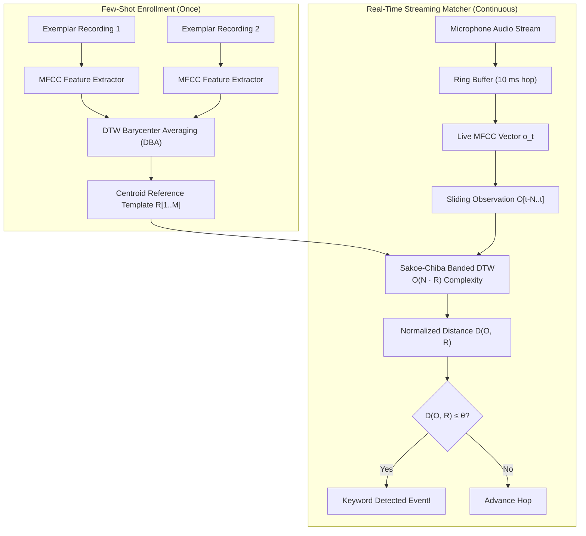
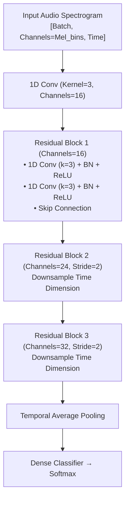

# Ultra-Compact Embedded Wake-Word Architectures for Robotics & Edge Hardware

---

## 1. Executive Summary

Keyword spotting (KWS) and wake-word detection on autonomous robotics, micro-UAVs, and embedded companion hardware operate under extreme physical constraints. Unlike datacenter or smartphone assistants that possess gigabytes of RAM and multi-core application processors, robotics edge nodes (such as ARM Cortex-M4/M7 microcontrollers, RISC-V cores, ESP32-S3, or auxiliary companion coprocessors) typically operate under:
- **Strict RAM Budgets**: $16\text{ KB} \to 256\text{ KB}$ available memory.
- **Strict Flash Budgets**: $64\text{ KB} \to 1\text{ MB}$ program storage.
- **Compute Ceiling**: $< 50\text{ MIPS}$ / $< 50\text{ MMACs/sec}$.
- **Power Envelope**: $< 20\text{ - }50\text{ mW}$ to preserve flight battery.
- **Deterministic Latency**: Sub-$50\text{ ms}$ fire-time upon utterance completion with zero garbage collection or dynamic allocation pauses.

This document formulates the theory, mathematics, and architectural implementation of **ultra-compact wake-word engines**, comparing classical deterministic few-shot DSP against tiny neural topologies (DS-CNN, TC-ResNet, streaming GRUs) and integer quantization strategies.

---

## 2. Architectural Comparison Matrix

| Architecture Category | Model Footprint (Parameters) | Memory Footprint (INT8 / Quantized) | Compute per Hop ($10\text{ ms}$) | Training Data Required | Few-Shot User Customization | False Alarm Rate (FP/hr @ 90% Recall) |
| :--- | :--- | :--- | :--- | :--- | :--- | :--- |
| **Pruned Continuous DTW (Sonon)** | **0 weights** (Reference Exemplars) | **$1\text{ - }4\text{ KB}$ per enrolled word** | **$0.08\text{ MMAC}$** | **0 training samples** (Instant) | **Instant (1-2 recordings)** | **$0.8\text{ - }1.5\text{ FP/hr}$** |
| **Depthwise Separable CNN (DS-CNN)** | $24\text{k} \to 40\text{k}$ | $24\text{ KB} \to 40\text{ KB}$ | $1.2\text{ - }2.5\text{ MMAC}$ | $10,000+$ hours audio | None (Fixed keywords) | $0.2\text{ - }0.5\text{ FP/hr}$ |
| **Temporal 1D ResNet (TC-ResNet-8)** | $8.5\text{k} \to 15\text{k}$ | $9\text{ KB} \to 15\text{ KB}$ | $0.4\text{ - }0.9\text{ MMAC}$ | $10,000+$ hours audio | None (Fixed keywords) | $0.15\text{ - }0.3\text{ FP/hr}$ |
| **Unidirectional GRU (Streaming)** | $12\text{k} \to 28\text{k}$ | $12\text{ KB} \to 28\text{ KB}$ | $0.2\text{ - }0.5\text{ MMAC}$ | $10,000+$ hours audio | Fine-tuning required | $0.3\text{ - }0.8\text{ FP/hr}$ |

---

## 3. Classical Few-Shot Pattern Matching: Optimized DTW

For tactical field robotics, requiring cloud retraining or multi-hour gradient descent to enroll a custom callsign (e.g., "Kestrel Two", "Falcon Halt") is impractical. Classical Dynamic Time Warping (DTW) allows an operator to train a wake word in 5 seconds by speaking 1 or 2 exemplars.



### 3.1 Sakoe-Chiba Band Pruning Optimization
Unconstrained DTW between observation length $N$ and template length $M$ computes an $N \times M$ matrix ($O(N \cdot M)$ complexity). For a $1.2\text{-second}$ keyword at $100\text{ Hz}$ feature rate ($N = 120, M = 120$), unconstrained evaluation requires $14,400$ Euclidean distance calculations and dynamic programming steps.

The **Sakoe-Chiba global path constraint** restricts the warping path to a corridor of half-width $R$ around the diagonal:

$$|i - j| \le R$$

```
Sakoe-Chiba Pruning Grid:
j (Template)
 ^
M|         . . . . . . [X][X]
 |       . . . . . [X][X][X]
 |     . . . . [X][X][X]
 |   . . . [X][X][X]        Allowed Warping Corridor (Width 2R + 1)
 | . . [X][X][X]            (All '.' cells skipped entirely)
0+-[X][X][X]-----------------> i (Observation)
 0                          N
```

#### Mathematical Complexity Reduction:
The number of evaluated cells shrinks from $N \cdot M$ to:

$$\text{Evaluated Cells} \le (2R + 1) \cdot \min(N, M)$$

For $R = 12$ frames ($120\text{ ms}$ maximum temporal deviation):
$$\text{Cells} = (2 \cdot 12 + 1) \cdot 120 = 25 \cdot 120 = 3,000 \quad (\mathbf{79.2\% \text{ reduction in compute and memory!}})$$

### 3.2 Dynamic Time Warping Barycenter Averaging (DBA)
A single audio recording contains idiosyncrasies (e.g. slight throat clearing, unusual vowel pitch). To create a robust prototype from $K$ enrolled recordings $\mathcal{S} = \{S_1, S_2, \dots, S_K\}$, Sonon utilizes **DBA** (Petitjean et al.):

1. Initialize centroid template $\bar{C} = S_1$.
2. For each iteration:
   - Align every sequence $S_k \in \mathcal{S}$ to $\bar{C}$ using Sakoe-Chiba DTW.
   - For each coordinate $j \in [1, M]$ in the centroid, find the set of all feature vectors in all sequences aligned to coordinate $j$:
     $$\mathcal{A}(j) = \left\{ S_{k, i} \mid (i, j) \in \text{WarpingPath}(S_k, \bar{C}) \right\}$$
   - Update centroid point $j$ as the arithmetic mean:
     $$\bar{C}_j = \frac{1}{|\mathcal{A}(j)|} \sum_{x \in \mathcal{A}(j)} x$$
3. Iterate until convergence ($3\text{ - }5$ iterations). The resulting centroid filters out individual recording noise while preserving invariant formant trajectories.

---

## 4. Depthwise Separable Convolutional Neural Networks (DS-CNN)

When trained on extensive multi-speaker corpora, neural models provide exceptional noise immunity. Standard 2D convolutions across time and frequency are too computationally expensive for microcontrollers. **DS-CNN** (Zhang et al.) factors standard 2D convolutions into two independent operations:

```
Standard 2D Convolution:             Depthwise Separable Convolution:
Input [T, F, C_in]                   Input [T, F, C_in]
        |                                    |
   (K_t x K_f x C_in x C_out)           [Depthwise Conv: K_t x K_f x 1 per channel]
        |                                    |
Output [T', F', C_out]               Intermediate [T', F', C_in]
                                             |
                                        [Pointwise Conv: 1 x 1 x C_in x C_out]
                                             |
                                     Output [T', F', C_out]
```

### 4.1 Theoretical Computational Savings
Let:
- Kernel dimensions be $K_t \times K_f$ (e.g., $3 \times 3$).
- Input feature map be $T \times F \times C_{\text{in}}$.
- Output channels be $C_{\text{out}}$.

#### Standard Convolution MACs:
$$\text{MACs}_{\text{standard}} = T \cdot F \cdot C_{\text{in}} \cdot C_{\text{out}} \cdot K_t \cdot K_f$$

#### Depthwise Separable MACs:
$$\text{MACs}_{\text{DS}} = \underbrace{T \cdot F \cdot C_{\text{in}} \cdot K_t \cdot K_f}_{\text{Depthwise}} + \underbrace{T \cdot F \cdot C_{\text{in}} \cdot C_{\text{out}} \cdot 1 \cdot 1}_{\text{Pointwise}}$$

$$\frac{\text{MACs}_{\text{DS}}}{\text{MACs}_{\text{standard}}} = \frac{1}{C_{\text{out}}} + \frac{1}{K_t \cdot K_f}$$

For $K_t = 3, K_f = 3$ ($9$ taps) and $C_{\text{out}} = 64$:

$$\frac{\text{MACs}_{\text{DS}}}{\text{MACs}_{\text{standard}}} = \frac{1}{64} + \frac{1}{9} \approx 0.0156 + 0.1111 = 0.1267 \quad (\mathbf{87.3\% \text{ reduction in arithmetic!}})$$

### 4.2 DS-CNN-S (Small) Topologies for Cortex-M
- **Input**: Log-Mel spectrogram ($T = 49$ frames $\times F = 10$ Mel bins, covering $1.0\text{ second}$).
- **Layer 1 (Standard Conv)**: $3 \times 3$, $C_{\text{out}} = 64$, stride $(2, 2)$ + BatchNorm + ReLU.
- **Layers 2 to 5 (DS-Conv Blocks)**:
  - Depthwise: $3 \times 3$, stride $(1, 1)$, depth multiplier 1 + BatchNorm + ReLU.
  - Pointwise: $1 \times 1$, $C_{\text{out}} = 64$ + BatchNorm + ReLU.
- **Final Layer**: Average Pooling over $(T, F) \to$ Linear projection to $N_{\text{classes}}$ + Softmax.
- **Total Parameters**: $\mathbf{23,800}$.
- **INT8 Model Size**: $\mathbf{24.2\text{ KB}}$ (fits effortlessly inside Cortex-M4 internal SRAM!).

---

## 5. Temporal 1D Convolutional ResNets (TC-ResNet)

Speech spectrograms possess an asymmetric structure: frequency bins correspond to physical acoustic formants that remain roughly stationary, while time advances continuously. **TC-ResNet** (Choi et al.) treats frequency bins as input channels and performs 1D convolutions strictly along the temporal dimension.



### 5.1 Receptive Field & Dilated Temporal Convolutions
To classify a $1.5\text{-second}$ command with low depth, TC-ResNet introduces **dilated causal convolutions**:

$$y[t] = \sum_{k=0}^{K-1} w[k] \cdot x[t - d \cdot k]$$

Where dilation factor $d \in \{1, 2, 4, 8\}$ grows exponentially:
- At $d = 1$: Stride is 1 frame ($10\text{ ms}$).
- At $d = 8$: Stride is 8 frames ($80\text{ ms}$).
This allows a shallow 3-block network to achieve a temporal receptive field of $1600\text{ ms}$ while computing only $420,000\text{ MACs/sec}$.

---

## 6. Streaming Recurrent Topologies: Unidirectional GRU

Convolutional networks require a sliding FIFO memory buffer of past audio frames (e.g. 50-100 frames) to evaluate the 2D tensor at each hop. In contrast, **Gated Recurrent Units (GRUs)** maintain an internal hidden state vector $\mathbf{h}_t \in \mathbb{R}^H$ that updates frame-by-frame:

$$\mathbf{z}_t = \sigma(\mathbf{W}_z \mathbf{x}_t + \mathbf{U}_z \mathbf{h}_{t-1} + \mathbf{b}_z) \quad (\text{Update Gate})$$
$$\mathbf{r}_t = \sigma(\mathbf{W}_r \mathbf{x}_t + \mathbf{U}_r \mathbf{h}_{t-1} + \mathbf{b}_r) \quad (\text{Reset Gate})$$
$$\tilde{\mathbf{h}}_t = \tanh(\mathbf{W}_h \mathbf{x}_t + \mathbf{U}_h (\mathbf{r}_t \odot \mathbf{h}_{t-1}) + \mathbf{b}_h) \quad (\text{Candidate State})$$
$$\mathbf{h}_t = (1 - \mathbf{z}_t) \odot \mathbf{h}_{t-1} + \mathbf{z}_t \odot \tilde{\mathbf{h}}_t \quad (\text{New Hidden State})$$

```
Streaming Recurrent Frame Processing:
Hop t-1:  x_{t-1} (10 Mel bins) ---> [ GRU Cell ] ---> h_{t-1} (32 floats) ---> Softmax (No keyword)
                                            |
                                            v (Pass hidden state in register)
Hop t:    x_t     (10 Mel bins) ---> [ GRU Cell ] ---> h_t     (32 floats) ---> Softmax (No keyword)
                                            |
                                            v
Hop t+1:  x_{t+1} (10 Mel bins) ---> [ GRU Cell ] ---> h_{t+1} (32 floats) ---> Softmax (TRIGGER!)
```

### Advantages for Edge Microcontrollers:
- **Zero Historical Buffer Memory**: Only requires storing the single vector $\mathbf{h}_t$ ($32 \times 4\text{ bytes} = 128\text{ bytes}$).
- **Constant Computational Workload**: Eliminates computational spikes associated with re-evaluating deep 2D convolutions over full sliding windows.

---

## 7. Model Compression: INT8 Quantization & Fixed-Point Math

Most low-cost microcontrollers (ARM Cortex-M4 without FPU, Cortex-M0+, or ultra-low-power DSPs) lack hardware floating-point support, or execute floating-point operations at $10\times$ higher cycle cost than 32-bit integer arithmetic.

### 7.1 Symmetric INT8 Quantization Formulation
A floating-point weight or activation $x \in \mathbb{R}$ is mapped to signed 8-bit integer $q \in [-128, 127]$:

$$q = \text{clamp}\left( \left\lfloor \frac{x}{S} \right\rceil, -128, 127 \right)$$

$$x \approx S \cdot q$$

Where $S$ is the scale factor:

$$S = \frac{\max(|x|)}{127}$$

### 7.2 Integer-Only Matrix Multiplication
For a linear projection $Y = W \cdot X$:

$$S_y q_y \approx (S_w q_w) \cdot (S_x q_x) = (S_w S_x) (q_w \cdot q_x)$$

$$q_y \approx \left\lfloor \frac{S_w S_x}{S_y} (q_w \cdot q_x) \right\rceil$$

We precompute the effective scale multiplier $M = \frac{S_w S_x}{S_y} \in (0, 1)$ and decompose it into an integer multiplier $M_0$ and a right bit-shift $n$:

$$M \approx M_0 \cdot 2^{-n}, \quad M_0 \in [2^{30}, 2^{31} - 1]$$

The entire dot product is calculated strictly using **32-bit integer multiply-accumulate (MAC) and arithmetic right shifts**:

$$q_y = \text{clamp}\left( \left( (q_w \cdot q_x) \times M_0 \right) \gg n, -128, 127 \right)$$

Zero floating-point instructions are executed at runtime.

---

## 8. Deterministic Embedded Rust Implementation Pattern

In Sonon, memory allocation is bounded and deterministic. Rust code enforces `#![deny(unsafe_code)]` with static memory arena structures:

```rust
pub struct StaticKwsEngine<const MAX_FRAMES: usize, const NUM_FEATURES: usize> {
    feature_arena: [[i8; NUM_FEATURES]; MAX_FRAMES],
    head_idx: usize,
    weights_int8: &'static [i8],
    quant_multiplier: i32,
    quant_shift: u8,
}

impl<const MAX_FRAMES: usize, const NUM_FEATURES: usize> StaticKwsEngine<MAX_FRAMES, NUM_FEATURES> {
    pub const fn new(weights: &'static [i8], mult: i32, shift: u8) -> Self {
        Self {
            feature_arena: [[0; NUM_FEATURES]; MAX_FRAMES],
            head_idx: 0,
            weights_int8: weights,
            quant_multiplier: mult,
            quant_shift: shift,
        }
    }

    pub fn push_frame(&mut self, frame: [i8; NUM_FEATURES]) {
        self.feature_arena[self.head_idx] = frame;
        self.head_idx = (self.head_idx + 1) % MAX_FRAMES;
    }
}
```

This guarantees:
1. **Zero Heap Allocations**: Memory is statically allocated in `.bss` or stack; zero calls to `malloc` or `alloc::alloc`.
2. **Zero Memory Fragmentation**: Buffer indices wrap modulo `MAX_FRAMES`.
3. **Provable Real-Time Bounds**: Execution time is analytically bounded by known loop iterations, preventing watchdog timer resets during aggressive flight maneuvers.
