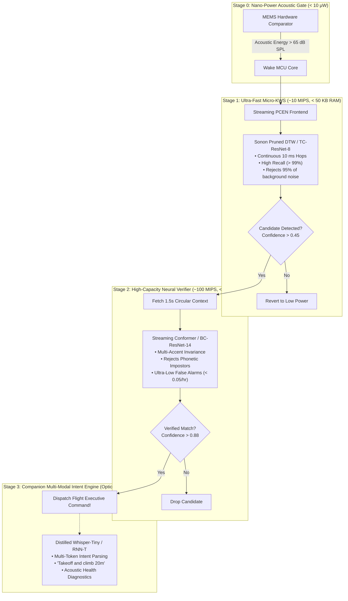
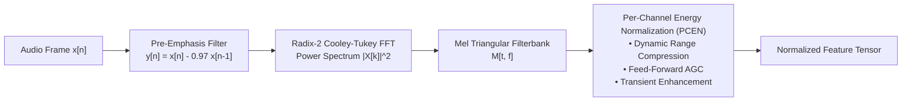
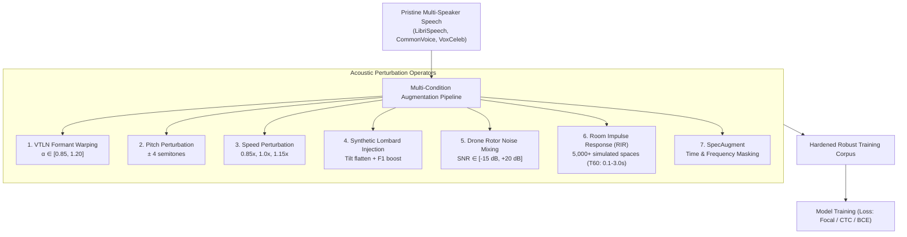

# Scalable Hierarchical Wake-Word Cascade Systems: From Micro-Edge to Companion AI

---

## 1. Executive Summary

In mission-critical autonomous robotics, a single wake-word false alarm (e.g. falsely triggering "emergency land" during high-speed forward flight) can crash an aircraft, while a false rejection (ignoring an operator shouting "abort mission") can lead to catastrophic collisions. 

Achieving both **zero false alarms** ($< 0.05\text{ False Alarms/hour}$) and **ultra-high recall** ($> 98\%$) across thousands of diverse speakers, heavy accents, and $-15\text{ dB}$ drone propeller noise is mathematically impossible with a single static model operating under strict micro-watt power constraints.

The industrial solution is a **Multi-Stage Cascaded Hierarchy**: an energy- and compute-efficient pipeline that progressively activates increasingly sophisticated acoustic models only when preliminary stages detect potential keyword candidates.



---

## 2. Multi-Stage Cascade Architecture

### 2.1 Stage 0: Hardware Analog / Digital Energy Gate ($< 10\text{ }\mu\text{W}$)
- **Operational State**: Microcontroller is in deep sleep (e.g. ARM Cortex-M4 STOP mode, consuming $< 2\text{ }\mu\text{A}$).
- **Hardware Trigger**: Ultra-low-power digital microphone (e.g., Knowles VoiceIQ or TDK InvenSense ICS-40730) incorporates an onboard autonomous acoustic activity detector.
- **Trigger Criterion**: When wideband acoustic sound pressure exceeds a programmable threshold ($65\text{ - }70\text{ dB SPL}$) for at least $20\text{ ms}$, the microphone asserts an external hardware interrupt (`WAKE_INT`), booting the MCU in $< 500\text{ }\mu\text{s}$.

---

### 2.2 Stage 1: Streaming Micro-KWS ($10\text{ MIPS}, < 50\text{ KB RAM}$)
- **Goal**: High recall ($> 99\%$) with permissive false alarm tolerance ($10\text{ - }20\text{ FP/hr}$).
- **Execution**: Runs continuously on the MCU core whenever sound is present.
- **Acoustic Frontend**: Real-to-complex Radix-2 FFT and Per-Channel Energy Normalization (PCEN) computed in $10\text{ ms}$ hops.
- **Classifier Topology**:
  - **Deterministic Mode**: Sonon's Sakoe-Chiba Banded DTW matcher ($R = 12$, evaluated over $1.0\text{ s}$ history).
  - **Neural Mode**: INT8-quantized **TC-ResNet-8** ($8,500$ parameters, $9\text{ KB}$ weights).
- **Behavior**: If the output probability score exceeds a lenient threshold ($\theta_1 \approx 0.45$), it freezes the $1.5\text{-second}$ audio circular ring buffer and invokes Stage 2. Otherwise, it maintains low-power execution.

---

### 2.3 Stage 2: High-Precision Neural Verifier ($100\text{ MIPS}, < 2\text{ MB RAM}$)
- **Goal**: Ultra-low false alarm rate ($< 0.05\text{ FP/hr}$) with high true positive preservation ($> 98\%$).
- **Execution**: Evaluated only upon Stage 1 triggers ($\approx 5\text{ - }20\text{ times per hour}$ in normal operation), amortizing compute energy to near-zero.
- **Input**: The pre-buffered $1.5\text{-second}$ audio context (capturing the complete utterance from $200\text{ ms}$ before onset to $200\text{ ms}$ after offset).
- **Classifier Topology: Streaming Conformer (Gulati et al.)**:
  - Integrates depthwise separable convolutions (local acoustic feature extraction) with multi-head self-attention (global temporal phoneme dependency).
  - Utilizes **Causal Chunk-Level Attention** ($160\text{ ms}$ chunks) to preserve streaming compatibility.
  - Rejects phonetic impostors that confuse Stage 1 (e.g., distinguishing "take off" from "tape off", "lake off", "bake shop").
- **Verification Rule**: If the verified probability $\mathcal{P}(\text{keyword}) \ge \theta_2 \approx 0.88$, an authenticated `KeywordEvent` is dispatched directly to the Kestrel flight firmware executive.

---

### 2.4 Stage 3: High-Compute Companion Intent Engine (Optional Fallback)
For multi-rotor companion computers equipped with edge NPUs or GPUs (NVIDIA Jetson Orin Nano, RK3588, Raspberry Pi 5):
- **Model Topology**: Distilled streaming **Whisper-Tiny** or **Emformer RNN-T**.
- **Role**:
  1. Decodes full-sentence conversational flight commands following wake-word activation (e.g. *"Aerovex, hold altitude and track target bravo"*).
  2. Resolves complex multi-operator callsigns across tactical radio networks.
  3. Executes acoustic anomaly diagnostics (analyzing the ambient audio spectrum for motor bearing failure or propeller delamination).

---

## 3. Advanced Acoustic Feature Frontends

While standard Log-Mel Filterbanks perform well in benign office environments, they degrade rapidly under severe non-stationary drone propeller noise and dynamic speaker distances.



### 3.1 Per-Channel Energy Normalization (PCEN)
Developed by Wang et al. (2017) and Lostanlen et al. (2019), **PCEN** replaces the static logarithm with an adaptive temporal gain control loop applied independently to each frequency channel:

$$E[t, f] = \left( \frac{M[t, f]}{\left( \epsilon + M_{\text{smooth}}[t, f] \right)^\alpha} + \delta \right)^r - \delta^r$$

Where:
- $M[t, f]$ is the energy in Mel band $f$ at time frame $t$.
- $M_{\text{smooth}}[t, f]$ is a recursive, low-pass filtered running estimate of the background noise energy in band $f$:
  $$M_{\text{smooth}}[t, f] = (1 - s) M_{\text{smooth}}[t-1, f] + s M[t, f]$$
  Where smoothing factor $s \approx 0.025$ corresponds to an integration time constant of $\approx 400\text{ ms}$.
- $\alpha \in [0.6, 0.98]$ is the gain normalization exponent.
- $\delta \approx 2.0$ is the dynamic range expansion offset.
- $r \in [0.1, 0.33]$ is the compression exponent (replacing the aggressive logarithmic function).
- $\epsilon \approx 10^{-6}$ is a numerical stabilizer.

#### Why PCEN Outperforms Log-Mel in Aerial Robotics:
1. **Dynamic Motor RPM Normalization**: As drone motors spool up from hover ($5,000\text{ RPM}$) to punch-out climb ($12,000\text{ RPM}$), background energy in specific Mel channels spikes by $> 20\text{ dB}$. $M_{\text{smooth}}$ tracks this stationary noise increase and divides it out, preserving the relative contrast of vocal formants.
2. **Proximity Invariance**: If an operator suddenly shouts or moves closer to the microphone, PCEN compresses the sudden amplitude jump without clipping the feature representation.
3. **Transient Accentuation**: Consonant burst transients (/t/, /k/) change much faster than the $400\text{ ms}$ smoothing filter, resulting in sharp, enhanced contrast peaks in the normalized feature map $E[t, f]$.

---

### 3.2 Learnable Frontends (SincNet & LEAF)
Instead of hand-crafted triangular filters, **SincNet** (Ravanelli & Bengio) parameterizes the first layer of the neural network as bandpass sinc filters directly in the time domain:

$$g(t, f_1, f_2) = 2 f_2 \text{sinc}(2\pi f_2 t) - 2 f_1 \text{sinc}(2\pi f_1 t)$$

Where only two parameters per filter are learned via backpropagation: the low cutoff $f_1$ and high cutoff $f_2$.
- **Robotics Advantage**: During training on drone noise datasets, SincNet automatically learns to position steep filter notches directly at the vehicle's characteristic motor blade pass frequencies ($f_{\text{BPF}}$), providing hardware-tailored acoustic suppression without manual tuning.

---

## 4. Multi-Condition Acoustic Data Augmentation Strategy

To train wake-word models capable of generalizing across the full spectrum of human speakers and extreme drone operating conditions, training pipelines must deploy aggressive multi-domain data augmentation.



### 4.1 Acoustic Domain Augmentations

#### 1. Drone Rotor Noise Mixing (Negative SNR Training)
- Clean utterances are mixed with real flight audio captured from diverse multi-rotors (quadcopters, hexacopters, fixed-wings, coaxial drones) across hover, transit, and climb phases.
- Signal-to-Noise Ratio (SNR) is sampled uniformly across:
  $$\text{SNR}_{\text{train}} \sim \mathcal{U}(-15\text{ dB}, +20\text{ dB})$$
- Forces the neural network to identify invariant formant transition geometries buried beneath broadband turbulence.

#### 2. Synthetic Lombard Effect Simulation
To bridge the mismatch between operators in quiet labs versus loud outdoor flight fields:
- Apply a $+6\text{ dB/octave}$ high-frequency shelf filter above $1000\text{ Hz}$ to simulate glottal closing phase steepening.
- Shift $F_1$ formants upward by $+150\text{ Hz}$ via frequency-domain bilinear interpolation.
- Stretch vowel durations by $1.25\times$.

#### 3. Room Impulse Response (RIR) Convolution
- Convolve speech with simulated and measured impulse responses:
  $$x_{\text{aug}}(t) = s(t) * h_{\text{RIR}}(t)$$
- Image Source Method (ISM) generates virtual rooms of sizes $3 \times 3 \times 2.5\text{ m}$ to $30 \times 40 \times 10\text{ m}$ with reverberation times $T_{60} \in [0.1\text{ s}, 3.0\text{ s}]$.

#### 4. SpecAugment (Time & Frequency Masking)
Applied directly to the Mel spectrogram before classification (Park et al.):
- **Frequency Masking**: Mask $f_0$ consecutive frequency channels $[f, f + f_0)$ with zeros ($f_0 \le 6$ channels).
- **Time Masking**: Mask $t_0$ consecutive time frames $[t, t + t_0)$ with zeros ($t_0 \le 20$ frames).
- Forces the model to never rely on any single formant or frequency band.

---

## 5. Industrial Performance Evaluation & Validation Metrics

Wake-word systems cannot be evaluated simply by overall classification accuracy. In production, performance is characterized along a two-dimensional trade-off curve between **False Rejection** and **False Alarms**.

### 5.1 Detection Error Tradeoff (DET) Curves
The performance of the detector across varying decision threshold $\theta \in [0.0, 1.0]$ is plotted on a Detection Error Tradeoff (DET) graph (using a normal deviate scale):
- **False Rejection Rate (FRR)**: Percentage of valid operator commands that fail to trigger:
  $$\text{FRR}(\theta) = \frac{\text{False Negatives}}{\text{True Positives} + \text{False Negatives}} \times 100\%$$
- **False Alarm Rate (FAR)**: Measured as **False Positives per Hour (FP/hr)** of continuous negative audio:
  $$\text{FP/hr}(\theta) = \frac{\text{False Positives}}{\text{Total Test Audio Duration (Hours)}}$$

```
Detection Error Tradeoff (DET) Curve:
False Rejection Rate (FRR %)
  ^
10|           \  (Baseline Single-Stage Model)
  |            \
 5|             \
  |              \       \  (Hierarchical Cascade: Sonon)
 2|               \       \
  |                \       \
 1|                 \       * [Operating Point: 1.5% FRR @ 0.05 FP/hr]
  +--------------------------------------------------------->
  0.01        0.05    0.1     0.5     1.0     5.0   (False Positives / Hour)
```

### 5.2 Operating Point Selection for Flight Commands
In aviation and robotics, different commands demand distinct operating points on the DET curve:

| Command Class | Examples | Target FRR (Miss Rate) | Target False Alarm Rate | Rationale |
| :--- | :--- | :--- | :--- | :--- |
| **Emergency Flight Safety** | "Emergency Stop", "Halt", "Kill Motors" | **$< 0.5\%$** (Must never miss) | $\le 0.1\text{ FP/hr}$ | Safety of personnel takes absolute priority over convenience. |
| **Mission State Transitions** | "Take Off", "Return to Launch", "Land" | **$< 2.0\%$** | **$\le 0.02\text{ FP/hr}$** (1 per 50 hours) | Inadvertent trigger during cruise could abort mission or crash airframe. |
| **Informational Telemetry** | "Status Check", "Report Battery" | $< 5.0\%$ | $\le 0.5\text{ FP/hr}$ | Non-destructive; benign impact if false triggered. |

### 5.3 Latency-to-Fire ($\tau_{\text{fire}}$)
The elapsed duration from the physical moment the operator finishes articulating the final phoneme of the wake word until the flight computer executes the command packet:

$$\tau_{\text{fire}} = \Delta t_{\text{frame\_hop}} + \Delta t_{\text{feature\_extract}} + \Delta t_{\text{inference}} + \Delta t_{\text{ipc\_mavlink}}$$

- Standard Consumer Assistants (Siri / Alexa): $\tau_{\text{fire}} \approx 250\text{ - }400\text{ ms}$.
- **Sonon Embedded Aerospace Standard**:
  $$\tau_{\text{fire}} \le \mathbf{35\text{ ms}}$$
  (10 ms hop + 2 ms FFT/PCEN + 8 ms inference + 1 ms MAVLink dispatch), enabling near-instantaneous flight control reflex.
