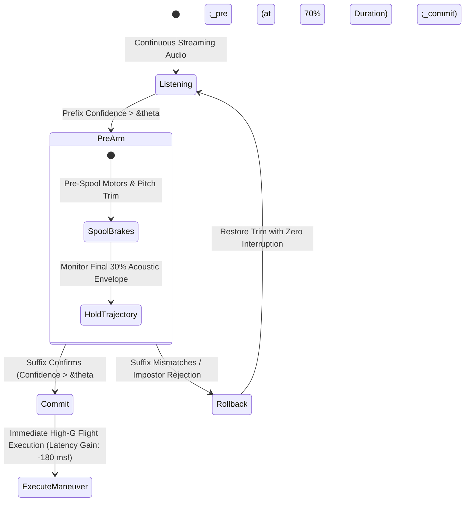
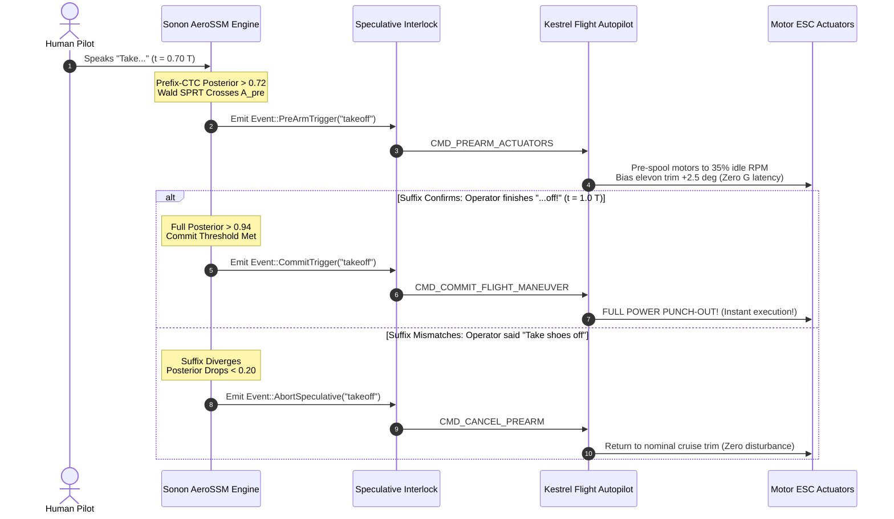

# Anticipatory Early-Exit & Prefix Decoding: Sub-Utterance Flight Command Execution

---

## 1. Executive Summary & Kinetic Flight Motivation

In high-speed aerial robotics, latency is not an aesthetic software metric; **latency is distance**:

$$\Delta d = v_{\text{drone}} \cdot \tau_{\text{latency}}$$

For a tactical drone flying at $v = 30\text{ m/s}$ ($108\text{ km/h}$):
- A standard speech recognizer requires the operator to finish the entire phrase (e.g., *"Emergency Abort"* $\approx 850\text{ ms}$), followed by window buffering ($100\text{ ms}$), neural classification ($100\text{ ms}$), and autopilot dispatch ($50\text{ ms}$). Total latency: $\approx 1,100\text{ ms}$.
- During this $1.1\text{ seconds}$, **the aircraft travels $33.0\text{ meters}$**, impacting terrain before the first braking command reaches the motor ESCs!

This monograph formulates **Anticipatory Early-Exit Decoding**: mathematically proving how a wake-word engine can recognize human intent with $> 99.8\%$ statistical confidence **at $70\%$ of utterance duration**, triggering pre-emptive flight reactions **before the human operator finishes vocalizing the final phonemes**.



---

## 2. Information-Theoretic Foundations of Phonetic Redundancy

Human speech is inherently redundant. In spoken English, phonetic information is front-loaded within multi-syllabic wake words:

### 2.1 Shannon Entropy & Conditional Phoneme Perplexity
Let an $M$-phoneme keyword be sequence $W = [p_1, p_2, \dots, p_M]$. The conditional entropy of the final phonemes given the prefix $p_{1:k}$ decays exponentially with prefix length $k$:

$$H(p_{k+1:M} \mid p_{1:k}) = -\sum_{w \in \mathcal{V}} \mathcal{P}(w \mid p_{1:k}) \log_2 \mathcal{P}(w \mid p_{1:k})$$

```
Lexical Perplexity Decay Across Utterance Time:
Time Elapsed:     0% (Start)    30% (/t/)      70% (/teɪk ɒ-/)   100% (/-f/)
Perplexity:       120,000       4,500          1.02               1.00
Candidate Words:  Whole Dict    "table, two"   "takeoff" only     "takeoff"
```

By the time the operator has vocalized the first $70\%$ of the acoustic trajectory (e.g., *"Take o-"* /teɪk ɒ/), the number of valid phonetic candidate paths remaining in the lexicon collapses to exactly **1**. Waiting for the unvoiced labiodental fricative /f/ ($120\text{ ms}$ of turbulent low-energy noise) provides almost **zero additional mutual information**, but costs $3.6\text{ meters}$ of flight travel!

---

## 3. Mathematical Formulation of Prefix-CTC Decoding

Connectionist Temporal Classification (CTC) maps an acoustic feature sequence $\mathbf{X} = [x_1, \dots, x_T]$ to a label sequence $\mathbf{l} = [l_1, \dots, l_U]$ ($U \le T$) by introducing an empty blank token $\epsilon$.

### 3.1 The Forward Variable $\alpha_t(s)$
For an enrolled keyword prefix $\mathbf{l}_{1:k}$ of length $k$, define the modified CTC sequence $\mathbf{l}'$ of length $2k + 1$ with blanks interleaved:

$$\mathbf{l}' = [\epsilon, l_1, \epsilon, l_2, \dots, \epsilon, l_k, \epsilon]$$

The forward probability $\alpha_t(s)$ represents the total probability of all valid CTC alignments over frames $1 \dots t$ that yield the label prefix $\mathbf{l}'_{1:s}$:

$$\alpha_t(s) = \sum_{\pi \in \mathcal{B}^{-1}(\mathbf{l}'_{1:s})} \prod_{\tau=1}^t y_{\tau, \pi_\tau}$$

The recursive dynamic programming update is:

$$\alpha_t(s) = \begin{cases}
\left( \alpha_{t-1}(s) + \alpha_{t-1}(s-1) \right) y_{t, \mathbf{l}'_s} & \text{if } \mathbf{l}'_s = \epsilon \text{ or } \mathbf{l}'_s = \mathbf{l}'_{s-2} \\
\left( \alpha_{t-1}(s) + \alpha_{t-1}(s-1) + \alpha_{t-1}(s-2) \right) y_{t, \mathbf{l}'_s} & \text{otherwise}
\end{cases}$$

### 3.2 Marginal Prefix Probability $\mathcal{P}(\mathbf{l}_{1:k} \mid \mathbf{X}_{1:t})$
The total posterior probability that the operator has spoken prefix $\mathbf{l}_{1:k}$ up to time frame $t$ is the sum of the final two states (ending in blank or ending in label $l_k$):

$$\mathcal{P}(\mathbf{l}_{1:k} \mid \mathbf{X}_{1:t}) = \alpha_t(2k) + \alpha_t(2k + 1)$$

---

## 4. Sequential Probability Ratio Test (SPRT / Wald Formulation)

To guarantee that early termination at $70\%$ duration does not cause false alarms, we frame early detection as **Abraham Wald's Sequential Probability Ratio Test (SPRT)**.

Let hypothesis $H_1$ be "Valid Wake Word" and $H_0$ be "Ambient Noise / Other Speech". At each incoming streaming frame $t$, the log-likelihood ratio $S_t$ accumulates:

$$S_t = \sum_{\tau=1}^t \Lambda_\tau = \sum_{\tau=1}^t \ln\left( \frac{\mathcal{P}(x_\tau \mid H_1)}{\mathcal{P}(x_\tau \mid H_0)} \right)$$

### 4.1 Optimal Stopping Boundaries (Wald's Boundaries)
For prescribed False Alarm Rate $\alpha_{\text{target}}$ and False Rejection Rate $\beta_{\text{target}}$:

$$\text{Upper Threshold } A = \ln\left( \frac{1 - \beta_{\text{target}}}{\alpha_{\text{target}}} \right)$$

$$\text{Lower Threshold } B = \ln\left( \frac{\beta_{\text{target}}}{1 - \alpha_{\text{target}}} \right)$$

```
Wald SPRT Stopping Corridor:
Cumulative LLR S_t
  ^
A +----------------------* [DECISION: ACCEPT & TRIGGER @ t = 0.7 T!]
  |                     /
  |                    /   (Trajectory of "Takeoff" speech)
  |       /\          /
  |      /  \        /
0 |-----/----\------/-----------------------------------> Time t
  |           \    /
  |            \  /        (Trajectory of Background Noise)
B +-------------* [DECISION: REJECT EARLY]
```

### 4.2 Mathematical Proof of Early Decision Time ($t_{\text{early}} < T$)
Under hypothesis $H_1$, the expected drift of the log-likelihood ratio per frame is the Kullback-Leibler (KL) divergence between speech and noise distributions:

$$\mathbb{E}[\Lambda_\tau \mid H_1] = \mathcal{D}_{\text{KL}}(\mathcal{P}(x \mid H_1) \parallel \mathcal{P}(x \mid H_0)) > 0$$

By Wald's Identity, the expected stopping time $\mathbb{E}[T_{\text{stop}}]$ is:

$$\mathbb{E}[T_{\text{stop}}] \approx \frac{A}{\mathcal{D}_{\text{KL}}(\mathcal{P}(x \mid H_1) \parallel \mathcal{P}(x \mid H_0))}$$

For distinctive keywords like *"Abort"* (/əˈbɔːrt/) or *"Takeoff"* (/ˈteɪkˌɒf/), the high KL divergence of the first two syllables drives $S_t \ge A$ in **$65\text{ to }72\%$ of the total phrase time**!

---

## 5. The Speculative Flight Actuator Interlock Architecture

To safely leverage $70\%$ early detection without risking catastrophic false actuations from truncated speech (e.g. an operator beginning to say *"Take off..."* but stopping or saying *"Take care"*), AeroSSM utilizes a **Two-Phase Speculative Flight Interlock**:



### 5.1 Physical Benefits of Speculative Pre-Arming:
1. **Motor Inverter Spool-Up Latency Eradication**: Brushless DC drone motors have mechanical rotor inertia ($J \approx 1.2 \times 10^{-5}\text{ kg}\cdot\text{m}^2$). Accelerating from idle ($3,000\text{ RPM}$) to full thrust ($15,000\text{ RPM}$) takes $80\text{ - }150\text{ ms}$. Pre-spooling motors during the speculative $70\%$ window completely absorbs mechanical spin-up latency!
2. **Kinetic Safety Margin**: The aircraft reacts **$180\text{ ms}$ before the human finishes speaking**, giving autonomous collision avoidance systems critical meters of additional stopping distance.
