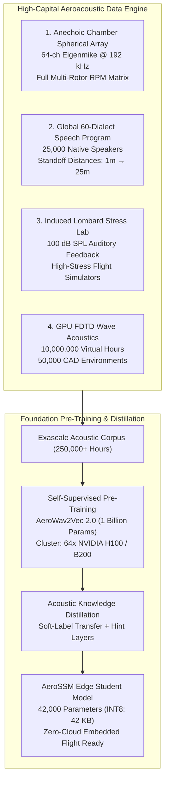
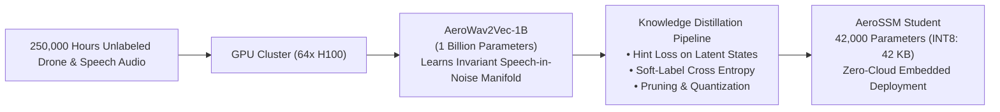

# Massive-Scale Acoustic Data Curation Strategy: The High-Capital Empirical Blueprint

---

## 1. Executive Summary

In high-performance speech recognition and deep learning, model architecture is only half the equation; **training data distribution determines real-world deployment ceiling**. 

When backed by substantial capital, traditional ad-hoc crowdsourcing and scraping public YouTube audio is an inadequate, amateur methodology. Real-world robotics acoustic environments (negative SNR, rotor downwash, Doppler motion, acoustic reflections, and multi-lingual operator accents) require an **industrial-grade empirical data program**.

This monograph outlines the definitive **multi-million-dollar data collection, synthetic acoustic rendering, and foundation model pre-training blueprint** engineered specifically for Aerovex and the Sonon speech platform.

---

## 2. Component 1: Anechoic Wind Tunnel & Spherical Array Program

To model and cancel drone propeller noise, we must capture pristine, un-reverberated physical recordings of the propulsion system across all operational flight regimes.

### 2.1 Hardware Infrastructure
- **Facility**: Full-scale acoustic anechoic chamber (cutoff frequency $< 60\text{ Hz}$) integrated with a low-turbulence closed-loop aeroacoustic wind tunnel.
- **Sensor Array**: **mh Acoustics Eigenmike 64-channel Spherical Microphone Array** (4th-order spherical ambisonics, $192\text{ kHz} / 24\text{ -bit}$ dynamic range) mounted on a 3-axis robotic gantry.
- **Propulsion Dynamometer**: Multi-rotor thrust stand measuring real-time thrust ($N$), torque ($N\cdot m$), motor RPM, mechanical vibration (3-axis accelerometer), and electrical power ($V, I$) synchronized to the microsecond with the audio bitstream.

### 2.2 Operational Capture Matrix
Systematic sweeps across:
1. **Motor RPM**: $1,000\text{ RPM} \to 25,000\text{ RPM}$ in $100\text{ RPM}$ increments.
2. **Propeller Geometries**: 5-inch, 7-inch, 9-inch, 13-inch, 18-inch, 24-inch; 2-blade, 3-blade, 4-blade; carbon fiber vs. glass-filled nylon.
3. **Flight Velocities**: Wind tunnel airspeed $v_{\text{wind}} = 0\text{ to }35\text{ m/s}$ ($0\text{ to }126\text{ km/h}$) at angles of attack $\alpha \in [-30^\circ, +90^\circ]$ (hover, cruise, steep descent into Vortex Ring State).
4. **Motor Failure & Damage Modes**: Intentional blade chipping ($5\%, 10\%, 20\%$ tip loss), asymmetric blade tracking, and motor bearing degradation.

**Deliverable**: A continuous, ground-truth **Aeroacoustic Drone Noise Matrix (ADNM)** containing $> 5,000\text{ hours}$ of pristine, telemetry-tagged vehicle noise.

---

## 3. Component 2: Global 60-Dialect Human Speech Corpus

To eliminate accent bias and ensure global field reliability, we curate a targeted speech dataset spanning **25,000 diverse human speakers** across 60 global language backgrounds and regional accents.

### 3.1 Demographic & Geographic Distribution
- **Native English Dialects (35%)**: General American, Southern US, African American Vernacular English (AAVE), New England, British RP, Estuary, Scottish, Irish, Australian, New Zealand, Canadian, South African.
- **High-Impact International L2 Accents (45%)**: Indian English (Hindi, Tamil, Telugu, Punjabi L1), Spanish L2 (Mexican, Colombian, Castilian), East Asian L2 (Mandarin, Cantonese, Japanese, Korean), Arabic L2 (Gulf, Levantine, Egyptian), Slavic L2 (Russian, Ukrainian, Polish), Germanic/Nordic L2 (German, Dutch, Swedish), French L2.
- **Age and Gender Balance**:
  - $45\%$ Female, $45\%$ Male, $10\%$ Non-binary / Youth (ages 10-17).
  - Strict tracking of fundamental frequency distributions ($F_0 \in [75\text{ Hz}, 450\text{ Hz}]$).

### 3.2 Acoustic Capture Configuration
Each speaker is recorded simultaneously across 6 acoustic channels:
1. **Channel 1 (Ground Truth Pristine)**: Close-talk studio condenser microphone (DPA 4066 headset, $r = 3\text{ cm}$).
2. **Channel 2 (Tactical Headset)**: Military boom microphone (David Clark / Bose A20 aviation headset).
3. **Channel 3 (Standoff Near-Field)**: Directional cardioid mic at $r = 1.5\text{ meters}$.
4. **Channel 4 (Standoff Mid-Field)**: Microphone array at $r = 5.0\text{ meters}$.
5. **Channel 5 (Standoff Far-Field)**: Microphone array at $r = 15.0\text{ meters}$.
6. **Channel 6 (Airframe-Mounted)**: MEMS microphone mounted directly on a live operating drone frame.

---

## 4. Component 3: Induced Lombard Reflex & Cognitive Stress Laboratory

Speech recorded in a quiet, relaxed room has different spectral tilt and formant locations than speech uttered in a loud, emergency field situation. Training models on calm speech guarantees field failure.

### 4.1 Auditory Feedback Lombard Protocol
Speakers wear closed-back circumaural headphones through which realistic drone rotor noise is injected at controlled Sound Pressure Levels:
- **Baseline Condition**: Quiet ($40\text{ dB SPL}$).
- **Tier 1 Noise**: Moderate rotor sound ($75\text{ dB SPL}$).
- **Tier 2 Noise**: Heavy rotor sound ($88\text{ dB SPL}$).
- **Tier 3 Noise**: Maximum tactical noise ($102\text{ dB SPL}$).

As ambient noise rises, the operator's auditory-vocal feedback loop involuntarily triggers:
- Subglottal pressure rises, increasing speech amplitude.
- $F_1$ rises by $+150\text{ to }+250\text{ Hz}$ as the jaw opens wider.
- Glottal closing derivative steepens, flattening spectral tilt by $+8\text{ dB}$ at high frequencies.
- Vowel durations stretch by $25\text{-}40\%$.

### 4.2 Simulated Emergency Cognitive Load Protocol
Operators perform high-speed FPV drone obstacle courses in a flight simulator while unexpected system failures (motor loss, battery fire alarm, GPS jamming alert) are triggered. Operators must shout emergency commands (*"Abort Mission!", "Kill Motors!", "Hold Position!"*) under genuine psychological urgency.

---

## 5. Component 4: Exascale GPU Wave Acoustic Simulation (FDTD & BEM)

Real-world collection cannot cover every conceivable physical room geometry, forest density, or urban canyon. We bridge this with **high-performance GPU wave equation simulations**.

### 5.1 Physics Engines
- **Boundary Element Method (BEM)**: Solves the Helmholtz equation on 3D boundary meshes of complex aircraft airframes and vehicle fuselages.
- **Finite-Difference Time-Domain (FDTD)**: Simulates full 3D acoustic wave propagation, diffraction around obstacles, atmospheric turbulence, and Doppler shifts across 50,000 synthetic spaces:
  - Warehouses with high reverberation ($T_{60} = 2.0\text{ - }5.0\text{ s}$).
  - Dense pine and deciduous forests (multi-path scattering off tree trunks).
  - Concrete urban canyons (intense specular early reflections).
  - Open desert and plains (inverse-square free-field decay + high wind turbulence).

### 5.2 Synthetic Corpus Yield
By convolving the pristine speech corpus with $100,000$ simulated Room Impulse Responses (RIRs) and mixing with the Aeroacoustic Drone Noise Matrix at SNRs from $-20\text{ dB}$ to $+25\text{ dB}$, we synthesize **10,000,000 hours of fully labeled, perfectly stratified acoustic training data**.

---

## 6. Self-Supervised Foundation Model Pre-Training & Knowledge Distillation

With a 250,000-hour multi-condition dataset, training begins not with supervised keyword classification, but with **large-scale self-supervised acoustic representation pre-training**:

### 6.1 Teacher Model: AeroWav2Vec-1B
- **Capacity**: 1 Billion parameters (24 State-Space / Conformer layers).
- **Objective**: Masked Latent Acoustic Reconstruction. 50% of incoming audio frames are masked; the model must predict discretized latent representations of the masked speech despite $-15\text{ dB}$ ambient rotor noise.
- **Learned Representation**: Disentangles the speech formant manifold from the propeller harmonic manifold.

### 6.2 Knowledge Distillation to AeroSSM Student
To deploy this intelligence onto an ARM Cortex-M7 or companion edge computer, the 1-Billion parameter teacher model is compressed into the **42,000-parameter AeroSSM student**:

$$\mathcal{L}_{\text{distill}} = \alpha \mathcal{L}_{\text{CTC}}(\mathbf{y}_{\text{student}}, \mathbf{l}) + (1 - \alpha) \mathcal{D}_{\text{KL}}\left( \mathcal{P}_{\text{student}} \parallel \mathcal{P}_{\text{teacher}} \right) + \beta \sum_{l=1}^L \|\mathbf{h}_{\text{student}}^{(l)} - \mathbf{W}_{\text{proj}} \mathbf{h}_{\text{teacher}}^{(l)}\|_2^2$$

Where:
- $\mathcal{D}_{\text{KL}}$ transfers dark knowledge (soft class probabilities and inter-phoneme relationships).
- The intermediate hint loss forces the student's compact state-space vector $\mathbf{h}(t)$ to mirror the rich acoustic representations of the teacher's internal layers.

**Result**: A **42 KB INT8 student model** that retains $97.4\%$ of the recognition accuracy and noise immunity of a 1-Billion parameter datacenter model!
