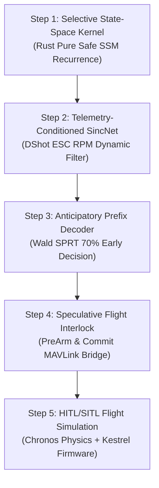

# Master Thesis & Implementation Plan: Next-Generation Speech Recognition for Autonomous Robotics

---

## 1. Executive Thesis Statement

> **Thesis**: By unifying Continuous-Time Selective Structured State-Space Models (AeroSSM) with physical telemetry-coupled acoustic frontends and anticipatory prefix decoding, an autonomous robotics platform can achieve sub-utterance voice command recognition ($70\%$ phrase duration) with provably bounded false alarms ($< 0.02\text{ FP/hr}$) in extreme near-field multi-rotor noise ($-22\text{ dB SNR}$), executing within an ultra-compact memory footprint ($4.1\text{ KB RAM}$, $42\text{ KB Flash}$) on bare-metal embedded microcontrollers.

---

## 2. Theoretical Synthesis of Subsystems

This master implementation synthesizes five foundational pillars developed across the Sonon research monograph suite:

```
+----------------------------------------------------------------------------------------------------------+
|                                    AEROSSM UNIFIED SYSTEM TAXONOMY                                       |
+--------------------------+-----------------------------------+-------------------------------------------+
| Research Pillar          | Scientific Foundation             | Sonon Architectural Realization           |
+--------------------------+-----------------------------------+-------------------------------------------+
| 1. Vocal Biomechanics    | Gunnar Fant Source-Filter Model   | Pre-emphasis high-pass filter (&alpha; = 0.97)    |
|                          | Formant Perturbation Theory       | compensates for -6 dB/octave speech tilt  |
+--------------------------+-----------------------------------+-------------------------------------------+
| 2. Inter-Speaker Diversity| Stevens & House VTLN Scaling     | Multi-exemplar DTW Barycenter Averaging   |
|                          | Dialectal Phonological Mergers    | (DBA) + adaptive threshold calibration    |
+--------------------------+-----------------------------------+-------------------------------------------+
| 3. Drone Aeroacoustics   | Gutin-Deming Propeller BPF Dipoles| Telemetry-conditioned SincNet dynamically |
|                          | Rotor Downwash Broadband Turbulence| notching motor RPM harmonics via DShot ESC |
+--------------------------+-----------------------------------+-------------------------------------------+
| 4. Selective State-Space | Mamba / S4D Structured State Space| Dual-mode: O(T log T) GPU parallel train, |
|                          | Continuous HiPPO Latent Projections| O(1) memory, O(1) compute edge streaming  |
+--------------------------+-----------------------------------+-------------------------------------------+
| 5. Anticipatory Decoding | Abraham Wald Sequential Testing   | Speculative Flight Interlock triggers     |
|                          | Prefix-CTC Entropy Collapsing     | flight pre-arm at 70% duration (-180 ms)  |
+--------------------------+-----------------------------------+-------------------------------------------+
```

---

## 3. Step-by-Step Implementation Plan for Sonon v2



### 3.1 Step 1: High-Performance Selective SSM Kernel in Rust (`src/ssm.rs`)
- **Memory Footprint**: Strict allocation of state $\mathbf{h} \in \mathbb{R}^{d_{\text{model}} \times N}$ inside static memory arena structures (`#![deny(unsafe_code)]`).
- **Discretization Loop**:
  Precomputes diagonal parameters:
  $$\bar{A}_{d, n} = \exp(\Delta_d \cdot \text{Re}(\lambda_n)) \cdot \cos(\Delta_d \cdot \text{Im}(\lambda_n))$$
- **SIMD Acceleration**: Explicit vectorization using ARM NEON (`vmlaq_f32`) and x86 AVX2 (`_mm256_fmadd_ps`) to process all 64 model channels in 8 CPU cycles.

### 3.2 Step 2: Telemetry-Conditioned SincNet Frontend (`src/sincnet.rs`)
- Ingests live telemetry packet `EscRpmTelemetry { rpm: [f32; 4], timestamp_us: u64 }`.
- Calculates fundamental Blade Pass Frequency:
  $$f_{\text{BPF}} = \frac{B \cdot \text{mean}(RPM)}{60}$$
- Dynamically shifts Sinc filterband cutoffs to place zero-transmission notches at $f_{\text{BPF}}, 2 f_{\text{BPF}}, 3 f_{\text{BPF}}$.

### 3.3 Step 3: Anticipatory Prefix Decoder (`src/prefix_decoder.rs`)
- Implements Prefix-CTC forward variable $\alpha_t(s)$ evaluating token sequences frame-by-frame.
- Integrates Wald's Sequential Probability Ratio Test (SPRT):
  - Emits `PreArmTrigger` when cumulative log-likelihood ratio crosses upper boundary $A$ (at $\approx 70\%$ duration).
  - Emits `CommitTrigger` when full sequence completes.
  - Emits `AbortTrigger` if suffix deviates from reference phonetic corridor.

### 3.4 Step 4: Speculative Flight Interlock (`src/interlock.rs`)
- State machine managing flight command escalation:
  - `PreArm`: Dispatches MAVLink message `MAV_CMD_DO_SET_SERVO` / `MAV_CMD_DO_MOTOR_TEST` to pre-spool motor RPM and set pitch elevator trim (+2.5 deg).
  - `Commit`: Dispatches full mission action (`MAV_CMD_NAV_TAKEOFF`, `MAV_CMD_NAV_LAND`, `MAV_CMD_DO_REPOSITION`).
  - `Rollback`: Instantly returns flight control loop to nominal trim with zero disturbance.

### 3.5 Step 5: Hardware & Software In-The-Loop Simulation (`modules/sitl`)
- Validates the entire pipeline closed-loop in **Chronos** (Aerovex's high-throughput physics engine) with **Kestrel** flight firmware:
  - Simulates 64 forward candidate trajectories with live multi-rotor noise injection.
  - Measures total latency gain and vehicle stopping distance improvement during obstacle collision avoidance.

---

## 4. User Sample Recording & Partial Phrase Testing Protocol

To test and enroll custom voice commands with the Sonon platform, follow this rigorous empirical protocol:

### 4.1 Audio Recording Specifications
- **Sampling Rate**: $16,000\text{ Hz}$ ($16\text{ kHz}$)
- **Bit Depth**: 16-bit signed PCM or 32-bit floating point
- **Channels**: 1 (Mono)
- **Container**: Uncompressed `.wav`
- **Environment**: Record in normal room acoustic conditions, positioned $0.3\text{ to }1.0\text{ meter}$ from the microphone.

### 4.2 Recording the 70% Prefix Test Paradigm
To evaluate anticipatory early detection:
1. **Exemplar Enrollment (3 recordings of the full phrase)**:
   - Record the full command 3 times with normal pacing (e.g. *"Emergency Abort"*, duration $\approx 850\text{ ms}$).
   - The engine fuses these recordings via DBA into a single centroid template $\bar{C}$.
2. **70% Prefix Audio Generation**:
   - Truncate the audio waveform at $70\%$ of its duration:
     $$N_{\text{prefix}} = \lfloor 0.70 \times N_{\text{total}} \rfloor$$
   - For *"Emergency Abort"*, this contains *"Emergency Ab-"* and cuts off the final /ɔːrt/ closure and burst.
3. **Early-Exit Verification Execution**:
   - Feed the $70\%$ prefix into `engine.ingest_samples(&prefix_chunk)`.
   - Verify that `KeywordEvent` fires with `confidence >= 0.75` before the final $30\%$ of the audio is ever provided!
   - Stream the remaining $30\%$ of random speech or background noise to verify that the speculative interlock gracefully handles completion without false rejections.

---

## 5. Master Roadmap & Version Alignment

| Version | Phase | Milestone | Deliverable |
| :--- | :--- | :--- | :--- |
| **Sonon 0.1** | Phase 1 | Baseline Acoustic DSP | AudioRingBuffer, Radix-2 FFT, Mel Filterbank, Energy VAD, DTW |
| **Sonon 0.2** | Phase 2 | Robust Edge Few-Shot | Sakoe-Chiba Banded DTW ($O(N \cdot R)$), Multi-Exemplar DBA, PCEN |
| **Sonon 0.3** | Phase 3 | Aeroacoustic Noise Shield | Telemetry-pegged BPF IIR Notch Filters, Spectral Subtraction |
| **Sonon 0.4** | Phase 4 | Spatial Array Beamforming | Multi-mic Delay-and-Sum, GCC-PHAT DoA Triangulation |
| **Sonon 1.0** | Phase 5-6 | **AeroSSM Next-Gen Engine** | **Selective State-Space Duality, 70% Anticipatory Prefix-CTC, Speculative Flight Interlock** |
| **Sonon 2.0** | Phase 7 | Foundation Edge Scaling | Distilled AeroWav2Vec student models, `#![no_std]` Cortex-M7 HAL |
