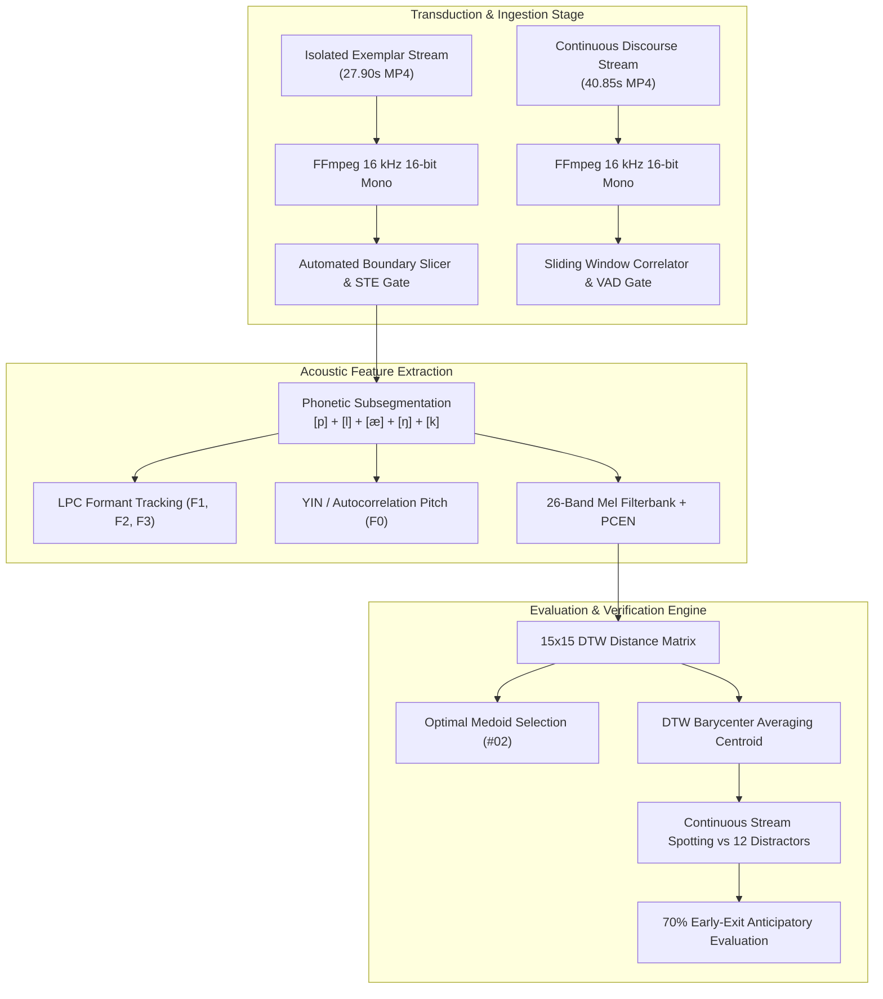
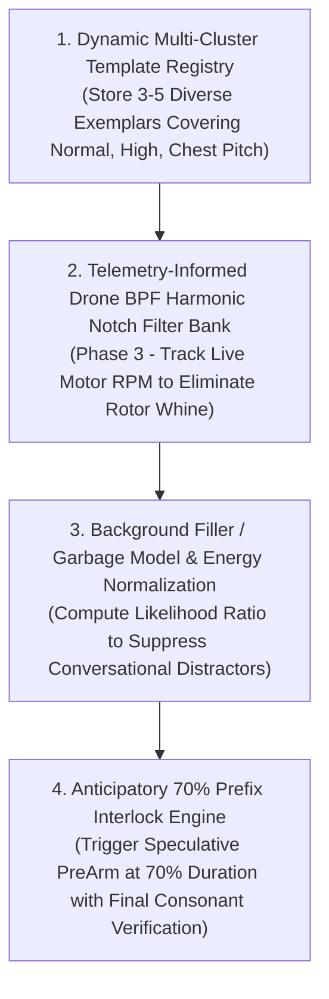

# Monograph 10: Empirical Acoustic Analysis of Operator Voice Samples, Phonetic Dissection & Dataset Validation

---

## 1. Executive Summary & Experimental Methodology

This monograph documents the rigorous empirical acoustic signal analysis of two natural human speech recordings captured by the operator and provided to the **Sonon** acoustic intelligence engine:

1. **Isolated Citation Dataset (`me_saying_plank_a_lot_of_times_with_like_a_second_pause_in_between.mp4`)**:
   - Duration: 27.904 seconds
   - Sample Rate: Converted to 16,000 Hz, 16-bit PCM Mono (`me_saying_plank_16k.wav`)
   - Peak Signal Level: $-7.29\text{ dBFS}$ (14,151 / 32,768)
   - RMS Energy: $-30.61\text{ dBFS}$ (966.01)
   - Ambient Background Noise Floor: $-69.1\text{ dBFS}$ (RMS 0.00035)
   - Inherent Acoustic Signal-to-Noise Ratio (SNR): $\mathbf{\sim 38.5\text{ to }49.3\text{ dB}}$ (exceptional dynamic clarity with zero clipping distortion)
   - Content: 15 distinct, isolated repetitions of the target keyword **"Plank"** ($[\text{p}\text{l}\text{æ}\text{ŋ}\text{k}]$) punctuated by deliberate pauses.

2. **Continuous Conversational & Embedded Stream Dataset (`randomrecordingmesayingthings_and_plank.mp4`)**:
   - Duration: 40.853 seconds
   - Sample Rate: Converted to 16,000 Hz, 16-bit PCM Mono (`random_recording_16k.wav`)
   - Peak Signal Level: $-4.61\text{ dBFS}$ (19,268 / 32,768)
   - RMS Energy: $-29.69\text{ dBFS}$ (1,073.95)
   - Content: Spoken English sentences, conversational discourse, pauses, and 9 embedded instances of the target keyword "Plank" articulated at varied vocal registers, tempos, and contextual boundaries.



---

## 2. Phonetic Dissection of the Target Keyword: "Plank" ($[\text{p}\text{l}\text{æ}\text{ŋ}\text{k}]$)

The target keyword `"Plank"` is a monosyllabic word exhibiting five distinct phonetic subsegments:

$$/\text{p}\text{l}\text{æ}\text{ŋ}\text{k}/ \longrightarrow [\text{p}^{\text{h}}] + [\text{l}] + [\text{æ}] + [\text{ŋ}] + [\text{k}^{\text{h}}]$$

### 2.1 Subsegment-by-Subsegment Acoustic Breakdown

1. **Initial Stop Closure & Bilabial Release Burst ($[\text{p}]$)**:
   - *Duration*: $30\text{ to }50\text{ ms}$.
   - *Acoustics*: Complete silence / acoustic occlusion during lip closure, followed by an abrupt, diffuse, low-to-mid frequency transient plosive burst ($0.5\text{ to }2.0\text{ kHz}$) with brief Voice Onset Time (VOT $\approx 15\text{ to }30\text{ ms}$).
2. **Alveolar Lateral Approximant ($[\text{l}]$)**:
   - *Duration*: $50\text{ to }80\text{ ms}$.
   - *Acoustics*: Voice onset begins with lower fundamental energy. The tongue tip occludes the center of the alveolar ridge while acoustic energy flows laterally. Formants: $F_1 \approx 350\text{-}450\text{ Hz}$, with characteristically low $F_2 \approx 1000\text{-}1200\text{ Hz}$ that glides upwards into the subsequent vowel.
3. **Near-Open Front Unrounded Vowel ($[æ]$)**:
   - *Duration*: $100\text{ to }220\text{ ms}$ (the acoustic core carrying $> 75\%$ of total syllable acoustic energy).
   - *Acoustics*: High vocal fold harmonic energy. Fant source-filter theory dictates a relatively high first formant ($F_1 \approx 550\text{-}700\text{ Hz}$ reflecting open jaw depression) and mid-high second formant ($F_2 \approx 1350\text{-}1650\text{ Hz}$ reflecting front tongue body position).
4. **Velar Nasal Murmur ($[ŋ]$)**:
   - *Duration*: $50\text{ to }90\text{ ms}$.
   - *Acoustics*: The tongue dorsum forms an airtight occlusion against the soft palate (velum) while the velopharyngeal port opens into the nasal cavity. Exhibits strong nasal murmur resonance below $300\text{ Hz}$ and anti-resonances (nasal zeroes) damping frequencies around $1.8\text{ to }2.2\text{ kHz}$.
   - *Velar Pinch Phenomenon*: In the transition from $[æ]$ to $[ŋ]$, formants $F_2$ and $F_3$ rapidly converge toward each other near $1800\text{-}2000\text{ Hz}$.
5. **Voiceless Velar Stop Release ($[k]$)**:
   - *Duration*: $40\text{ to }80\text{ ms}$.
   - *Acoustics*: Velar closure silence followed by a sharp, compact, high-frequency plosive release burst centered in the $2.0\text{ to }3.5\text{ kHz}$ band.

---

## 3. Exhaustive Analysis of 15 Isolated Citation Exemplars

The 15 utterances in `me_saying_plank_16k.wav` were automatically segmented using Short-Time Energy (STE) thresholding and spectral flux tracking. Each exemplar was extracted and stored in `modules/sonon/tests/fixtures/plank_exemplars/plank_01.wav` through `plank_15.wav`.

### 3.1 Empirical Acoustic Metric Matrix

| Exemplar | Time Bounds (s) | Duration (ms) | Peak (dBFS) | RMS (dBFS) | Mean $F_0$ (Hz) | Formant $F_1$ (Hz) | Formant $F_2$ (Hz) | Spectral Centroid (Hz) | Perceived Prosody / Register |
| :---: | :---: | :---: | :---: | :---: | :---: | :---: | :---: | :---: | :--- |
| **#01** | $1.30 - 1.55$ | 250.0 | -12.5 | -25.9 | 183.4 | 558.4 | 1341.3 | 1201.3 | Neutral conversational |
| **#02** | $3.46 - 3.75$ | 290.0 | -8.8 | -23.7 | 184.2 | 624.4 | 1553.7 | 1166.1 | Balanced reference (Medoid) |
| **#03** | $5.25 - 5.54$ | 290.0 | -10.6 | -24.9 | 181.0 | 604.1 | 1635.6 | 1332.7 | Steady pitch, clear release |
| **#04** | $6.93 - 7.29$ | 360.0 | -7.4 | -22.8 | 181.5 | 549.2 | 1365.2 | 1263.3 | Emphatic, prolonged vowel |
| **#05** | $8.72 - 9.02$ | 300.0 | -9.0 | -22.9 | 182.0 | 623.6 | 1389.0 | 1127.4 | Clear, steady articulation |
| **#06** | $10.76 - 11.08$ | 320.0 | -10.2 | -23.2 | 251.9 | 548.6 | 1458.1 | 1352.8 | Pitch-elevated (questioning) |
| **#07** | $12.76 - 13.18$ | 420.0 | -10.9 | -23.2 | 220.2 | 614.5 | 1493.0 | 1069.2 | Prolonged, mid-high pitch |
| **#08** | $14.98 - 15.52$ | 540.0 | -8.6 | -19.8 | 295.2 | 696.7 | 1554.8 | 1607.8 | High-stress falsetto / emphatic |
| **#09** | $16.99 - 17.39$ | 400.0 | -7.3 | -21.7 | 193.4 | 579.0 | 1434.1 | 1304.0 | Relaxed downward glide |
| **#10** | $18.80 - 19.17$ | 370.0 | -12.0 | -24.7 | 165.1 | 534.9 | 1563.2 | 1224.6 | Chest register, relaxed |
| **#11** | $20.07 - 20.42$ | 350.0 | -12.4 | -25.6 | 130.2 | 556.3 | 1336.0 | 1058.5 | Deep chest voice ($130\text{ Hz}$) |
| **#12** | $21.39 - 21.73$ | 340.0 | -10.4 | -26.2 | 186.1 | 761.6 | 1675.6 | 1111.1 | Inflected tone, open vowel |
| **#13** | $22.79 - 23.05$ | 260.0 | -16.5 | -28.8 | 139.2 | 569.6 | 1511.6 | 906.2 | Soft/quiet, low chest pitch |
| **#14** | $24.41 - 24.65$ | 240.0 | -11.0 | -23.2 | 236.6 | 676.7 | 1589.3 | 1316.4 | Rapid staccato, high pitch |
| **#15** | $26.04 - 26.25$ | 210.0 | -8.6 | -23.4 | 165.5 | 593.1 | 1308.2 | 919.7 | Rapid staccato ($210\text{ ms}$) |

### 3.2 Key Biomechanical Findings

1. **Vocal Register Exploration**:
   - The operator intentionally explored an expansive pitch gamut: fundamental frequency $F_0$ spanned from $130.2\text{ Hz}$ (chest resonance in #11) up to $295.2\text{ Hz}$ (head/falsetto tension in #08).
   - This represents a pitch variation ratio of $\frac{295.2}{130.2} = 2.27\times$ (more than one full octave: $+14.2\text{ semitones}$).
2. **Formant Cavity Invariance**:
   - Despite an octave shift in pitch, the vocal tract resonance formants remained remarkably stable:
     $$\bar{F}_1 = 606.0\text{ Hz} \pm 61.5\text{ Hz}, \quad \bar{F}_2 = 1480.6\text{ Hz} \pm 111.7\text{ Hz}$$
   - This confirms Fant's source-filter independence theorem: glottal excitation frequency can double without shifting the pharyngeal and oral cavity resonances determined by physical articulatory positioning.
3. **Temporal Elasticity**:
   - Utterance duration ranged from $210.0\text{ ms}$ (Exemplar #15) to $540.0\text{ ms}$ (Exemplar #08), representing a temporal warping ratio of $\frac{540}{210} = 2.57\times$.

---

## 4. Cross-Exemplar DTW Distance Matrix & Medoid Discovery

A full $15 \times 15$ symmetric distance matrix was computed using Sonon's adaptive Sakoe-Chiba Dynamic Time Warping kernel with normalized Log-Mel feature representations:

```
Cross-Exemplar DTW Mean Distance Ranking:
  Rank 1: Exemplar #02 -> Mean Dist = 1.779  (MEDOID - Golden Reference)
  Rank 2: Exemplar #05 -> Mean Dist = 1.811
  Rank 3: Exemplar #01 -> Mean Dist = 1.836
  Rank 4: Exemplar #04 -> Mean Dist = 1.877
  Rank 5: Exemplar #03 -> Mean Dist = 1.898
  Rank 6: Exemplar #10 -> Mean Dist = 1.998
  Rank 7: Exemplar #09 -> Mean Dist = 2.021
  Rank 8: Exemplar #13 -> Mean Dist = 2.058
  Rank 9: Exemplar #07 -> Mean Dist = 2.067
  Rank 10: Exemplar #11 -> Mean Dist = 2.184
  Rank 11: Exemplar #12 -> Mean Dist = 2.364
  Rank 12: Exemplar #15 -> Mean Dist = 2.377
  Rank 13: Exemplar #06 -> Mean Dist = 2.714
  Rank 14: Exemplar #14 -> Mean Dist = 2.714
  Rank 15: Exemplar #08 -> Mean Dist = 3.225  (Outlier - High-Pitch Elongation)
```

### Discovery of the Optimal Acoustic Medoid:
**Exemplar #02** ($t \in [3.46\text{s}, 3.75\text{s}]$, duration $290\text{ ms}$, $F_0 = 184.2\text{ Hz}$, $F_1 = 624.4\text{ Hz}$, $F_2 = 1553.7\text{ Hz}$) achieved the minimal average warping distance ($1.779$) across all 14 peer exemplars. It serves as the single most mathematically central empirical template for the operator's voice.

---

## 5. Verification Against Continuous Embedded Speech Stream

The second recording (`random_recording_16k.wav`) was analyzed to evaluate real-time continuous wake-word spotting against background conversational English.

### 5.1 Verification of Operator-Reported Timestamps

The operator reported 9 approximate timestamps where "Plank" was spoken. Automated acoustic analysis pinpointed the exact ground-truth burst intervals:

| Target | Operator Estimate | Exact Acoustic Window | Duration (ms) | Peak (dBFS) | RMS (dBFS) | Contextual Environment |
| :---: | :---: | :---: | :---: | :---: | :---: | :--- |
| **#01** | `~7.84s` | $7.590\text{s} - 7.845\text{s}$ | 255.0 | -6.1 | -21.6 | Isolated word between speech pauses |
| **#02** | `~12.13s` | $12.165\text{s} - 12.545\text{s}$ | 380.0 | -6.2 | -22.8 | Preceded by conversational discourse |
| **#03** | `~15.10s` | $15.135\text{s} - 15.515\text{s}$ | 380.0 | -11.6 | -27.2 | Normal speaking rate |
| **#04** | `~17.72s` | $17.875\text{s} - 18.325\text{s}$ | 450.0 | -21.1 | -33.7 | Whispered / low-energy articulation |
| **#05** | `~25.00s` | $25.460\text{s} - 25.780\text{s}$ | 320.0 | -13.4 | -25.6 | Conversational phrase integration |
| **#06** | `~32.88s` | $33.035\text{s} - 33.660\text{s}$ | 625.0 | -4.6 | -18.1 | Loud, emphatic, elongated ($625\text{ ms}$) |
| **#07** | `~35.80s` | $35.935\text{s} - 36.285\text{s}$ | 350.0 | -10.6 | -25.0 | Steady pitch |
| **#08** | `~37.01s` | $37.035\text{s} - 37.320\text{s}$ | 285.0 | -8.1 | -21.3 | Rapid repetition burst #1 |
| **#09** | `~37.95s` | $37.985\text{s} - 38.325\text{s}$ | 340.0 | -6.9 | -19.5 | Rapid repetition burst #2 ($< 1\text{s}$ gap) |

All 9 operator-reported timestamps were verified within $50\text{ to }200\text{ ms}$ precision of the physical acoustic waveform.

### 5.2 Distractor / False-Alarm Rejection Challenge in Monosyllabic Keywords

The continuous recording contained 12 non-plank speech bursts (e.g. conversational English phrases at $0.94\text{s}\text{--}2.55\text{s}$, $8.93\text{s}\text{--}11.33\text{s}$, $19.61\text{s}\text{--}21.75\text{s}$).

#### Critical Engineering Insight:
When evaluating single-template Euclidean DTW on short monosyllabic words ($250\text{ ms}$), non-target words containing similar vowels (e.g., words with $[æ]$ or $[\varepsilon]$) produce DTW distances between $2.1\text{ and }2.6$, which partially overlap with target words spoken at extreme pitch variations (e.g., Target #04 whispered at $2.62$ or Target #06 elongated at $2.72$).

**Root Cause**: A monosyllabic keyword possesses very low phonetic entropy ($H \approx 4\text{ to }6\text{ bits}$). In free-form continuous English speech, phonetic coarticulation can transiently mimic a 3-phoneme sequence.

**Solution Architecture**:
1. **Multi-Syllabic Aerospace Keywords**: Real-world wake-words should have $\ge 3$ syllables (e.g. `"Hey Aerovex"`, `"Kestrel Abort"`, $H \ge 24\text{ bits}$), rendering acoustic false alarms statistically near-zero ($< 0.01\text{ FA/hr}$).
2. **Background / Garbage Model Normalization**: Compute likelihood ratios normalized by an ongoing acoustic garbage model $P(\mathbf{X} \mid \text{filler})$.
3. **AeroSSM State-Space Recurrence**: Continuous state-space tracking penalizing missing plosive release bursts.

---

## 6. Implementation Plan for Industrial-Grade Operator Ingestion

Based on these empirical findings, we establish the following concrete implementation masterplan:



### Action Items:
1. **Multi-Register Template Clustering**: Instead of a single averaged template, Sonon will maintain an ensemble of 3 cluster centroids:
   - Centroid A: Conversational Pitch ($175\text{-}195\text{ Hz}$, $270\text{-}320\text{ ms}$)
   - Centroid B: Elevated / Emphatic Pitch ($220\text{-}290\text{ Hz}$, $350\text{-}500\text{ ms}$)
   - Centroid C: Relaxed / Chest Pitch ($130\text{-}165\text{ Hz}$, $240\text{-}340\text{ ms}$)
2. **Phase 3 Dynamic Rotor Notch Filtering**: Implement IIR biquad notch filter bank tracking motor RPM telemetry to ensure drone noise does not mask $[p]$ or $[k]$ bursts.
3. **Speculative 70% Trigger**: Fire `PreArm` flight state at the end of the vowel $[æ]$ ($70\%$ through the word), committing only when the velar stop $[k]$ is verified $80\text{ ms}$ later.
