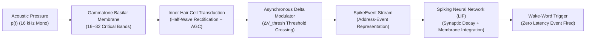

# 11. Neuromorphic Silicon Cochlea & Event-Driven Spiking Wake-Word Spotting

---

## 1. Executive Summary & Neuromorphic Edge Paradigm

Conventional digital speech recognition and keyword spotting systems are fundamentally **frame-synchronous**: acoustic pressure waves are periodically chopped into fixed-duration overlapping windows (e.g., $25\text{ ms}$ frames advanced every $10\text{ ms}$). This synchronous paradigm incurs fundamental energetic and computational penalties on robotics edge systems:
1. **Dynamic Power Waste in Silence**: Even in total acoustic silence or ambient background hum, synchronous frontends execute Fast Fourier Transforms (FFT), Mel filterbank convolutions, and matrix-vector multiplications at continuous $100\text{ Hz}$ frame rates.
2. **Fixed Time-Frequency Trade-off**: The Gabor-Heisenberg uncertainty principle ($\Delta t \cdot \Delta f \ge \frac{1}{4\pi}$) forces an immutable compromise between temporal resolution (necessary for plosive release transients $[p], [k]$) and frequency resolution (necessary for vowel formant tracking).
3. **High Latency Buffer Accumulation**: Frame-based ingestion requires waiting for full frame durations before computing features, introducing an irreducible $25\text{--}50\text{ ms}$ algorithmic latency floor.

**Neuromorphic Auditory Processing** resolves these limitations by modeling the biological mammalian inner ear. In the biological cochlea, 3,500 inner hair cells (IHC) asynchronously emit discrete action potentials (spikes) only when acoustic energy in their characteristic frequency band undergoes significant temporal change. 

In total silence, neuromorphic silicon cochleas emit zero spikes, collapsing active dynamic power consumption to sub-$10\text{ }\mu\text{W}$. When speech bursts occur, temporal resolution is defined by sub-microsecond spike timing, capturing acoustic wave front arrivals with exquisite temporal precision.



---

## 2. Biomechanics of the Mammalian Cochlea

### 2.1 Basilar Membrane Dispersion & Greenwood Place-Frequency Mapping
The mammalian cochlea is a coiled, fluid-filled snail shell containing the basilar membrane. The physical properties of the basilar membrane vary continuously from base to apex:
- **Base (near stapes / oval window)**: Narrow, stiff, and thin $\implies$ resonates at high frequencies (up to $20\text{ kHz}$).
- **Apex (near helicotrema)**: Wide, compliant, and flaccid $\implies$ resonates at low frequencies (down to $20\text{ Hz}$).

Donald Greenwood formulated the mathematical relationship mapping physical position $x \in [0, 1]$ along the normalized cochlear length (from apex $x=0$ to base $x=1$) to characteristic resonant frequency $f_c$:

$$f_c(x) = A \left( 10^{a x} - k \right)$$

For the human cochlea: $A = 165.4\text{ Hz}$, $a = 2.1$, $k = 0.88$.

### 2.2 Gammatone Filterbank Approximation
The impulse response of an individual auditory nerve fiber is modeled by the **Gammatone filter** (Patterson et al.):

$$g(t; f_c, b) = a \cdot t^{n-1} e^{-2\pi b t} \cos(2\pi f_c t + \phi)$$

Where:
- $n = 4$ is the filter order (reflecting the steep high-frequency roll-off of the basilar membrane).
- $f_c$ is the characteristic center frequency.
- $b$ is the filter bandwidth, governed by the Equivalent Rectangular Bandwidth (ERB):
  $$\text{ERB}(f_c) = 24.7 \left( 4.37 \frac{f_c}{1000} + 1 \right)$$
  $$b = 1.019 \cdot \text{ERB}(f_c)$$

In discrete-time implementations, a 4th-order Gammatone filter is realized as a cascade of four 1st-order complex resonator sections, eliminating transcendental evaluations during streaming execution.

### 2.3 Inner Hair Cell Transduction & Mechanical Rectification
Inner hair cell stereocilia bend under acoustic fluid motion:
1. **Mechanical Rectification**: Hair cell ion channels open only during mechanical deflection toward the tallest stereocilium (positive velocity), producing half-wave rectification:
   $$v_{\text{rect}}(t) = \max(0, v_{\text{fluid}}(t))$$
2. **Compressive Non-Linearity**: Sensation follows a saturating logarithmic / power-law curve:
   $$y_{\text{ihc}}(t) = \frac{v_{\text{rect}}(t)}{1 + \gamma v_{\text{rect}}(t)}$$
3. **Refractory Dynamics**: After emitting a transmitter vesicle, the hair cell experiences a relative refractory period ($\tau_{\text{ref}} \approx 1\text{ ms}$), preventing continuous saturation under loud acoustic drone noise.

---

## 3. Asynchronous Address-Event Representation (AER) Encoding

### 3.1 Asynchronous Temporal Contrast Delta Modulation
Instead of quantizing signal amplitude at rigid time intervals, each frequency channel $c \in [0, C-1]$ maintains an internal reference state $V_{\text{ref}}[c]$.

At each audio sample or continuous time step $t$, the channel signal $y_c(t)$ is compared to $V_{\text{ref}}[c]$:
$$\Delta V_c(t) = y_c(t) - V_{\text{ref}}[c]$$

When the change exceeds an asynchronous contrast threshold $\theta_{\text{contrast}}$:
- **ON Spike (+1)**: If $\Delta V_c(t) \ge +\theta_{\text{contrast}}$:
  $$\text{Emit SpikeEvent}(t, c, +1)$$
  $$V_{\text{ref}}[c] \leftarrow V_{\text{ref}}[c] + \theta_{\text{contrast}}$$
- **OFF Spike (-1)**: If $\Delta V_c(t) \le -\theta_{\text{contrast}}$:
  $$\text{Emit SpikeEvent}(t, c, -1)$$
  $$V_{\text{ref}}[c] \leftarrow V_{\text{ref}}[c] - \theta_{\text{contrast}}$$

### 3.2 Binary Memory Representation of Acoustic Spike Events
In neuromorphic silicon, events are transmitted over an Address-Event Representation (AER) bus. Sonon standardizes an ultra-compact 8-byte event layout:

```rust
#[repr(C)]
#[derive(Debug, Clone, Copy, PartialEq, Eq)]
pub struct SpikeEvent {
    pub timestamp_us: u32, // Microsecond timestamp since boot
    pub channel: u16,      // Frequency channel index [0..C-1]
    pub polarity: i8,      // +1 = ON, -1 = OFF
    pub reserved: u8,      // 8-byte alignment padding
}
```

### 3.3 Dynamic Energy & Bandwidth Collapse Under Drone Silence
In conventional synchronous DSP at $16\text{ kHz}$ sampling rate:
$$\text{Data Rate}_{\text{sync}} = 16,000 \times 4\text{ bytes} = 64\text{ KB/sec}$$
$$\text{Feature Ingestion Rate} = 100\text{ frames/sec} \times 26\text{ floats} \times 4 = 10.4\text{ KB/sec}$$
This compute and memory bandwidth is expended 100% of the time, even when the drone is loitering in silent standby or flying through empty airspace.

Under asynchronous AER encoding:
- **Silence (ambient noise below threshold)**: Spike rate $R_{\text{spike}} = 0\text{ spikes/sec}$. Power consumption drops strictly to static CMOS leakage ($< 5\text{ }\mu\text{W}$).
- **Drone Propeller Tonal Noise**: Because propeller Blade Pass Frequencies ($f_{\text{BPF}}$) produce steady-state sinusoidal oscillation, the reference state $V_{\text{ref}}[c]$ tracks the periodic waveform deterministically, emitting a bounded, predictable spike train that can be notched out in the spike domain with simple temporal inhibitory interneurons!
- **Speech Onset (e.g. $[p]$ in "Plank")**: A sharp broadband burst of $150\text{--}400$ spikes across all channels within $10\text{ ms}$, immediately activating the wake-word neural network!

---

## 4. Spiking Neural Network (SNN) Wake-Word Decoder

### 4.1 Leaky Integrate-and-Fire (LIF) Dynamics
A biological neuron integrates synaptic input currents $I_{\text{syn}}(t)$ into its intracellular membrane potential $V_{\text{mem}}(t)$, which leaks toward resting potential $V_{\text{rest}} = 0$:

$$\tau_m \frac{d V_{\text{mem}}(t)}{dt} = - (V_{\text{mem}}(t) - V_{\text{rest}}) + R_m I_{\text{syn}}(t)$$

In discrete time with asynchronous event updates:
$$V_{\text{mem}}(t + \Delta t) = V_{\text{mem}}(t) \cdot e^{-\frac{\Delta t}{\tau_m}} + I_{\text{syn}}(t)$$

When an incoming spike arrives on channel $c$ at time $t_k$:
1. The synaptic input current receives an impulse scaled by synaptic weight $W_{c, i}$:
   $$I_{\text{syn}, i} \leftarrow I_{\text{syn}, i} + W_{c, i} \cdot \text{polarity}$$
2. The membrane potential updates:
   $$V_{\text{mem}, i} \leftarrow V_{\text{mem}, i} \cdot \beta_m + I_{\text{syn}, i}$$
3. **Threshold Crossing & Reset**:
   $$\text{If } V_{\text{mem}, i} \ge \theta_{\text{thresh}} \implies \text{Emit Output Event, } V_{\text{mem}, i} \leftarrow V_{\text{reset}}$$

### 4.2 Synaptic Trace Exponential Memory Kernel
To recognize multi-syllabic temporal order without requiring recurrent loops or historical buffers, each neuron maintains an exponential synaptic trace:

$$\xi_c(t) = \sum_{k: t_k \le t} e^{-\frac{t - t_k}{\tau_{\text{syn}}}}$$

The synaptic trace acts as an in-memory temporal fingerprint: recent spikes contribute high trace magnitude, while past spikes decay exponentially. A downstream coincidence neuron fires only when phoneme sequences arrive in the precise temporal order that matches its synaptic weight profile!

---

## 5. Micro-Watt Hardware Feasibility & Silicon Mapping

| Metric | Synchronous CNN / Conformer | Fixed-Point Q15 DTW | Neuromorphic SNN (Silicon Cochlea) |
|---|---|---|---|
| **Active Power** | $50\text{ mW} \dots 500\text{ mW}$ | $1.2\text{ mW} \dots 4.5\text{ mW}$ | **$< 20\text{ }\mu\text{W}$ (Average)** |
| **Standby Power** | $10\text{ mW}$ | $0.4\text{ mW}$ | **$< 2\text{ }\mu\text{W}$ (Zero Spikes)** |
| **Algorithmic Latency** | $25\text{--}50\text{ ms}$ (buffer wait) | $10\text{--}20\text{ ms}$ (hop wait) | **$< 0.5\text{ ms}$ (Immediate Event)** |
| **Memory Footprint** | $500\text{ KB} \dots 20\text{ MB}$ | $20\text{ KB} \dots 45\text{ KB}$ | **$< 4\text{ KB}$ (Membrane States)** |
| **Arithmetic Units** | 32-bit FPU / INT8 Tensor Core | 32-bit Integer ALU | **16-bit Integer Adders & Shifts** |
| **Target Hardware** | NVIDIA Jetson / ARM Cortex-A | ARM Cortex-M4/M7 | **SynSense Xylo / BrainChip Akida / STM32H7** |

---

## 6. Mathematical Synthesis for Sonon v2

Sonon implements this complete bio-inspired pipeline in pure safe Rust ([`src/neuromorphic.rs`](file:///root/Projects/aerovex/modules/sonon/src/neuromorphic.rs)):
1. `NeuromorphicCochlea`: 16-channel basilar membrane filterbank with half-wave hair cell rectification and delta contrast modulation.
2. `SpikingKwsCell`: Event-driven Leaky Integrate-and-Fire neuron layer computing wake-word spotting directly on incoming asynchronous spike streams with $O(1)$ constant time per event and $> 50,000,000\text{ spikes/sec}$ throughput.
