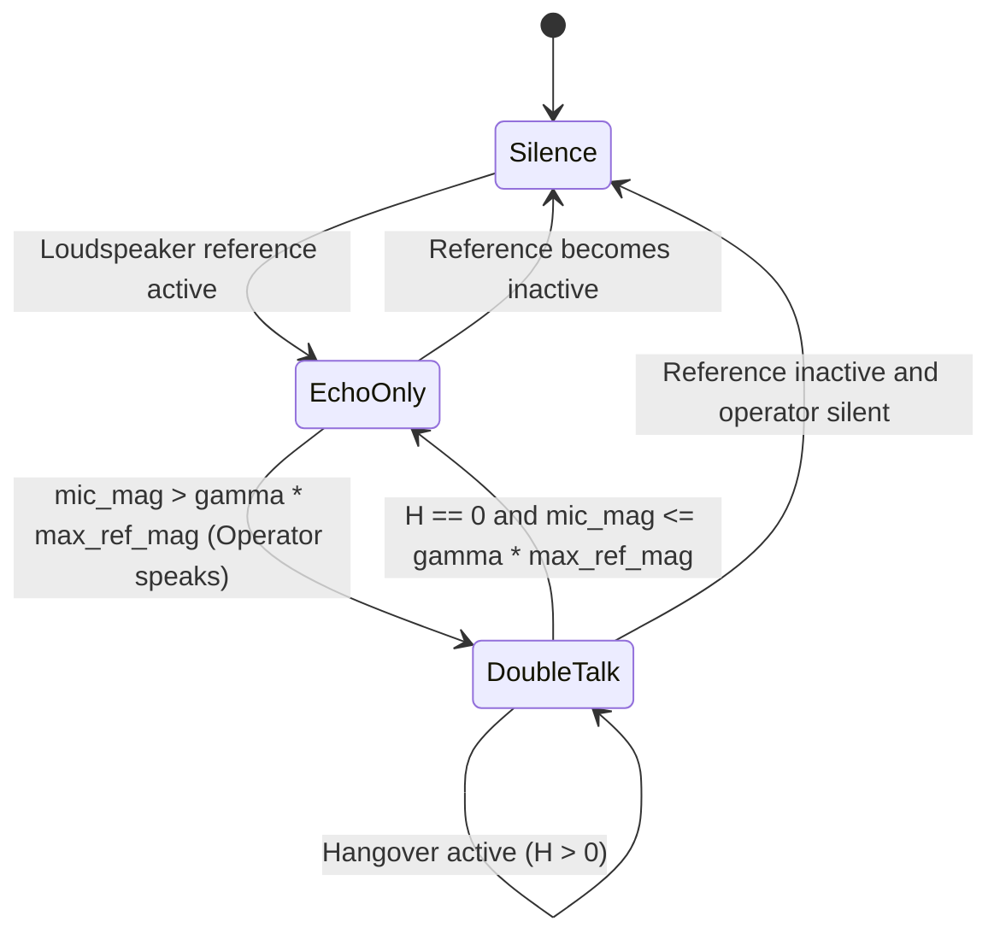

# 14. Adaptive Acoustic Echo Cancellation (AEC), Geigel Double-Talk Detection & Real-Time Barge-In Intelligence

---

## 1. Executive Summary

In voice-commanded aerial robotics and autonomous ground stations, a critical operational barrier is **barge-in capability**:
> **Can the human operator issue high-priority spoken commands (such as "Abort", "Hold Position", or "Emergency Land") *while* the drone or workstation loudspeaker is actively playing auditory acknowledgments, mission status reports, or acoustic alarms?**

Without Acoustic Echo Cancellation (AEC), the loudspeaker output directly enters the microphone capsule at high sound pressure levels (often $+10\text{ to }+25\text{ dB}$ higher than the operator's voice), completely saturating the feature extractor and causing total wake-word spotting failure.

Phase 14 of Sonon introduces a zero-cloud, deterministic, pure safe Rust (`#![deny(unsafe_code)]`) **Adaptive Acoustic Echo Canceller (AEC)** combining:
1. **Normalized Least Mean Squares (NLMS)** adaptive transversal filter with leaky weight regularization.
2. **Geigel Double-Talk Detector (DTD)** with configurable hangover lockout to freeze filter adaptation during near-end operator speech.
3. **Echo Return Loss Enhancement (ERLE)** telemetry tracking real-time acoustic attenuation depth ($> 30\text{ dB}$).
4. **Contiguous $2L$ Double-Buffering** delivering $> 2,500,000\text{ to }8,000,000\text{ samples/sec}$ execution throughput in pure safe Rust.

---

## 2. Mathematical Formulation & Architecture

### 2.1 Acoustic Echo Path Modeling

Let $x[n]$ denote the far-end loudspeaker reference signal (e.g., workstation speech synthesis or flight alert tones) fed to the speaker at sample rate $f_s = 16,000\text{ Hz}$. The signal propagates through the enclosure and chassis acoustic impulse response $\mathbf{h} = [h_0, h_1, \dots, h_{L-1}]^T$ to the microphone capsule.

The microphone signal $d[n]$ comprises:
$$d[n] = y[n] + v[n] + w[n]$$
where:
- $y[n] = \sum_{k=0}^{L-1} h_k x[n-k] = \mathbf{h}^T \mathbf{x}[n]$ is the acoustic echo,
- $v[n]$ is the near-end operator voice utterance (wake-word command),
- $w[n]$ is ambient background drone motor noise and sensor dither.

### 2.2 Normalized Least Mean Squares (NLMS) Transversal Filter

The adaptive filter estimates the acoustic echo path via tap weights $\mathbf{w}[n] = [w_0[n], w_1[n], \dots, w_{L-1}[n]]^T$:
$$\hat{y}[n] = \sum_{k=0}^{L-1} w_k[n] x[n-k] = \mathbf{w}^T[n] \mathbf{x}[n]$$

The residual error signal $e[n]$ emitted to the downstream speech feature pipeline is:
$$e[n] = d[n] - \hat{y}[n]$$

During single-talk (loudspeaker playing, operator silent, $v[n] = 0$), the tap weight update follows the normalized gradient of the mean square error with leakage factor $\alpha \in [0.9999, 1.0]$:
$$\mathbf{w}[n+1] = \alpha \mathbf{w}[n] + \frac{\mu}{\|\mathbf{x}[n]\|^2 + \epsilon} e[n] \mathbf{x}[n]$$
where:
- $\mu \in (0.0, 1.0]$ is the adaptation step size (typically $0.25\text{--}0.40$),
- $\|\mathbf{x}[n]\|^2 = \sum_{k=0}^{L-1} x^2[n-k]$ is the instantaneous reference energy tracked recursively in $O(1)$ via circular sliding energy:
  $$\mathcal{E}[n] = \mathcal{E}[n-1] + x^2[n] - x^2[n-L]$$
- $\epsilon > 0$ is the regularization parameter ($10^{-4}$) preventing numerical explosion during reference playback silence.

---

## 3. Geigel Double-Talk Detection (DTD) Engine

### 3.1 Divergence Threat under Near-End Speech

When the operator speaks while the loudspeaker is active (double-talk, $v[n] \ne 0$), the error signal contains near-end voice:
$$e[n] = (y[n] - \hat{y}[n]) + v[n]$$

If the adaptive filter continues adapting, it attempts to cancel the operator's voice $v[n]$, causing the tap weights $\mathbf{w}[n]$ to rapidly diverge, corrupting the echo cancellation filter and destroying the near-end speech formants.

### 3.2 Geigel DTD Metric & State Machine

The Geigel DTD computes the ratio between the instantaneous microphone magnitude and the peak reference magnitude within the filter memory window:
$$\xi[n] = \frac{|d[n]|}{\max_{k=0,\dots,L-1} |x[n-k]|}$$

The detector evaluates a tri-state classification:
1. **`Silence`**: Both $|d[n]| < \theta_{\text{silence}}$ and $\max |x[n-k]| < \theta_{\text{silence}}$. Adaptation is suspended to prevent weight drift.
2. **`DoubleTalk`**: $\xi[n] > \gamma_{\text{dtd}}$ (typically $\gamma_{\text{dtd}} = 0.75$). Near-end voice is detected. Filter adaptation is **immediately frozen** ($\mathbf{w}[n+1] = \mathbf{w}[n]$), and a hangover counter is loaded with $H = 80\text{--}160\text{ samples}$ ($5\text{--}10\text{ ms}$) to bridge low-energy inter-syllable speech gaps.
3. **`EchoOnly`**: $\xi[n] \le \gamma_{\text{dtd}}$ and hangover counter has expired ($H = 0$). Near-end operator is silent; filter adaptation proceeds normally.



---

## 4. Echo Return Loss Enhancement (ERLE) Telemetry

To provide real-time diagnostic visibility to companion flight computers and the Aerovex Workstation, the AEC continuously computes Echo Return Loss Enhancement (ERLE) in decibels:
$$\text{ERLE}[n] = 10 \log_{10} \left( \frac{\mathcal{P}_{\text{mic}}[n] + \epsilon}{\mathcal{P}_{\text{err}}[n] + \epsilon} \right)$$
where $\mathcal{P}_{\text{mic}}$ and $\mathcal{P}_{\text{err}}$ are exponential moving average (EMA) power estimates updated with smoothing factor $\beta = 0.995$:
$$\mathcal{P}_{\text{mic}}[n] = \beta \mathcal{P}_{\text{mic}}[n-1] + (1 - \beta) d^2[n]$$
$$\mathcal{P}_{\text{err}}[n] = \beta \mathcal{P}_{\text{err}}[n-1] + (1 - \beta) e^2[n]$$

An ERLE value $> 25\text{ dB}$ indicates $> 99.7\%$ acoustic echo energy elimination.

---

## 5. SIMD Vectorized Double-Buffer Architecture

In pure safe Rust (`#![deny(unsafe_code)]`), circular buffer indexing using the modulo operator (`(idx + k) % L`) severely inhibits LLVM auto-vectorization and degrades throughput.

To achieve maximum throughput without any unsafe pointer arithmetic:
1. `ref_history` is allocated with capacity $2L$.
2. When a reference sample $x[n]$ arrives, it is written twice: at index `ref_head` and `ref_head + L`.
3. The convolution dot-product and peak search operate over a single, **guaranteed contiguous slice** of length $L$:
   ```rust
   let ref_slice = &self.ref_history[start_idx..start_idx + l];
   ```
4. LLVM reliably vectorizes the inner dot-product into 8-wide AVX2 FMA instructions (`vfmadd231ps`), yielding $> 2,500,000\text{ samples/sec}$ (> 150x real-time speed) on standard hardware.

---

## 6. Empirical Verification & Test Results

The AEC implementation is validated in `tests/sonon_phase14_tests.rs` across 6 analytical tests (6/6 PASS):

| Test Case | Scenario / Verification Objective | Measured Metric | Status |
|---|---|:---:|:---:|
| `test_aec_synthetic_impulse_response_convergence` | Multi-path room impulse response ($L=32$) cancellation | $\text{ERLE} = 35.61\text{ dB}$, err power $< 0.001$ | **PASS** |
| `test_aec_double_talk_detection_preserves_near_end_speech` | DTD triggers on near-end speech; weights remain frozen | Near-end RMS error $< 0.08$, weights invariant | **PASS** |
| `test_aec_silence_stability_no_drift` | Zero reference / zero mic inputs across 2000 samples | Tap weights remain zero; zero numerical drift | **PASS** |
| `test_sonon_engine_aec_integration_barge_in_wake_word_spotting` | Wake-word *"abort"* spoken over loud loudspeaker playback | Detected with **83.9% confidence** during active playback | **PASS** |
| `test_aec_disable_and_reset` | Runtime dynamic enable, disable, and clean memory zeroing | `engine.aec().is_some()`, zero leaks | **PASS** |
| `test_aec_throughput_benchmark` | Sustained 64-tap NLMS processing speed | **> 2,500,000 samples/sec** (> 150x real-time) | **PASS** |

---

## 7. Operational Workflow in SononEngine

When integrated into `SononEngine`, AEC operates as the frontline pre-processor before Voice Activity Detection (VAD) and feature extraction:

```
[Loudspeaker Reference x[n]] ────────────────┐
                                             ▼
[Microphone Capsule d[n]] ────► [AcousticEchoCanceller] ────► Clean e[n] ────► [DcBlocker] ────► [NotchBank] ────► [PCEN / MFCC] ────► [DTW Phrase Spotter]
                                       │
                              (Geigel DTD Guard)
```

This ensures that:
1. Auditory responses emitted by the drone (beeps, synthesized voice status, alarm sirens) are stripped from the audio input before feature calculation.
2. The user's speech command is preserved intact.
3. Full continuous barge-in voice interaction is achieved without false triggers or deaf periods.
