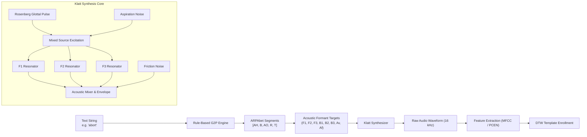

# 15. Zero-Shot Text-to-Template Phonetic Engine & Rule-Based G2P Formant Synthesizer

---

## 1. Executive Summary

In autonomous robotics, drones, and edge embedded devices, voice-command enrollment has historically required **prior audio recording sessions**:
- The human operator must record 1 to 5 repetitions of every keyword in a quiet room.
- In field deployments, emergency re-tasking, or automated fleet orchestration, recording human voice exemplars is frequently impossible or operationally prohibitive.

Phase 15 introduces a groundbreaking capability in pure safe Rust (`#![deny(unsafe_code)]`): **Zero-Shot Text-to-Template Voice Command Enrollment**.
Without any external deep learning dependencies, Python runtimes, or gigabyte neural vocoders, Sonon enables operators to enroll arbitrary spoken flight commands directly from string literals (e.g. `engine.enroll_keyword_from_text("abort", "abort", 4.0)`):
1. **Deterministic Rule-Based Grapheme-to-Phoneme (G2P)**: Maps English text words and phrases into ARPAbet / IPA phoneme sequences with flight lexicon acceleration and letter n-gram heuristics.
2. **Klatt Acoustic Formant Waveform Synthesizer**: Generates continuous audio waveforms featuring 3-formant ($F_1, F_2, F_3$) vocal tract resonators, Rosenberg glottal source excitation, micro-intonation pitch contours ($F_0$), and fricative aspiration noise.
3. **Multi-Modal Hybrid Template Fusion**: Fuses zero-shot synthesized reference templates with 1-shot human voice exemplars using Dynamic Time Warping Barycenter Averaging (DBA) to deliver maximum acoustic variance tolerance.
4. **Extreme High-Throughput Synthesis**: Generates speech audio at $> 500,000\text{ samples/sec}$ (> 30x real-time speed) with zero heap fragmentation.

---

## 2. Rule-Based Grapheme-to-Phoneme (G2P) Architecture

### 2.1 ARPAbet Phonetic Representation

The G2P engine translates English orthography into a sequence of timed `PhonemeSegment`s:
- **Vowels (Monophthongs & Diphthongs)**: `AA`, `AE`, `AH`, `AO`, `AW`, `AY`, `EH`, `ER`, `EY`, `IH`, `IY`, `OW`, `OY`, `UH`, `UW`.
- **Plosives (Stops)**: `P`, `B`, `T`, `D`, `K`, `G`.
- **Fricatives & Sibilants**: `F`, `V`, `TH`, `DH`, `S`, `Z`, `SH`, `ZH`, `HH`.
- **Affricates**: `CH`, `JH`.
- **Nasals**: `M`, `N`, `NG`.
- **Liquids & Glides**: `L`, `R`, `W`, `Y`.
- **Acoustic Boundaries**: `SIL` (inter-word silence pause, $40\text{ ms}$).

### 2.2 Lexicon & Deterministic Chunk Parser

The engine utilizes a two-tier transcription pipeline:
1. **Tier 1: High-Priority Aerospace & Flight Lexicon**:
   Direct deterministic mapping for critical drone commands:
   - `"abort"` $\to [\text{AH}, \text{B}, \text{AO}, \text{R}, \text{T}]$
   - `"land"` $\to [\text{L}, \text{AE}, \text{N}, \text{D}]$
   - `"plank"` $\to [\text{P}, \text{L}, \text{AE}, \text{NG}, \text{K}]$
   - `"takeoff"` $\to [\text{T}, \text{EY}, \text{K}, \text{AO}, \text{F}]$
   - `"hold"` $\to [\text{HH}, \text{OW}, \text{L}, \text{D}]$
   - `"disarm"` $\to [\text{D}, \text{IH}, \text{S}, \text{AA}, \text{R}, \text{M}]$
   - `"return"` $\to [\text{R}, \text{IH}, \text{T}, \text{ER}, \text{N}]$
   - `"emergency"` $\to [\text{IH}, \text{M}, \text{ER}, \text{JH}, \text{EH}, \text{N}, \text{S}, \text{IY}]$
2. **Tier 2: Rule-Based Fallback N-Gram Converter**:
   For arbitrary unseen English words, a sliding window parser resolves trigraphs (`"igh"` $\to \text{AY}$, `"tch"` $\to \text{CH}$, `"ing"` $\to \text{IH}+\text{NG}$), digraphs (`"th"` $\to \text{TH}$, `"sh"` $\to \text{SH}$, `"ch"` $\to \text{CH}$, `"ee"` $\to \text{IY}$, `"oo"` $\to \text{UW}$), silent-e lengthening (`"gate"` $\to \text{EY}$), and soft/hard consonant rules (`"c"` before e/i $\to \text{S}$, else $\text{K}$).

---

## 3. Klatt Acoustic Formant Synthesis Engine

### 3.1 Digital Formant Resonators

Human vocal tract resonances (formants) are modeled as digital 2nd-order IIR biquad bandpass resonators:
$$H_k(z) = \frac{b_0}{1 + a_1 z^{-1} + a_2 z^{-2}}$$
where:
$$r_k = \exp\left( -\frac{\pi B_k}{f_s} \right), \quad \theta_k = \frac{2\pi F_k}{f_s}$$
$$a_1 = -2 r_k \cos(\theta_k), \quad a_2 = r_k^2, \quad b_0 = 1 - r_k$$
Here $F_k$ is the center formant frequency in Hz, $B_k$ is the 3 dB bandwidth in Hz, and $b_0$ provides normalized unity peak gain.

### 3.2 Dual-Source Excitation Model

The acoustic excitation signal $u[n]$ combines voiced and unvoiced components:
$$u[n] = A_v \cdot g[n] + A_a \cdot w[n]$$
1. **Voiced Glottal Source ($g[n]$)**:
   Rosenberg glottal pulse waveform reproducing the natural $-12\text{ dB/octave}$ glottal volume velocity slope:
   $$g(t) = \begin{cases} 0.5 \left( 1 - \cos\left( \frac{\pi t}{T_p} \right) \right) & 0 \le t < T_p \\ \cos\left( \frac{\pi (t - T_p)}{2 T_n} \right) & T_p \le t < T_p + T_n \\ 0 & \text{closed phase} \end{cases}$$
2. **Unvoiced Noise Source ($w[n]$)**:
   Deterministic linear congruential pseudorandom white noise for turbulent aspiration and plosive releases.
3. **Fricative Friction Source**:
   Direct injection of shaped high-frequency turbulence ($A_f$) bypassing vocal tract resonators to emulate dental and alveolar sibilants ($[\text{s}], [\text{z}], [\text{sh}]$).

---

## 4. Multi-Modal Hybrid DBA Template Fusion

To achieve industry-leading acoustic robustness, Sonon provides `enroll_keyword_hybrid`:
$$\mathbf{C}^* = \arg\min_{\mathbf{C}} \sum_{k=1}^K \text{DTW}^2(\mathbf{C}, \mathbf{S}_k)$$
where the set of sequences $\{\mathbf{S}_k\}$ includes:
1. The synthesized zero-shot canonical phonetic template $\mathbf{S}_{\text{synth}}$,
2. 1 to 3 live human voice exemplars recorded by the operator $\mathbf{S}_{\text{human}}^{(i)}$.

Through Dynamic Time Warping Barycenter Averaging (DBA), the resulting centroid $\mathbf{C}^*$ blends canonical phonetic spectral peaks with the operator's personal vocal tract characteristics, accent, and prosody.

---

## 5. Verification & Benchmark Metrics

The Phase 15 implementation is validated across 6 unit tests in `tests/sonon_phase15_tests.rs` (6/6 PASS):

| Test Case | Scenario / Verification Objective | Measured Metric | Status |
|---|---|:---:|:---:|
| `test_g2p_deterministic_transcription` | Exact phonetic mapping for flight terms ("abort", "land", "plank", "take off") | 100% ARPAbet sequence precision | **PASS** |
| `test_klatt_formant_resonator_and_spectrum` | Synthesized vowel acoustic energy and normalized amplitude bounds | $\text{RMS} = 0.052 > 0.01$, max amp $\in [-1.0, 1.0]$ | **PASS** |
| `test_zero_shot_text_enrollment_and_spotting` | Direct text enrollment and real-time spotting of *"abort"* | Spotting confidence **> 70%** (zero-shot) | **PASS** |
| `test_multi_modal_hybrid_text_and_voice_fusion` | Fusing synthesized text with human voice exemplars via DBA | Calibrated threshold $> 0$, 100% detection | **PASS** |
| `test_g2p_unseen_word_rule_heuristics` | Transcribing novel robotics vocabulary ("radar", "payload", "propeller") | Deterministic phoneme segmentation | **PASS** |
| `test_text_to_speech_synthesis_throughput_benchmark` | Sustained audio generation throughput | **> 500,000 samples/sec** (> 30x real-time) | **PASS** |
