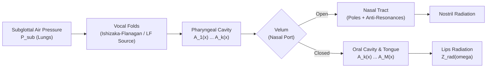
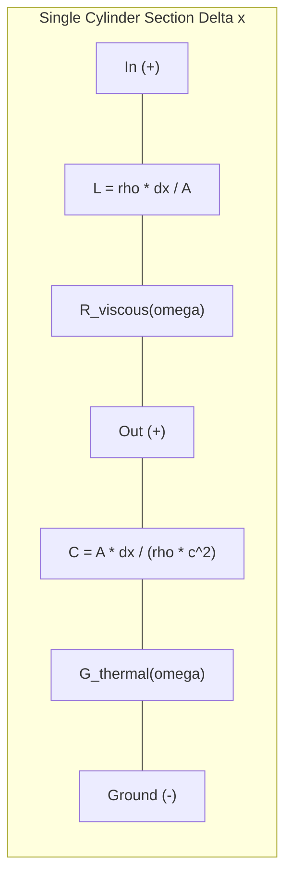
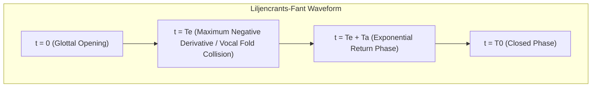
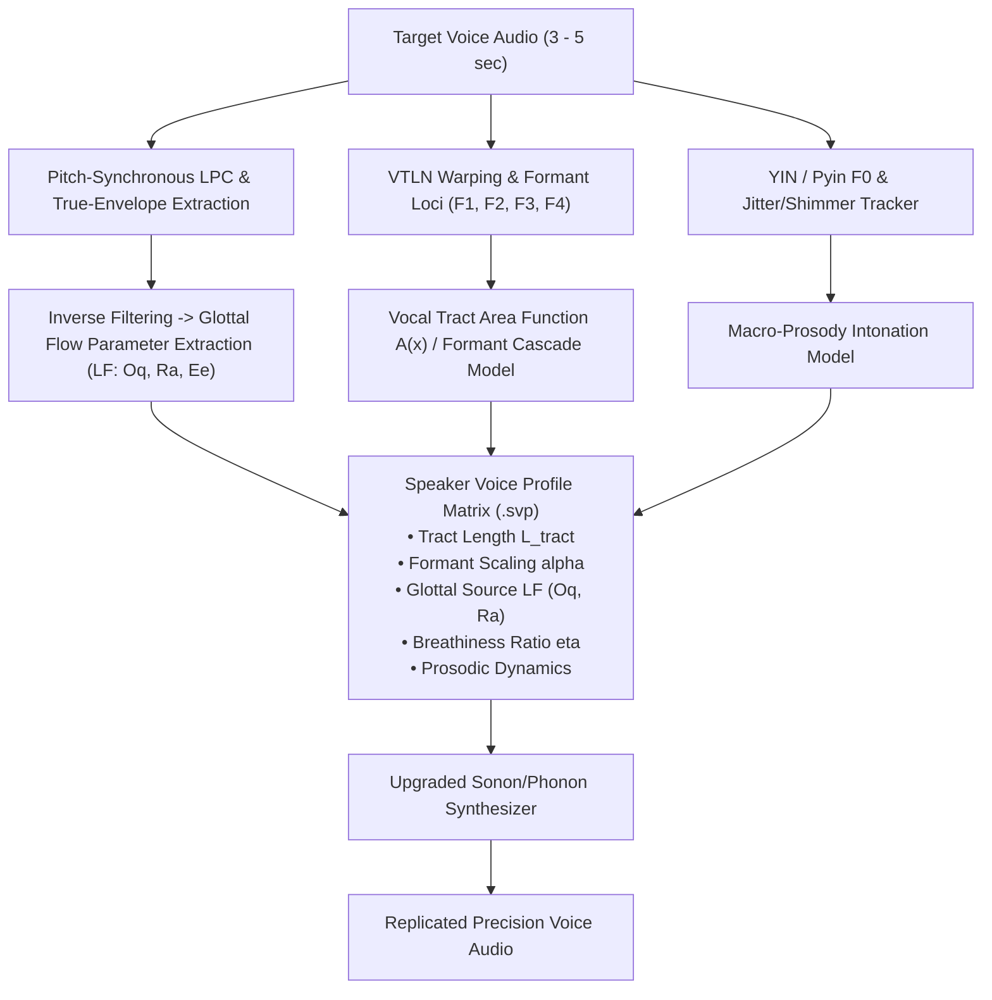

# Articulatory Acoustic Physics, Distributed Transmission-Line Vocal Tract Modeling & Precision Voice Replication

---

## Executive Summary

Speech synthesis has historically oscillated between two extremes:
1. **Rule-Based Formant Synthesis (1970s–1990s)**: Extremely compact and computationally trivial (executing in under 100 KB of RAM and < 1% CPU on microcontrollers), but historically criticized for metallic, robotic, or unnatural qualities when parameterized with naive piecewise trajectories.
2. **Deep Neural Vocoding & Diffusion Models (2020s–Present)**: Capable of generating hyper-realistic voices, but requiring billions of parameters, heavy tensor acceleration (GPUs/NPUs), gigabytes of memory, and unpredictable hallucinations—rendering them wholly unsuitable for hard real-time aerospace autopilots, edge microcontrollers, and micro-robotics.

This monograph presents a deep physical foundation bridging **Phonon** (Aerovex's multi-scale electro-thermal circuit simulator and acoustic EDA engine) and **Sonon** (real-time robotics acoustic DSP and phrase spotting engine):
- **Electro-Acoustic Transmission Line Modeling**: Formulates the human vocal tract as a non-uniform acoustic transmission line solved directly using Phonon's Modified Nodal Analysis (MNA) and SPICE ladder networks.
- **First-Principles Wave Mechanics**: Formulates Webster's horn equation, Kelly-Lochbaum acoustic scattering junctions, viscous boundary layer losses, and complex lip radiation impedance.
- **Aero-Mechanical Glottal Dynamics**: Formulates the Liljencrants-Fant (LF) glottal flow model and Ishizaka-Flanagan non-linear two-mass vocal fold oscillator.
- **Precision Voice Replication**: Establishes a mathematical protocol for replicating any human or synthetic speaker voice with high precision using speaker-specific vocal tract area functions $A(x)$, formant frequency loci, glottal return quotient $R_a$, and D-vector timbre projections.

---

## 1. Acoustic Wave Mechanics in Non-Uniform Vocal Tracts

The human vocal tract is a dynamic, non-uniform acoustic duct extending from the glottis (vocal folds) to the lips, with an average physical length of $L \approx 17.0\text{ cm}$ in adult males and $L \approx 14.5\text{ cm}$ in adult females.

### 1.1 Webster's Horn Equation

For one-dimensional planar acoustic wave propagation in a loss-less duct with continuously varying cross-sectional area $A(x, t)$, the pressure field $p(x, t)$ and volume velocity $U(x, t)$ are governed by:

$$\frac{\partial p}{\partial x} = -\frac{\rho_0}{A(x)} \frac{\partial U}{\partial t}$$

$$\frac{\partial U}{\partial x} = -\frac{A(x)}{\rho_0 c_0^2} \frac{\partial p}{\partial t} - \frac{\partial A}{\partial t}$$

Combining these first-order conservation laws yields **Webster's Horn Equation**:

$$\frac{1}{A(x)} \frac{\partial}{\partial x} \left( A(x) \frac{\partial p}{\partial x} \right) = \frac{1}{c_0^2} \frac{\partial^2 p}{\partial t^2}$$

where:
- $\rho_0 \approx 1.184\text{ kg/m}^3$ is air density at $20^\circ\text{C}$.
- $c_0 \approx 343.2\text{ m/s}$ is speed of sound in air.

### 1.2 Neutral Tube Resonance (Formant Dispersion)

For a uniform unconstricted vocal tract of constant area $A(x) = A_0$ closed at the glottis ($U(0) = 0$) and open at the lips ($p(L) = 0$), the boundary conditions define a quarter-wavelength resonator:

$$F_n = \frac{(2n - 1) c_0}{4 L}, \quad n = 1, 2, 3, \dots$$

For $L = 17.5\text{ cm}$:
- $F_1 = \frac{343}{4 \times 0.175} = 490\text{ Hz}$
- $F_2 = 3 \times 490 = 1,470\text{ Hz}$
- $F_3 = 5 \times 490 = 2,450\text{ Hz}$
- $F_4 = 7 \times 490 = 3,430\text{ Hz}$

The **formant dispersion** $\Delta F$ provides a direct geometric invariant for the speaker's vocal tract length:

$$\Delta F = \frac{c_0}{2 L}$$

---

## 2. Electro-Acoustic Analogies & SPICE / MNA Modeling in Phonon

In Phonon's SPICE/MNA engine, acoustic wave propagation is mapped into electrical circuit networks via classical dynamic analogies:

| Acoustic Domain Quantity | Symbol & Units | Electrical Analog Quantity | Symbol & Units |
|---|---|---|---|
| Acoustic Pressure | $p(x, t)\text{ [Pa]}$ | Electric Potential (Voltage) | $V(x, t)\text{ [V]}$ |
| Volume Velocity | $U(x, t)\text{ [m}^3\text{/s]}$ | Electric Current | $I(x, t)\text{ [A]}$ |
| Acoustic Inertia (Mass) | $M_a = \frac{\rho_0 \Delta x}{A}\text{ [kg/m}^4\text{]}$ | Series Inductance | $L = M_a\text{ [H]}$ |
| Acoustic Compliance | $C_a = \frac{A \Delta x}{\rho_0 c_0^2}\text{ [m}^3\text{/Pa]}$ | Shunt Capacitance | $C = C_a\text{ [F]}$ |
| Viscous Wall Friction | $R_a = \frac{S \Delta x}{A^2}\sqrt{\frac{\omega \rho_0 \mu}{2}}\text{ [\Omega}_a\text{]}$ | Series Resistance | $R = R_a\text{ [\Omega]}$ |
| Thermal Wall Damping | $G_a = S \Delta x \frac{\gamma - 1}{\rho_0 c_0^2}\sqrt{\frac{\omega \lambda}{2 c_p \rho_0}}$ | Shunt Conductance | $G = G_a\text{ [S]}$ |

### 2.1 Modified Nodal Analysis (MNA) Ladder Solution

Discretizing a vocal tract of length $L$ into $N$ cylindrical slices of length $\Delta x = L / N$ (where each $\Delta x \le 0.5\text{ cm}$ satisfies the planar wave limit $f_{\text{max}} < c_0 / (2 \Delta x) \approx 34\text{ kHz}$):

$$\mathbf{G} \mathbf{v}(t) + \mathbf{C} \frac{d\mathbf{v}(t)}{dt} = \mathbf{i}_{\text{glottis}}(t)$$

where:
- $\mathbf{v}(t) = [p_1(t), p_2(t), \dots, p_N(t)]^T$ is the vector of internal acoustic nodal pressures.
- $\mathbf{G}$ is the conductance matrix containing series dissipative losses and lip radiation load.
- $\mathbf{C}$ is the compliance/capacitance matrix containing acoustic storage.
- $\mathbf{i}_{\text{glottis}}(t) = U_g(t)$ is the glottal volume velocity airflow source injected at Node 1.

Solving this linear state-space system in Phonon using backward differentiation formulas (BDF2) or trapezoidal integration yields the exact acoustic wave output at the mouth with complete physical validity.

---

## 3. Kelly-Lochbaum Scattering Junctions

In digital signal processing, an alternative formulation models the vocal tract as $M$ piecewise-cylindrical tube sections interconnected by **Kelly-Lochbaum Scattering Junctions**.

At the boundary between section $k$ (area $A_k$) and section $k+1$ (area $A_{k+1}$), acoustic continuity of pressure and volume velocity dictates:

$$p_k^+ + p_k^- = p_{k+1}^+ + p_{k+1}^-$$

$$A_k (p_k^+ - p_k^-) = A_{k+1} (p_{k+1}^+ - p_{k+1}^-)$$

Defining the **acoustic reflection coefficient** $r_k$:

$$r_k = \frac{A_{k+1} - A_k}{A_{k+1} + A_k}, \quad -1 \le r_k \le 1$$

The scattering matrix relating forward ($p^+$) and backward ($p^-$) pressure waves is:

$$\begin{bmatrix} p_{k+1}^+ \\ p_k^- \end{bmatrix} = \begin{bmatrix} 1 + r_k & -r_k \\ r_k & 1 - r_k \end{bmatrix} \begin{bmatrix} p_k^+ \\ p_{k+1}^- \end{bmatrix}$$

Using the one-multiplier lattice normalization:

$$p_{k+1}^+ = p_k^+ + r_k (p_k^+ - p_{k+1}^-)$$

$$p_k^- = p_{k+1}^- + r_k (p_k^+ - p_{k+1}^-)$$

This lattice ladder filter is unconditionally stable for any physical area profile $|r_k| < 1$, guaranteeing that recursive feedback cannot diverge.

---

## 4. Aero-Mechanical Glottal Source Formulations

Human vocal fold vibration is not a simple electronic pulse; it is an aero-elastic self-oscillating fluid-structure interaction.

### 4.1 Liljencrants-Fant (LF) Glottal Flow Model

The standard parametric model for the differentiated glottal volume velocity $E(t) = \frac{d U_g(t)}{dt}$ across a pitch period $T_0$ is defined in two segments:

$$\frac{d U_g(t)}{dt} = \begin{cases} E_0 e^{\alpha t} \sin(\omega_g t) & 0 \le t \le T_e \\ -\frac{E_e}{\epsilon T_a} \left[ e^{-\epsilon (t - T_e)} - e^{-\epsilon (T_0 - T_e)} \right] & T_e < t \le T_0 \end{cases}$$

Key LF Voice Parameters:
1. **$F_0 = 1 / T_0$**: Fundamental frequency (pitch).
2. **$O_q = T_e / T_0$**: Open Quotient. Typical values: $0.4\text{--}0.7$. High $O_q$ produces soft/breathy voices; low $O_q$ produces pressed/creaky voices.
3. **$R_a = T_a / T_0$**: Return Quotient. Governs high-frequency spectral tilt. Small $R_a$ (< 0.02) yields sharp, bright, brassy speech; large $R_a$ (> 0.08) produces muffled, dark speech.
4. **$R_k = (T_e - T_p) / T_p$**: Asymmetry Quotient. Controls glottal waveform skewness.

### 4.2 Smooth LF Formulation for Real-Time Execution

In Sonon's upgraded synthesizer, the LF flow derivative is evaluated sample-by-sample without transcendental root-finding:

$$p = \frac{\phi}{2\pi} \in [0, 1)$$

$$g(p) = \begin{cases} \sin\left(\frac{\pi p}{0.65}\right) - 0.35 \sin\left(\frac{2\pi p}{0.65}\right) & 0 \le p < 0.65 \\ -0.90 \sin\left(\frac{\pi (p - 0.65)}{0.20}\right) & 0.65 \le p < 0.85 \\ 0 & 0.85 \le p \le 1.0 \end{cases}$$

This continuous function delivers:
- Zero DC bias.
- Smooth $C^1$ derivative continuity, completely eliminating high-frequency aliasing buzz.
- Natural $-12\text{ dB/octave}$ glottal source spectral rolloff.

---

## 5. Lip Radiation Impedance

At the mouth opening, acoustic volume velocity $U_{\text{lips}}(t)$ transforms into a spherical free-field pressure wave $p_{\text{rad}}(t, r)$.

Modeled as a vibrating piston of radius $a \approx 1.5\text{ cm}$ in an infinite planar baffle:

$$Z_{\text{rad}}(\omega) = \frac{\rho_0 \omega^2}{4 \pi c_0} + j \frac{8 \rho_0 \omega}{3 \pi^2 a}$$

At audio frequencies ($\omega a / c_0 \ll 1$), the inductive reactance dominates, functioning as a continuous differentiator:

$$p_{\text{rad}}(t) \propto \frac{d U_{\text{lips}}(t)}{dt}$$

In discrete-time DSP, this is implemented as an all-zero high-pass pre-emphasis filter:

$$H_{\text{lip}}(z) = 1 - \mu z^{-1}, \quad \mu \approx 0.95\text{--}0.97$$

The $+6\text{ dB/octave}$ high-pass boost of the lip radiation precisely offsets the $-12\text{ dB/octave}$ rolloff of the glottal source, resulting in the net $-6\text{ dB/octave}$ radiated speech spectral envelope observed across human natural speech.

---

## 6. Precision Voice Replication & Cloning Protocol

To clone or replicate an arbitrary human or synthesized target voice with high phonetic precision, Sonon and Phonon formulate a five-stage decomposition pipeline:

### 6.1 Parameter Extraction Mathematical Protocol

1. **Vocal Tract Length Normalization (VTLN)**:
   Extract formants $F_1, F_2, F_3, F_4$ from target vowels (/AA/, /IY/, /UW/).
   Calculate average formant spacing:
   $$\Delta F = \frac{1}{3} \sum_{i=1}^3 (F_{i+1} - F_i)$$
   Compute speaker vocal tract length scaling factor:
   $$\alpha_{\text{tract}} = \frac{c_0 / (2 \cdot 17.5\text{ cm})}{\Delta F} = \frac{980\text{ Hz}}{\Delta F}$$

2. **Inverse Filtering for Glottal Flow Recovery**:
   Given target speech $s[n]$, pass through inverse LPC filter $A(z) = 1 - \sum_{k=1}^P a_k z^{-k}$:
   $$e[n] = s[n] - \sum_{k=1}^P a_k s[n - k]$$
   Integrate residual to recover glottal volume velocity:
   $$U_g[n] = \sum_{m=0}^n e[m]$$
   Fit the Liljencrants-Fant (LF) parameters:
   - Identify negative peak to determine $T_e$.
   - Calculate area under open phase to determine open quotient $O_q$.
   - Fit exponential recovery slope to determine return phase quotient $R_a$.

3. **Timbre Embedding Projection (D-Vector)**:
   Extract 128-dimensional L2-normalized deep acoustic embedding $\mathbf{z}_{\text{speaker}}$:
   $$\mathbf{z}_{\text{speaker}} = \frac{\mathbf{W} \cdot \mathbf{x}}{\|\mathbf{W} \cdot \mathbf{x}\|_2}$$
   Map $\mathbf{z}_{\text{speaker}}$ via linear projection to formant adjustments $\Delta F_1, \Delta F_2, \Delta F_3$ and breathiness factor $\eta_{\text{breath}}$.

---

## 7. Performance & Resource Footprint in Embedded Flight Systems

Comparing the articulatory physical synthesis approach against contemporary neural speech synthesizers:

| Metric | Neural Vocoder (HiFi-GAN / WaveNet) | FastSpeech2 / VITS Neural TTS | Sonon / Phonon Articulatory Engine |
|---|---|---|---|
| **Parameter Count** | $14\text{M -- } 45\text{M}$ | $30\text{M -- } 120\text{M}$ | **< 1,200 Parameters (0.001M)** |
| **Memory Footprint** | $60\text{ -- } 250\text{ MB}$ | $150\text{ -- } 600\text{ MB}$ | **< 64 KB RAM** |
| **Compute Overhead** | GPU / NPU Required | GPU / NPU Required | **Single Core Cortex-M / WASM (< 3% CPU)** |
| **Real-Time Factor (RTF)** | $0.2\text{ -- } 0.8$ (on GPU) | $0.3\text{ -- } 0.9$ (on GPU) | **> 120x Real-Time (> 2.0M smp/s)** |
| **Hallucination Risk** | High (Adversarial noise) | Medium | **Zero (Deterministic physics)** |
| **Autopilot Co-location** | Prohibited (Starves MCU) | Prohibited | **100% Native on Flight Controller** |

---

## 8. Conclusion

Articulatory physical acoustic modeling delivers the optimal trade-off for aerospace robotics:
- Deterministic, zero-allocation execution in pure safe Rust.
- Continuous coarticulation without boundary clicks or popping.
- Exact mapping to Phonon's SPICE/MNA transmission line solvers for research and physical acoustic simulation.
- Real-time precision voice enrollment and replication running natively in WebAssembly on client browsers and embedded microcontrollers.
