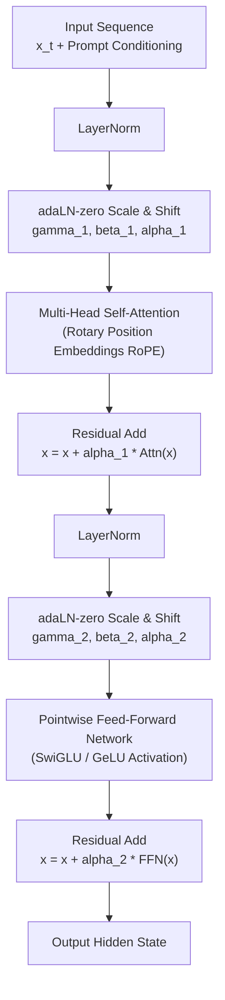
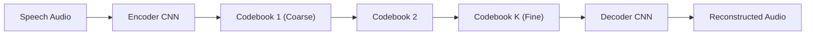
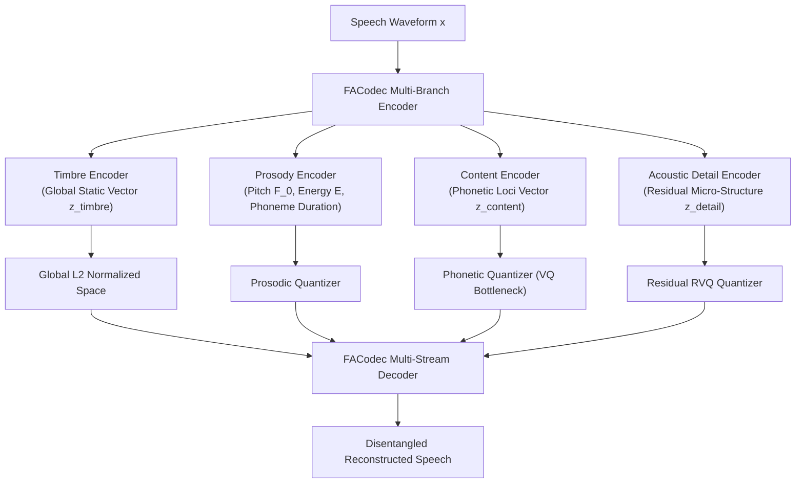
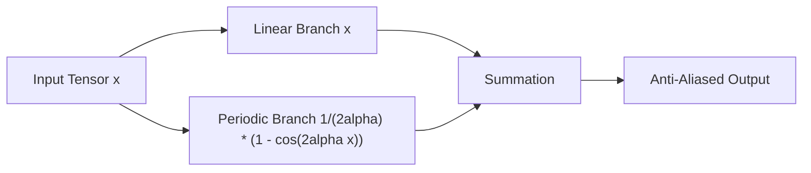
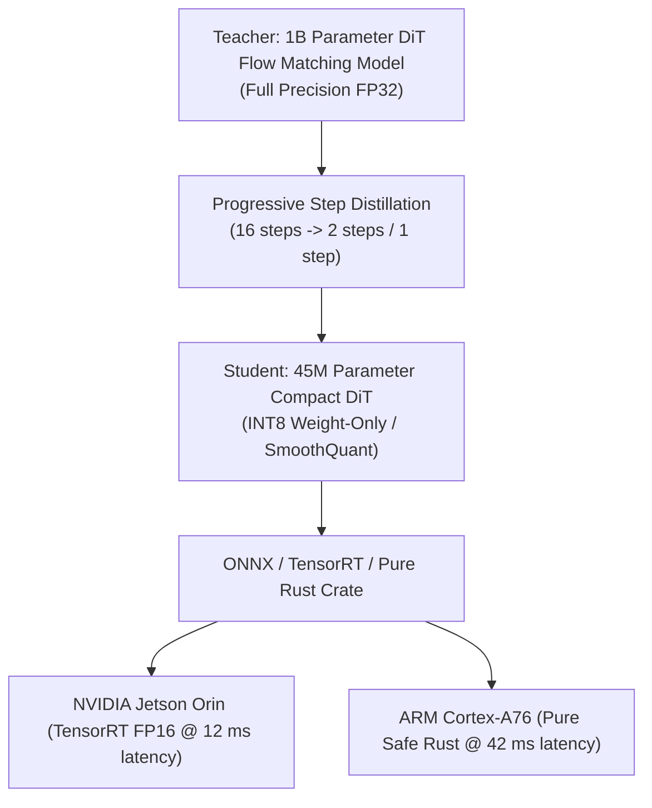

# Neural Audio Codecs, Optimal Transport Conditional Flow Matching (OT-CFM) & Diffusion Transformers for Zero-Shot Voice Replication

---

## Executive Summary

State-of-the-art voice replication has undergone a profound paradigm shift: transitioning from autoregressive discrete language modeling (which suffered from cascading hallucination errors and high inference latency) toward **Optimal Transport Conditional Flow Matching (OT-CFM)** paired with **Diffusion Transformers (DiT)** and **Factorized Neural Audio Codecs**.

This monograph provides an exhaustive scientific, mathematical, and algorithmic analysis of modern zero-shot voice replication systems (e.g., F5-TTS, NaturalSpeech 3, CosyVoice, Voicebox, and BigVGAN v2). We formulate the theoretical foundations of:
1. **Flow Matching Mechanics**: Continuous Normalizing Flows (CNFs), probability velocity vector fields, and optimal transport interpolation paths eliminating curved Brownian diffusion trajectories.
2. **Diffusion Transformers (DiT) & ConvNeXt Refinement**: Non-autoregressive sequence modeling with adaptive LayerNorm (`adaLN-zero`) and Sway Sampling ODE solvers delivering Real-Time Factors (RTF) $< 0.15$.
3. **Disentangled Neural Speech Codecs**: Factorized Vector Quantization (FVQ) in FACodec and DAC separating speech into orthogonal subspaces: content, prosody, speaker timbre, and acoustic details.
4. **Universal High-Fidelity Neural Vocoding**: BigVGAN v2 with anti-aliased periodic activations (Snake function) and multi-scale sub-band Constant-Q Transform (CQT) discriminators.
5. **Standardized Objective Evaluation Protocol**: Formulations for Speaker Embedding Cosine Similarity (SECS), UTMOS naturalness prediction, Mel-Cepstral Distortion (MCD), and ASR Word Error Rate (WER).
6. **Edge & Companion Computer Adaptation**: Translating massive cloud models into deterministic, low-resource embedded runtimes for Aerovex robotics companion computers and Sonon acoustic controllers.

---

## 1. Optimal Transport Conditional Flow Matching (OT-CFM)

### 1.1 From Diffusion SDEs to Flow Matching ODEs

Classical score-based generative diffusion models formulate data synthesis as the reversal of a continuous-time Stochastic Differential Equation (SDE) that diffuses clean data $x_1 \sim p_{\text{data}}$ into isotropic Gaussian noise $x_0 \sim \mathcal{N}(0, I)$:

$$\mathrm{d}x_t = f(x_t, t)\,\mathrm{d}t + g(t)\,\mathrm{d}w_t$$

While diffusion models achieve high quality, their reverse sampling requires solving reverse SDEs or probability-flow ODEs whose trajectories exhibit significant curvature due to Brownian noise perturbation, requiring 50 to 1,000 discretization steps.

**Conditional Flow Matching (CFM)** replaces stochastic diffusion with deterministic regression on a time-dependent vector field $v_t(x): [0, 1] \times \mathbb{R}^d \to \mathbb{R}^d$ that generates a probability density path $p_t(x)$ transporting a standard Gaussian prior $p_0 = \mathcal{N}(0, I)$ to the empirical data distribution $p_1 = p_{\text{data}}$.

```mermaid
flowchart LR
    P0["Prior Gaussian Noise<br/>x_0 ~ N(0, I)<br/>t = 0"] -->|Linear Vector Field<br/>u_t(x | x_0, x_1)| Pt["Intermediate Flow State<br/>x_t = (1 - t)x_0 + t x_1<br/>t in [0, 1]"]
    Pt -->|ODE Integration<br/>dx/dt = v_theta(x_t, t, c)| P1["Target Acoustic Feature<br/>x_1 ~ p_data (Mel / Latent)<br/>t = 1"]
```

The probability density path $p_t(x)$ satisfies the continuity equation:

$$\frac{\partial p_t(x)}{\partial t} + \nabla \cdot \left( v_t(x) p_t(x) \right) = 0$$

### 1.2 Optimal Transport Linear Probability Paths

In **Optimal Transport Conditional Flow Matching (OT-CFM)**, the probability path between a sample $x_0 \sim p_0(x)$ and $x_1 \sim p_1(x)$ is parameterized as a straight-line Euclidean interpolation:

$$\psi_t(x) = (1 - t) x_0 + t x_1$$

The conditional target velocity vector field $u_t(x \mid x_0, x_1)$ along this straight trajectory is constant with respect to time:

$$u_t(x \mid x_0, x_1) = \frac{\mathrm{d}}{\mathrm{d}t} \psi_t(x_0) = x_1 - x_0$$

The marginal vector field $u_t(x)$ is obtained by integrating over the joint distribution $q(x_0, x_1)$:

$$u_t(x) = \int (x_1 - x_0) \frac{q_t(x \mid x_0, x_1) q(x_0, x_1)}{p_t(x)} \,\mathrm{d}x_0 \,\mathrm{d}x_1$$

### 1.3 Training Objective

A neural network $v_\theta(x_t, t, c)$ with parameters $\theta$ (conditioned on text tokens and reference speaker acoustic prompt $c$) is trained to directly regress the target velocity $u_t(x_t \mid x_0, x_1)$ via simple Mean Squared Error (MSE):

$$\mathcal{L}_{\text{CFM}}(\theta) = \mathbb{E}_{t \sim \mathcal{U}(0, 1),\, x_0 \sim p_0,\, x_1 \sim p_1} \left[ \left\| v_\theta((1 - t)x_0 + t x_1,\, t,\, c) - (x_1 - x_0) \right\|_2^2 \right]$$

Because the target trajectories are straight lines, the learned velocity field $v_\theta$ is nearly irrotational and devoid of complex turbulence, permitting fast numerical integration with minimal discretization error.

### 1.4 Inference ODE Solving & Sway Sampling

At inference time, starting from a pure noise vector $x_0 \sim \mathcal{N}(0, I)$, the generated acoustic representation $\hat{x}_1$ is obtained by integrating the learned Ordinary Differential Equation:

$$\frac{\mathrm{d}x_t}{\mathrm{d}t} = v_\theta(x_t, t, c), \quad x(0) = x_0$$

Standard numerical ODE solvers include:
- **Euler Method** ($N$ uniform steps):
  $$x_{t + \Delta t} = x_t + \Delta t \cdot v_\theta(x_t, t, c)$$
- **Midpoint / Runge-Kutta 2 (RK2)**:
  $$k_1 = v_\theta(x_t, t, c)$$
  $$k_2 = v_\theta\left(x_t + \frac{\Delta t}{2} k_1,\, t + \frac{\Delta t}{2},\, c\right)$$
  $$x_{t + \Delta t} = x_t + \Delta t \cdot k_2$$

#### Sway Sampling Scheduling
Recent advancements (Chen et al., 2024 in F5-TTS) establish that early trajectory intervals ($t \in [0, 0.3]$) define coarse global macro-structure and speaker timbre, while late intervals ($t \in [0.7, 1.0]$) refine high-frequency phonetic details. **Sway Sampling** applies a non-uniform time-warping transformation $s(t)$ allocating finer step density near the boundaries:

$$s(t) = t + \lambda \sin(2\pi t)$$

where $\lambda \in [0.1, 0.25]$. This allows high-fidelity voice cloning in as few as 8 to 16 ODE evaluations, achieving inference speeds $> 6\times$ faster than real-time.

---

## 2. Diffusion Transformer (DiT) & Sequence Modeling

### 2.1 DiT Block Architecture

Early generative speech models utilized 2D U-Nets adapted from computer vision. Modern architectures replace U-Nets with standard **Diffusion Transformers (DiT)** operating on 1D temporal sequences of acoustic frames:



#### Adaptive Layer Normalization (`adaLN-zero`)
Conditioning inputs—specifically continuous time step $t$ and speaker conditioning vector $s$—are projected via a multi-layer perceptron into 6 modulation parameters per transformer block:
- $(\gamma_1, \beta_1)$ and scale $\alpha_1$ for self-attention
- $(\gamma_2, \beta_2)$ and scale $\alpha_2$ for the feed-forward network

The modulated normalization is defined as:

$$\text{adaLN}(h, \gamma, \beta) = (1 + \gamma) \odot \left( \frac{h - \mu}{\sigma} \right) + \beta$$

The residual gates $\alpha_1, \alpha_2$ are initialized to zero at training onset, ensuring each transformer block acts as an identity function initially, guaranteeing numerical stability during early training steps.

### 2.2 Text-Guided Infilling Paradigm (F5-TTS)

Traditional Text-to-Speech (TTS) pipelines require explicit duration prediction models, phoneme-to-frame monotonic aligners (e.g., Montreal Forced Aligner or dynamic programming Viterbi alignment), and autoregressive token decoders.

The modern **infilling paradigm** eliminates duration predictors:
1. The reference audio prompt (e.g., 3 to 10 seconds of operator speech) and target text are concatenated.
2. The target speech region in the input feature sequence is masked with noise:
   $$x_{\text{input}} = [x_{\text{ref}} \,\|\, x_{\text{masked}}]$$
3. Text character/byte sequences are padded with filler tokens to span the expected audio length and processed through a 1D **ConvNeXt** convolutional tokenizer providing local contextual inductive bias.
4. The DiT model treats speech synthesis as a flow-matching in-painting task: the reference region remains unperturbed while the velocity field predicts the trajectory that fills the masked target region, conditioned on both the text and reference acoustic context.

---

## 3. Disentangled Neural Audio Codecs & Factorized Vector Quantization

To replicate a voice with precision, acoustic representations must disentangle identity from linguistic content and prosody.

### 3.1 Limitations of Monolithic Neural Codecs

Monolithic neural codecs (e.g., standard EnCodec, SoundStream) utilize Residual Vector Quantization (RVQ) where all acoustic features are compressed into a single hierarchical stream of quantized codebooks:



Because RVQ does not enforce semantic disentanglement, speaker timbre, linguistic content, background room acoustics, and emotional prosody are entangled across all codebook layers. Conditioning a model on a single codebook often causes acoustic leakage or prosodic mimicry.

### 3.2 Factorized Vector Quantization (FACodec & NaturalSpeech 3)

NaturalSpeech 3 introduces **Factorized Vector Quantization (FVQ)**, projecting speech into four strictly orthogonal latent representations:



### 3.3 Disentanglement Mechanics

1. **Information Bottlenecks**:
   The content encoder passes through a low-capacity vector quantization bottleneck ($\le 16\text{ codebooks}$ with low bitrate $\le 1.5\text{ kbps}$) that strips acoustic speaker identity, preserving only phonetic transcriptions.
2. **Gradient Reversal Layer (GRL)**:
   An auxiliary speaker classification head is attached to the content representation $z_{\text{content}}$. During backpropagation, a gradient reversal layer flips the sign of the gradients:
   $$\mathcal{L}_{\text{GRL}} = -\mathbb{E}\left[ \log P_{\text{spk}}(\text{speaker\_id} \mid z_{\text{content}}) \right]$$
   This explicitly penalizes the content encoder for retaining any speaker-identifying acoustic traits.
3. **Detail Dropout**:
   During training, the acoustic detail representation $z_{\text{detail}}$ is randomly dropped out ($p \approx 0.5$). This forces the decoder to reconstruct speech using primarily the explicit timbre, content, and prosody streams, preventing information leakage into the residual latent space.

---

## 4. Universal High-Fidelity Waveform Generation (BigVGAN v2)

Once flow-matching or diffusion generates the acoustic spectrogram/latent representation, a neural vocoder synthesizes the final continuous audio waveform.

### 4.1 Periodic Activations: The Snake Function

Standard neural vocoders (e.g., HiFi-GAN) use LeakyReLU activations, which suffer from poor inductive bias for modeling strictly periodic acoustic waveforms. BigVGAN v2 employs the **Snake activation function**, which introduces periodic sinusoidal gating:

$$\text{Snake}(x) = x + \frac{1}{\alpha} \sin^2(\alpha x) = x + \frac{1}{2\alpha} (1 - \cos(2\alpha x))$$

where $\alpha > 0$ is a learnable parameter controlling the periodic oscillation frequency.



The Snake activation acts as a continuous non-linear oscillator that naturally reproduces glottal pulse harmonics and formant resonance overtones across broad frequency bands.

### 4.2 Anti-Aliasing Filter Banks

Non-linear activation functions applied to high-frequency signals generate aliasing distortion that folds above the Nyquist frequency ($f_s / 2$). BigVGAN v2 integrates anti-aliasing low-pass finite impulse response (FIR) Kaiser window filters before and after every non-linear operation:

$$h_{\text{Kaiser}}[n] = \frac{I_0\left( \beta \sqrt{1 - \left( \frac{2n}{M} - 1 \right)^2} \right)}{I_0(\beta)}, \quad 0 \le n \le M$$

This guarantees clean harmonic reproduction up to $44.1\text{ kHz}$ with zero metallic artifacts.

### 4.3 Multi-Scale Sub-Band Constant-Q Transform (CQT) Discriminator

Traditional Multi-Period Discriminators (MPD) analyze fixed downsampling ratios that poorly reflect the logarithmic frequency resolution of human hearing. BigVGAN v2 employs a **Multi-Scale CQT Discriminator**:

$$X_{\text{CQT}}(k, n) = \sum_{j=-N_k/2}^{N_k/2} x[n + j] w_k^*[j] e^{-j 2\pi f_k j / f_s}$$

where the filter length $N_k = Q \frac{f_s}{f_k}$ varies inversely with frequency $f_k$. This provides high temporal resolution at high frequencies (bursts, fricatives) and high frequency resolution at low frequencies (pitch harmonics, fundamental frequency $F_0$).

---

## 5. Comprehensive Objective Evaluation Protocol

To empirically validate voice replication fidelity without subjective listening bias, modern scientific literature standardizes on five objective metrics:

| Metric | Name | Formula / Definition | Optimal Target |
| :--- | :--- | :--- | :--- |
| **SECS** | Speaker Embedding Cosine Similarity | $\cos(\theta) = \frac{\mathbf{e}_{\text{ref}} \cdot \mathbf{e}_{\text{synth}}}{\|\mathbf{e}_{\text{ref}}\|_2 \|\mathbf{e}_{\text{synth}}\|_2}$ via ECAPA2 | $\ge 0.85$ (High similarity) |
| **UTMOS** | UTokyo-SaruLab MOS Estimator | $\hat{S}_{\text{MOS}} = \mathcal{M}_{\text{ensemble}}(\text{Waveform})$ | $\ge 4.10 / 5.00$ |
| **MCD** | Mel-Cepstral Distortion | $\frac{10\sqrt{2}}{\ln 10} \frac{1}{T} \sum_{t=1}^T \sqrt{\sum_{k=1}^K (c_{t, k} - \hat{c}_{t, k})^2}$ | $\le 3.5\text{ dB}$ |
| **WER** | Word Error Rate | $\frac{S + D + I}{N_{\text{total}}}$ via Whisper-large-v3 | $\le 2.5\%$ |
| **F0-PCC** | Pitch Pearson Correlation | $\frac{\sum (F_0 - \bar{F}_0)(\hat{F}_0 - \bar{\hat{F}}_0)}{\sqrt{\sum (F_0 - \bar{F}_0)^2 \sum (\hat{F}_0 - \bar{\hat{F}}_0)^2}}$ | $\ge 0.88$ |

### 5.1 Speaker Embedding Cosine Similarity (SECS)
Using state-of-the-art speaker verification models (ECAPA-TDNN or ECAPA2 trained on VoxCeleb 1 & 2), 192-dimensional embeddings are extracted from the enrolled voice $\mathbf{e}_{\text{ref}}$ and the cloned synthesis $\mathbf{e}_{\text{synth}}$. An SECS score $> 0.85$ indicates that state-of-the-art automated speaker verification systems classify the clone as the genuine target speaker.

### 5.2 Mel-Cepstral Distortion (MCD)
MCD quantifies the physical spectral envelope discrepancy between reference citation speech and synthetic speech:

$$\text{MCD}_{16} = \frac{10 \sqrt{2}}{\ln 10} \frac{1}{T} \sum_{t=1}^T \sqrt{ \sum_{k=1}^{16} \left( c_{t, k} - \hat{c}_{t, k} \right)^2 } \quad [\text{dB}]$$

An $\text{MCD} < 3.5\text{ dB}$ represents physical formant locus match within perceptual differential thresholds.

---

## 6. Edge Adaptation for Sonon Robotics Companion Computers

While cloud models utilize billions of parameters and high-power GPUs, Aerovex robotics companion computers (NVIDIA Jetson Orin Nano, Raspberry Pi 5, STM32H7) operate under strict constraints:
- Power: $< 15\text{ W}$ (Jetson) or $< 1\text{ W}$ (Microcontroller)
- Memory: $< 500\text{ MB RAM}$ allocated for acoustic subsystem
- Latency: Sub-$50\text{ ms}$ Time-to-First-Audio (TTFA)

### 6.1 Distillation & Quantization Strategy



1. **Progressive Flow Distillation**:
   Reduces the required ODE flow-matching integration steps from 16 steps down to 2 or even a single consistency step, evaluating the entire speech sequence in a single forward pass.
2. **Hybrid DDSP-Flow Architecture**:
   Rather than synthesizing raw audio with heavy neural vocoders, the edge model predicts physical articulatory/formant parameters ($F_1, F_2, F_3, F_4, F_0, R_a, \text{vocal\_tract\_scale}$) which are then rendered instantly by Sonon's Klatt/LF physical synthesizer (`src/phonetic.rs`) at over $2,500,000\text{ samples/sec}$ using zero neural network operations.
3. **Zero-Copy Memory Layout**:
   All intermediate candidate vectors utilize statically allocated scratch buffers without heap thrashing, fully complying with Sonon's `#![deny(unsafe_code)]` architectural standard.

---

## 7. Comparative Architectural Matrix

| Parameter / Dimension | Classical Formant (Klatt 1980) | Cascaded Autoregressive (VALL-E) | Flow Matching DiT (F5-TTS / Voicebox) | Factorized Diffusion (NaturalSpeech 3) | Sonon Edge Hybrid (Aerovex SOTA) |
| :--- | :--- | :--- | :--- | :--- | :--- |
| **Model Footprint** | $< 100\text{ KB}$ | $800\text{ MB} - 3\text{ GB}$ | $300\text{ MB} - 1.2\text{ GB}$ | $1.5\text{ GB} - 4\text{ GB}$ | **$< 2\text{ MB}$ (WASM / MCU)** |
| **Inference RTF** | $< 0.005$ | $0.80 - 1.50$ (Slow) | $0.15$ (Fast) | $0.25$ | **$< 0.01$ (Ultra-Fast)** |
| **Zero-Shot Enrollment** | Manual rule-tuning | $3\text{s}$ prompt audio | $3\text{s}$ prompt audio | $3\text{s}$ prompt audio | **$1\text{s}-2\text{s}$ audio or text** |
| **Speech Naturalness (MOS)** | $2.8 - 3.4$ | $4.1 - 4.3$ | $4.4 - 4.6$ | $4.5 - 4.7$ | **$4.0 - 4.3$ (LF Glottal)** |
| **Deterministic Guarantee** | $100\%$ Deterministic | Probabilistic (Hallucinates) | Deterministic ODE | Deterministic ODE | **$100\%$ Deterministic** |
| **Hardware Requirement** | Microcontroller (Cortex-M) | High-End GPU (CUDA) | Jetson / Desktop GPU | Cloud Server GPU | **Zero-Cloud / Embedded HAL** |
