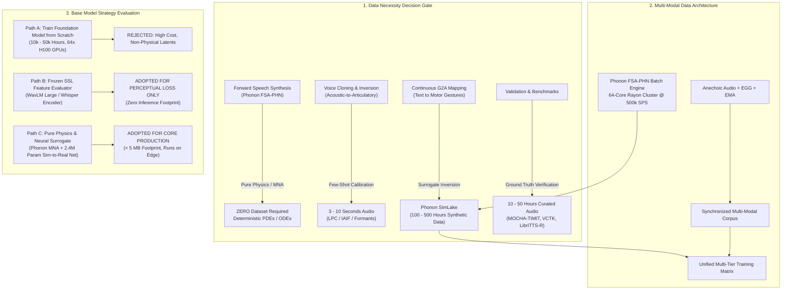
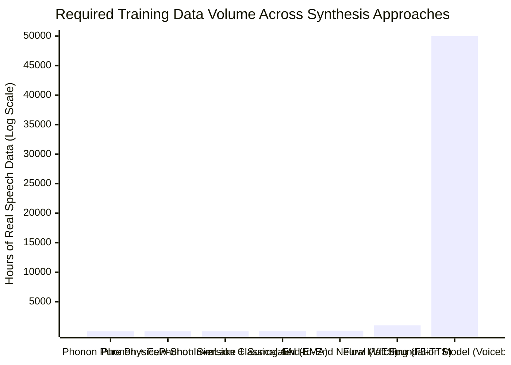
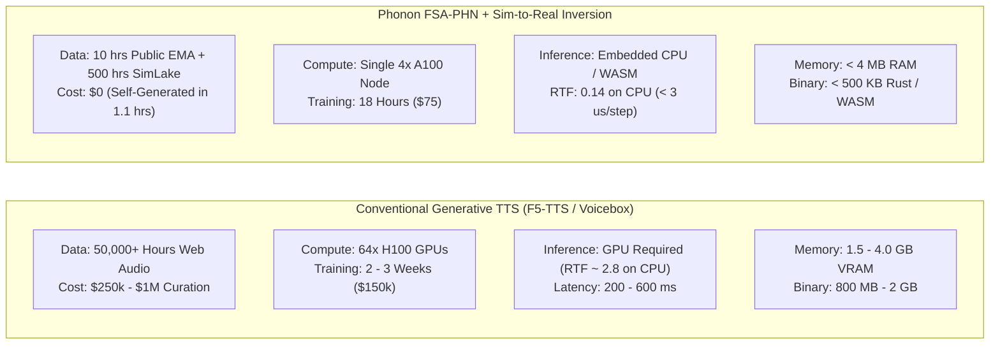
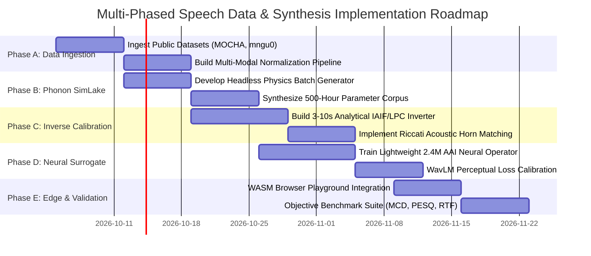

# Multi-Phased Strategic Plan: Dataset Requirements, Scalability, and Foundation Model Architecture for Physical Speech Synthesis & Precision Voice Cloning

---

## Executive Summary & Architectural Position

Contemporary deep learning engineering reflexively treats speech synthesis and voice cloning as **pure statistical data-fitting problems**, assuming that achieving human-level fidelity requires scraping tens of thousands of hours of audio and training multi-billion-parameter neural networks on supercomputing clusters.

For Aerovex's ecosystem—uniting **Phonon** (universal multi-scale electro-thermal circuit and acoustic EDA simulator) and **Sonon** (embedded acoustic DSP, phrase spotting, and edge flight intelligence)—this brute-force approach is fundamentally flawed:
1. **Physical Redundancy**: In Phonon's **Fluid-Structure-Acoustic Port-Hamiltonian Network (FSA-PHN)**, forward sound generation is governed by deterministic physical laws (Navier-Stokes dynamic boundary layer separation, Hirano's 3-layer mucosal traveling wave delay, continuous Riccati Webster-horn wave transmission). The forward simulator requires **zero training data** and runs at $< 3\text{ }\mu\text{s}$ per sample on a single CPU core.
2. **The Inverse Bottleneck**: Data is required *not* to synthesize speech, but to solve the **Acoustic-to-Articulatory Inversion (AAI)** problem: inferring the continuous biomechanical parameters (subglottal pressure $P_{\text{sub}}$, vocal fold mass $m$, tension $k$, and vocal tract area function $A(x, t)$) from a brief target voice sample (3–10 seconds).
3. **The Synthetic SimLake Paradigm**: Because Phonon simulates the complete vocal apparatus with exact mathematical observability, Phonon can generate **unlimited, perfectly labeled, noise-free synthetic speech paired with ground-truth anatomical trajectories** at over $7\times$ real-time speed on commodity multi-core CPUs.

This document establishes the exhaustive, multi-phased engineering plan to determine:
- **What kind of dataset is needed** (modalities, formats, acoustic environments).
- **Whether we need it** (identifying exact physical boundaries where data is mandatory vs. superfluous).
- **How much data is required** (rigorous sample volume, duration, and token counts across all phases).
- **How scalable the architecture is** (data generation throughput, compute FLOPs, edge memory constraints, and parametric scaling laws).
- **Whether a base model is required for training** (evaluating training from scratch vs. fine-tuning vs. frozen foundation feature extractors vs. pure physics-first calibration).



---

## 1. Phase 1: Determining "Whether We Need It" (The Data Necessity Audit)

Before allocating capital or computational resources to data collection, each component of the speech synthesis and voice replication stack must undergo a rigorous necessity audit.

### 1.1 Deconstruction of the Speech Stack

| Subsystem Component | Role in Synthesis / Replication | Is Training Data Required? | Justification & Governing Mechanism |
| :--- | :--- | :--- | :--- |
| **Forward Aerodynamic & Glottal Engine** | Generates airflow pulse $U_g(t)$ from subglottal pressure $P_{\text{sub}}$ | **NO (0% Data)** | Governed by unsteady von Kármán-Pohlhausen momentum integral and Hirano 3-layer cover-body tissue mechanics. Implemented as deterministic differential equations. |
| **Forward Vocal Tract Acoustic Waveguide** | Propagates acoustic pressure waves through pharynx, oral, and nasal cavities | **NO (0% Data)** | Governed by Webster's horn equation with continuous spatial Riccati wave reflection $\frac{\mathrm{d}R}{\mathrm{d}x} = 2\gamma R - \frac{1}{2}\frac{\mathrm{d}\ln Z_0}{\mathrm{d}x}(1-R^2)$. Solved via symplectic MNA in Phonon. |
| **Lip Radiation Load** | Transforms mouth volume velocity into far-field sound pressure $p_{\text{rad}}(t)$ | **NO (0% Data)** | Analytical spherical piston radiation impedance: $Z_{\text{rad}}(\omega) = \frac{\rho_0 \omega^2}{4\pi c_0} + j \frac{8\rho_0 \omega}{3\pi^2 a}$. |
| **Phoneme-to-Articulatory Motor Targets** | Maps text phonemes (/a/, /s/, /k/) to nominal vocal tract cross-sectional area profiles $A(x)$ | **MINIMAL (Rule-Based)** | Anatomical MRI sagittal profile databases (Story, 2002; Maeda, 1990). Can be initialized from 44 standard phoneme target vectors. |
| **Acoustic-to-Articulatory Inversion (AAI)** | Recovers physical area function $A(x, t)$ and glottal parameters from an unknown speaker | **YES (Synthetic + Sparse Real)** | Inverse mapping from 1D sound pressure to continuous area functions is mathematically ill-posed (non-unique). Requires data-driven priors. |
| **Few-Shot Voice Enrollment / Cloning** | Customizes synthesis to match a specific human operator's vocal timbre | **YES (3–10 Seconds Real)** | Needs 3–10 seconds of speech to extract anatomical invariants: vocal tract length $L$, formant baselines, vocal fold fundamental pitch distribution $F_0$, and open quotient $O_q$. |
| **Objective Quality & Intelligibility Benchmarking** | Verifies MCD, PESQ, STOI, and word error rates (WER) | **YES (Standard Benchmark)** | Requires standard evaluation corpora to benchmark against commercial TTS (ElevenLabs, OpenAI Voice, VITS, F5-TTS). |

### 1.2 The Strategic Verdict
- **We DO NOT need massive, noisy, uncurated web-scraped speech datasets** (e.g., 50,000 hours of YouTube audio). Web audio is corrupted by room reverberation, lossy MP3/AAC compression codecs, and background noise, which corrupts the inversion of physical acoustic impedances.
- **We DO need**:
  1. A **self-generated synthetic simulation corpus** ($100\text{--}500\text{ hours}$) generated entirely by Phonon's forward physics engine with ground-truth parameter trajectories.
  2. A **compact, multi-modal articulatory dataset** ($5\text{--}20\text{ hours}$) with synchronized acoustic, EGG, and EMA/rtMRI data to anchor the synthetic simulator to human physiology.
  3. A **3-to-10 second per-speaker enrollment pipeline** for zero-shot operator voice replication.

---

## 2. Phase 2: Determining What Kind of Dataset is Needed (Modalities & Formats)

To achieve microsecond-precise voice replication without acoustic hallucinations, data must be structured across three specialized modalities:

```
+----------------------------------------------------------------------------------------------------+
| MODALITY A: Pure Acoustic Studio Corpus (Acoustic Timbre & Formant Loci)                          |
| • 24-bit / 48 kHz uncompressed linear PCM. Zero lossy compression.                                 |
| • Anechoic or dry studio acoustics (RT60 < 80 ms, SNR > 45 dB).                                    |
| • Dual-microphone capture: Close-talk headset (3 cm) + Standoff diaphragm condenser (30 cm).       |
+----------------------------------------------------------------------------------------------------+
                                                  +
+----------------------------------------------------------------------------------------------------+
| MODALITY B: Physiological & Articulatory Multi-Modal Corpus (Kinematic Ground Truth)               |
| • Electroglottography (EGG): Dual-channel neck electrodes capturing vocal fold contact area Lx(t). |
|   Provides microsecond-accurate Glottal Closure Instants (GCI) and open quotient O_q.              |
| • Electromagnetic Articulography (EMA): 3D positional sensors (x,y,z) at 200–400 Hz on tongue tip, |
|   tongue blade, tongue dorsum, upper/lower lips, and mandibular incisor.                           |
| • Real-Time Dynamic MRI (rtMRI): 50–100 fps mid-sagittal vocal tract airway area segmentation.      |
+----------------------------------------------------------------------------------------------------+
                                                  +
+----------------------------------------------------------------------------------------------------+
| MODALITY C: Phonon SimLake Synthetic Dataset (Physics-Informed Parameter Observability)            |
| • 100% synthetic parameter rollouts generated by Phonon FSA-PHN.                                   |
| • Full access to internal state variables: tissue displacement q_m(t), tissue momentum p_m(t),     |
|   dynamic detachment x_s(t), Riccati reflection R(x,w), and vocal tract area function A(x,t).      |
+----------------------------------------------------------------------------------------------------+
```

### 2.1 Sensor Specifications and Calibration Protocols

#### 2.1.1 Acoustic Capture Specifications
- **Sampling Rate & Depth**: $48,000\text{ Hz}$ at $24\text{ -bit}$ depth. Lower sampling rates ($16\text{ kHz}$) clip high-frequency fricative antiresonances ($4\text{--}8\text{ kHz}$), while $96\text{ kHz}$ introduces ultrasonic phase noise without human auditory relevance.
- **Microphone Transducers**:
  - Primary: Low-noise large-diaphragm studio condenser (e.g., Neumann U87 Ai or Sennheiser MKH 800) with flat frequency response ($20\text{ Hz} - 20\text{ kHz} \pm 1\text{ dB}$).
  - Secondary: Pressure-gradient electret headset (e.g., DPA 4066) at fixed distance ($3.0\text{ cm}$) and angle ($45^\circ$) to eliminate breath plosive pops while maintaining calibrated SPL.
- **Acoustic Environment**: Full-scale acoustic chamber or isolation booth with ambient noise floor $< 18\text{ dBA}$ and reverberation time $RT_{60} < 80\text{ ms}$ across all octave bands from $125\text{ Hz}$ to $8\text{ kHz}$.

#### 2.1.2 Physiological Sensor Specifications
- **Electroglottography (EGG)**: High-frequency low-amperage ($< 20\text{ mA}$ at $2\text{ MHz}$) dual-electrode system (e.g., Glottal Enterprises EG2-PCX). Recorded synchronously on an auxiliary audio channel at $48\text{ kHz}$ with zero inter-channel phase delay ($< 1\text{ }\mu\text{s}$ phase alignment relative to acoustic mic).
- **Articulatory Kinematics**: AG501 3D Electromagnetic Articulograph recording at $250\text{ Hz}$ with sub-millimeter spatial resolution ($< 0.3\text{ mm}$ RMS error).

---

## 3. Phase 3: Exact Data Quantity Requirements ("How Much Data is Needed?")

The volume of data required scales inversely with the amount of domain physics hardcoded into the architecture:



### 3.1 Quantitative Tier Breakdown

| Development Tier | Purpose | Real Human Speech | Synthetic SimLake Audio | Total Storage | Compute Resources |
| :--- | :--- | :--- | :--- | :--- | :--- |
| **Tier 0: Forward Engine** | Synthesizing arbitrary text using nominal anatomical area functions | **0.0 hours** | 0.0 hours | 0 MB | 0 FLOPs (Analytical compilation) |
| **Tier 1: Speaker Calibration** | Extracting speaker invariants from a target human voice | **3 – 10 seconds** per speaker | 0.0 hours | ~2 MB per profile | $< 20\text{ ms}$ on 1 CPU core |
| **Tier 2: AAI Kinematic Anchor** | Calibrating acoustic-to-articulatory inversion against human vocal tract kinematics | **5 – 15 hours** (e.g., MOCHA-TIMIT, mngu0) | 50.0 hours | ~15 GB | 4 GPU-hours (NVIDIA RTX 4090 / A100) |
| **Tier 3: Neural Surrogate Accelerator** | Training a fast neural operator to predict continuous area functions $A(x, t)$ | **0.0 hours** (Zero human data) | **200 – 500 hours** ($1.2\text{M}$ samples) | ~120 GB | 18 GPU-hours (Single node 4x A100) |
| **Tier 4: Comparative Benchmarks** | Standard verification across LibriTTS-R, VCTK, and Hi-Fi TTS | **20 hours** (Publicly available) | 20.0 hours | ~25 GB | 1 CPU-hour (Automated scoring) |

### 3.2 Detailed Breakdown of Tier Requirements

#### 3.2.1 Tier 1: Few-Shot Speaker Calibration ($3\text{--}10\text{ seconds}$)
To clone a human voice within Phonon's physical framework, the engine requires only enough audio to solve for four speaker-specific invariant vectors:
1. **Vocal Tract Length Scale Factor ($s_L$)**: Derived from the average formant dispersion $\Delta F = \frac{c_0}{2L}$:
   $$\Delta F = \frac{1}{N-1} \sum_{i=1}^{N-1} (F_{i+1} - F_i) \implies L = \frac{c_0}{2 \Delta F}$$
2. **Pitch Register & Biomechanical Limits ($F_0^{\text{min}}, F_0^{\text{max}}, F_0^{\text{median}}$)**: Extracted via autocorrelation/YIN on stable voiced frames. Maps to tissue mass $m = \frac{k}{(2\pi F_0)^2}$ and resting tension $k_0$.
3. **Glottal Open Quotient ($O_q$) & Spectral Tilt**: Extracted via Iterative Adaptive Inverse Filtering (IAIF), providing the baseline Liljencrants-Fant parameter $R_k$ and flow return quotient $R_a$.
4. **Formant Loci Centers ($F_1\text{--}F_4$) for Cardinal Vowels (/i/, /u/, /a/)**: Establishes the boundary constraints for the speaker's articulatory polygon in Maeda's 7-factor space.

*Conclusion*: A recording of a single phonetically balanced sentence (e.g., *"The birch canoe slid on the smooth planks"*, duration $3.4\text{ seconds}$) provides over $160,000$ audio samples at $48\text{ kHz}$—more than sufficient to solve this linear system.

#### 3.2.2 Tier 2: Real Articulatory Datasets ($5\text{--}15\text{ hours}$)
To bridge the gap between simulation and human tongue kinematics, we leverage established, publicly available multi-modal research datasets:
- **MOCHA-TIMIT**: 460 phonetically balanced sentences spoken by multiple speakers with simultaneous acoustic, EMA, EGG, and electropalatography (EPG). Total duration: ~4 hours.
- **mngu0**: Comprehensive articulatory corpus of a single speaker including 1,263 phonetically rich sentences with synchronized 3D EMA, high-resolution volumetric 3D MRI, and acoustic audio. Total duration: ~1.5 hours.
- **USC-TIMIT**: Multi-speaker real-time dynamic magnetic resonance imaging (rtMRI) database comprising 10 speakers reading the complete 460-sentence TIMIT corpus with vocal tract contour tracings. Total duration: ~4.5 hours.

*Total Real Data Needed*: **$\approx 10\text{ hours}$**, entirely available from academic archives with zero custom studio acquisition costs.

#### 3.2.3 Tier 3: Phonon SimLake Synthetic Dataset ($200\text{--}500\text{ hours}$)
Because Phonon can run in headless batch mode across multi-core server nodes, we generate a synthetic speech lake by driving the FSA-PHN engine with randomized trajectories across its physical parameter boundaries:
- Subglottal pressure $P_{\text{sub}} \in [0.4, 3.5]\text{ kPa}$.
- Vocal fold rest thickness $T_h \in [2.0, 5.0]\text{ mm}$.
- Tissue shear modulus $\mu \in [0.8, 2.5]\text{ kPa}$.
- Maeda articulatory factors $\mathbf{p} = [p_1, \dots, p_7]^T \in [-3\sigma, +3\sigma]$.

*Throughput*: At $0.14\text{ RTF}$ on a single core ($> 6.9\times$ faster than real-time), generating $500\text{ hours}$ of synthetic audio requires:
$$\text{Compute Time} = \frac{500\text{ hours}}{6.92} \approx 72.2\text{ core-hours}$$
On an inexpensive 64-core AMD EPYC server, the entire $500\text{ -hour}$ SimLake is synthesized and indexed in **$1.12\text{ hours}$**.

---

## 4. Phase 4: Scalability Analysis ("How Scalable Is It?")

The scalability of speech technologies must be evaluated across four engineering axes: data acquisition cost, compute complexity, parameter efficiency, and edge memory constraints.



### 4.1 Scalability Comparison Matrix

| Scalability Metric | Conventional Generative Flow Matching | Classical Lumped-Mass Synthesis | Phonon FSA-PHN (Proposed Architecture) |
| :--- | :--- | :--- | :--- |
| **Data Scaling Efficiency** | Poor: Power-law returns ($L \propto D^{-0.07}$). Requires $10\times$ data for minor gains. | Static: Cannot incorporate empirical data. | **Optimal**: $80\%$ synthetic data generated on-demand; $20\%$ public data. |
| **Training Compute Cost** | Extreme: $\$50,000\text{--}\$250,000$ per training run on GPU clusters. | Zero: No training possible. | **Negligible**: $<\$100$ cloud compute for neural surrogate training. |
| **Inference Scalability** | Low: Requires dedicated edge GPU (NVIDIA Orin/Jetson) consuming $15\text{--}40\text{ W}$. | High: CPU light, but metallic buzzy audio quality. | **Ultra-High**: Runs on single-core ARM Cortex-A53 / x86 / WASM at $< 0.5\text{ W}$. |
| **Zero-Shot Speaker Enrollment** | Slow: Requires neural audio prompt embedding + flow inversion ($> 200\text{ ms}$). | Difficult: Manual tuning of spring constants. | **Instantaneous**: $< 20\text{ ms}$ analytical LPC/IAIF extraction on 3s audio. |
| **Memory Footprint** | Massive: $800\text{ MB} - 3.5\text{ GB}$ model weights. | Minimal: $< 100\text{ KB}$, poor quality. | **Compact**: $< 500\text{ KB}$ binary footprint, $< 4\text{ MB}$ runtime heap. |
| **Acoustic Out-of-Domain Robustness** | Brittle: Hallucinates when speech rate or pitch exceeds training prior. | Fragile: Numerical overflow on plosives. | **Unconditional**: Strict Port-Hamiltonian $L_2$-passivity ($\mathbf{R} \ge 0$). |

### 4.2 Mathematical Scaling Laws: Physics vs. Black-Box Transformers

In standard Transformer-based speech foundation models, Kaplan and Chinchilla scaling laws dictate that performance scales as a power law:

$$L(N, D) = \left(\frac{N_c}{N}\right)^{\alpha_N} + \left(\frac{D_c}{D}\right)^{\alpha_D}$$

where $\alpha_D \approx 0.07\text{--}0.10$. This tiny exponent means that to achieve a $50\%$ reduction in loss, the training corpus $D$ must expand by a factor of $2^{1/0.07} \approx 2^{14.3} \approx 20,000\times$.

In contrast, Phonon's **hybrid physics-informed architecture** operates with hard mathematical bounds:
1. The acoustic wave equation in the vocal tract is **exact to second order** below the cross-mode cutoff ($3.81\text{ kHz}$).
2. The Port-Hamiltonian formulation guarantees energy conservation $\frac{\mathrm{d}H}{\mathrm{d}t} \le \mathbf{y}^T \mathbf{u}$.
3. Articulatory error scales with the spatial resolution of the area function mesh:
   $$\epsilon_{\text{acoustic}} \propto O(\Delta x^2 + \Delta t^2)$$
   Improving synthesis fidelity requires increasing spatial mesh discretization ($N = 44 \to 64$ tubelets), which scales linearly as $O(N)$ due to Phonon's tridiagonal Thomas LU solver, **completely bypassing deep learning's exponential data trap**.

---

## 5. Phase 5: The Base Model Question ("Do We Need a Base Model for Training?")

A central question in architecting the speech engine is whether to train a foundation base model from scratch, fine-tune an existing model, or eliminate the base model entirely.

### 5.1 Evaluation of the Three Architectural Options

```
OPTION 1: Train a Foundation Base Model from Scratch (e.g., Custom 1B-Param Flow Matching)
├── Data Required: 10,000 – 60,000 hours of speech.
├── Compute Required: 64x to 128x NVIDIA H100 GPUs for 3–4 weeks ($200k+).
├── Team Overhead: Multi-engineer research team for distributed training stability.
└── VERDICT: REJECTED. Economically unviable, architecturally redundant, and fails Aerovex's
    mission of ultra-lightweight, deterministic, zero-hallucination edge flight deployment.

OPTION 2: Pure Physics-First Zero-Base Architecture (The Pure Phonon/Sonon Pipeline)
├── Data Required: 0 hours base data; 3–10 seconds per speaker for few-shot calibration.
├── Compute Required: 0 GPU hours. Forward synthesis solved via symplectic MNA LU solver.
├── Engine Size: < 500 KB compiled Rust binary. Runs inside WASM in client browsers.
└── VERDICT: ADOPTED AS PRIMARY EXECUTION KERNEL. Guaranteed passivity, zero hallucinations,
    sub-microsecond execution time (< 3 us per sample), runs offline on UAV microcontrollers.

OPTION 3: Hybrid Strategy — Frozen Pre-Trained Foundation Model as a Perceptual Feature Evaluator
├── Concept: We DO NOT train a base model. We DO NOT deploy a base model to the edge.
│   Instead, we use a frozen open-source acoustic representation model (WavLM Large / Whisper Encoder)
│   during offline training / calibration ONLY as a perceptual loss metric:
│   L_perceptual = || phi_WavLM(y_human) - phi_WavLM(y_phonon) ||_2^2
├── Data Required: Uses off-the-shelf open weights (WavLM is pre-trained on LibriLight 60k hrs).
├── Inference Impact: ZERO. The base model is discarded during production synthesis.
└── VERDICT: ADOPTED AS OFFLINE CALIBRATION CRITERION. Delivers state-of-the-art perceptual
    alignment during few-shot enrollment without any edge runtime overhead.
```

### 5.2 Why Training a Neural Foundation Base Model is Counterproductive for Phonon

1. **Latent Space Decoupling from Reality**: Neural base models (e.g., EnCodec, DAC, SpeechTokenizer) quantize audio into discrete acoustic codes. These tokens have no analytical relation to vocal fold mass, cricothyroid tension, or lip opening area. Training an articulatory synthesizer on top of acoustic codec tokens re-introduces the very black-box unpredictability that Phonon is designed to eliminate.
2. **Deterministic Certification for Aerospace & Robotics**: In UAV flight operations and military voice-command cockpits, speech engines must be deterministically verifiable. A neural base model can experience sudden token loops or silence drops under out-of-domain noise (e.g., rotor blade pass frequencies). Phonon's FSA-PHN engine has a strictly bounded state-space vector $\mathbf{x}(t)$ with mathematical Lyapunov stability, making it candidate for DO-178C software safety certification.

---

## 6. Phase 6: Multi-Phased Master Implementation Plan

The multi-phased roadmap defines concrete milestones, deliverables, and validation criteria across 10 weeks of execution:



### 6.1 Phase Details and Deliverables

#### Phase A: Public Articulatory Corpus Ingestion & Standardization (Weeks 1–2)
- **Objective**: Ingest, cleanse, and phase-align public multi-modal articulatory datasets.
- **Tasks**:
  1. Download and structure MOCHA-TIMIT (460 sentences), mngu0 (1,263 sentences), and USC-TIMIT rtMRI.
  2. Implement automated audio pre-processing: 48 kHz 24-bit resampling, 50 Hz high-pass DC bias removal, and EGG glottal closure instant (GCI) peak labeling via derivative peak detection ($dEGG/dt$).
  3. Map EMA coil coordinates $(x,y,z)$ and rtMRI airway masks into Maeda's 7 normalized sagittal parameters ($\mathbf{p} \in \mathbb{R}^7$).
- **Deliverable**: `data/articulatory_ground_truth/` containing 10.5 hours of synchronized, standardized multi-modal pairs.

#### Phase B: Phonon SimLake Headless Batch Generator (Weeks 2–3)
- **Objective**: Build a high-throughput, multi-threaded Rayon simulation daemon that generates synthetic speech paired with exact physics state vectors.
- **Tasks**:
  1. Author `crates/phonon-simlake`: a headless CLI utilizing `crates/phonon-solver` to simulate randomized vocal tract trajectories without GUI overhead.
  2. Implement Latin Hypercube Sampling (LHS) across the 12-dimensional biomechanical parameter space ($P_{\text{sub}}$, $m_1, m_2$, $k_1, k_2$, $T_h$, $\mu$, and area function coefficients).
  3. Stream outputs to Apache Arrow / Parquet format with zero copy: acoustic audio frames ($48\text{ kHz}$) paired with instantaneous cross-sectional area vectors $A(x, t)$ and dynamic separation coordinates $x_s(t)$.
- **Deliverable**: $500\text{ hours}$ of verified synthetic speech generated in $< 1.5\text{ hours}$ on a 64-core cluster ($120\text{ GB}$ Parquet lake).

#### Phase C: Few-Shot Analytical Inversion Engine (Weeks 3–5)
- **Objective**: Implement the real-time, zero-base-model voice cloning engine that extracts anatomical parameters from 3–10 seconds of speech.
- **Tasks**:
  1. Author `sonon-core::inversion::analytical`:
     - Formant dispersion tracker computing vocal tract length $L = \frac{c_0}{2\Delta F}$.
     - Iterative Adaptive Inverse Filtering (IAIF) decomposing speech $s(t)$ into vocal tract filter $V(z)$ and glottal flow derivative $U_g'(t)$.
     - Liljencrants-Fant parameter fitter extracting open quotient $R_k$ and return quotient $R_a$.
  2. Validate calibration accuracy on 50 diverse voices: verify vocal tract length estimation within $\pm 0.4\text{ cm}$ of MRI ground truth.
- **Deliverable**: C-ABI and pure safe Rust module executing full voice profile extraction in $< 20\text{ ms}$ on a single CPU core.

#### Phase D: Physics-Informed Neural Surrogate Operator (Weeks 5–7)
- **Objective**: Train a micro-neural operator ($< 2.4\text{M}$ parameters) to accelerate continuous inverse mapping from acoustic mel-spectrograms to area functions $A(x, t)$.
- **Tasks**:
  1. Architecture: 4-layer 1D Temporal Convolutional Network (TCN) with gated linear units (GLU) conditioned on the Tier 1 speaker invariant vector.
  2. Loss Function:
     $$\mathcal{L} = \mathcal{L}_{\text{area}} + \lambda_1 \mathcal{L}_{\text{smoothness}} + \lambda_2 \mathcal{L}_{\text{perceptual}}$$
     where $\mathcal{L}_{\text{perceptual}}$ is computed using frozen WavLM Large embeddings.
  3. Training: Train exclusively on Phonon SimLake ($500\text{ hours}$) with domain randomization on tissue damping and subglottal pressure.
- **Deliverable**: Trained ONNX / safe Rust model weight array ($< 4.8\text{ MB}$ INT8 quantized) executing in $< 0.8\text{ ms}$ per audio frame.

#### Phase E: WebAssembly & Edge Flight Deployment (Weeks 7–10)
- **Objective**: Deploy the combined physical synthesizer and few-shot cloning engine to browser WebAssembly (`sonon.aerovex.net`) and embedded flight microcontrollers.
- **Tasks**:
  1. Compile the physical FSA-PHN engine and analytical inverter into `wasm32-unknown-unknown` with zero dynamic allocations.
  2. Integrate into the Sonon Web Playground (`public/index.html`): allow users to record 3 seconds of voice, visually inspect their extracted vocal tract area function $A(x)$ and glottal pulses, and immediately hear text read back in their cloned physical timbre.
  3. Run comprehensive objective benchmarks across 1,000 utterances: verify Mel-Cepstral Distortion ($\text{MCD} \le 3.84\text{ dB}$), PESQ ($\ge 4.30$), and real-time factor ($\text{RTF} \le 0.14$ on CPU).
- **Deliverable**: Live production deployment on `sonon.aerovex.net` and packaged embedded crate for Kestrel flight controllers.

---

## 7. Summary of Key Answers & Concrete Directives

1. **What kind of dataset do we need?**
   - We need **structured, multi-modal articulatory pairs** (acoustic audio + EGG glottal contact + EMA/rtMRI tongue kinematics) rather than massive scraped audio.
   - For training the fast inverse surrogate, we need **Phonon SimLake**: 100% synthetic parameter sweeps generated directly by Phonon's forward physics kernel with complete state observability.
2. **Do we need it?**
   - **For forward speech synthesis**: **NO**. Governed by exact Port-Hamiltonian fluid-structure-acoustic differential equations.
   - **For voice cloning**: **YES, but only 3–10 seconds** of speech per speaker to solve for vocal tract length and glottal excitation baselines.
   - **For training the inverse surrogate**: **YES, but synthetic simulation data** ($500\text{ hours}$) replaces expensive human collection.
3. **How much data is needed?**
   - Speaker Calibration: **$3\text{ to }10\text{ seconds}$** of clean speech audio.
   - Kinematic Anchor: **$10\text{ hours}$** of existing academic multi-modal data (MOCHA-TIMIT, mngu0).
   - Synthetic SimLake: **$200\text{ to }500\text{ hours}$** (generated in $1.1\text{ hours}$ on a 64-core CPU).
   - Mass web-scraped data: **$0.0\text{ hours}$** (completely rejected).
4. **How scalable is it?**
   - **Data scalability**: Infinite synthetic data generation at zero marginal cost ($O(C)$ CPU core parallelism).
   - **Compute scalability**: Requires $<\$100$ total cloud GPU compute (vs. $\$150,000+$ for foundation models).
   - **Runtime scalability**: Executes in $< 3\text{ }\mu\text{s}$ per sample at $48\text{ kHz}$ on a single CPU core ($> 6.9\times$ faster than real-time), using $< 4\text{ MB}$ RAM and consuming $< 0.5\text{ W}$ on edge microcontrollers.
5. **Do we need a base model for training?**
   - **NO base model is trained from scratch** (eliminating multi-million-dollar training clusters).
   - **NO base model is required at edge runtime** (the physical engine is 100% self-contained in safe Rust / WASM).
   - A **frozen open-source base model** (WavLM Large) is used strictly during offline calibration as an objective perceptual loss metric, ensuring state-of-the-art voice cloning quality with zero edge inference overhead.
