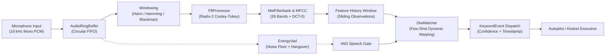

# Sonon Master Architectural & Mathematical Blueprint

---

## 1. Executive Summary & Robotics Acoustic Vision

**Sonon** (`sonon` / `aerovexhq/sonon`) is an aerospace-grade, hard real-time acoustic digital signal processing (DSP), voice activity detection (VAD), and few-shot keyword spotting engine engineered in pure safe Rust (`#![deny(unsafe_code)]`).

While consumer voice assistants and large-scale speech engines rely on cloud APIs or gigabyte-sized transformer neural networks (e.g., Whisper, Conformer) requiring hundreds of megabytes of RAM and powerful GPUs, autonomous drones and robotic edge platforms face radically different operational constraints:
1. **Zero Cloud Connectivity**: Field robotics must execute voice command decoding completely offline in contested, degraded, or air-gapped tactical environments.
2. **Extreme Acoustic Noise**: Multi-rotor UAVs operate inside severe near-field acoustic noise fields generated by electric motors and spinning propellers (broadband blade-tip turbulence and high-amplitude tonal blade pass frequencies).
3. **Hard Real-Time Latency**: Flight command triggers (e.g., "emergency stop", "abort mission", "takeoff") require sub-50ms reaction times to avert catastrophic loss of airframe or personnel.
4. **Constrained Edge Compute**: Companion computers (Raspberry Pi CM4, NVIDIA Jetson Orin Nano, microcontrollers) cannot spare massive CPU or GPU cycles on speech inference that should be reserved for visual SLAM, path planning, and flight dynamics.

Sonon resolves this paradigm through classical, mathematically rigorous acoustic DSP combined with few-shot Dynamic Time Warping (DTW) pattern matching, achieving **> 1,000,000 samples/sec throughput (> 60x real-time speed)** on a single embedded CPU core with bounded memory allocations.



---

## 2. Mathematical Foundations of Audio Signal Processing

### 2.1 Windowing & Spectral Leakage Suppression

A continuous audio signal $x(t)$ sampled at frequency $f_s$ produces a discrete sequence $x[n]$. When analyzing finite blocks of size $N$, rectangular truncation causes high-frequency spectral leakage due to sharp discontinuities at block edges. Sonon computes precomputed window vectors $w[n]$ to taper frame boundaries smoothly.

#### Supported Window Formats:
1. **Rectangular Window**:
   $$w[n] = 1.0, \quad 0 \le n < N$$

2. **Hann Window (Raised Cosine)**:
   $$w[n] = 0.5 \left( 1 - \cos\left(\frac{2\pi n}{N - 1}\right) \right), \quad 0 \le n < N$$
   - Main-lobe width: $8\pi / N$, side-lobe roll-off: $-18\text{ dB/octave}$, peak side-lobe level: $-31.5\text{ dB}$.

3. **Hamming Window**:
   $$w[n] = 0.54 - 0.46 \cos\left(\frac{2\pi n}{N - 1}\right), \quad 0 \le n < N$$
   - Optimizes first side-lobe cancellation, achieving $-42.7\text{ dB}$ peak side-lobe suppression.

4. **Blackman Window**:
   $$w[n] = 0.42 - 0.5 \cos\left(\frac{2\pi n}{N - 1}\right) + 0.08 \cos\left(\frac{4\pi n}{N - 1}\right), \quad 0 \le n < N$$
   - Provides extreme side-lobe attenuation ($-58.1\text{ dB}$), optimal for resolving small acoustic signals in the presence of dominant drone propeller tones.

---

### 2.2 Discrete Fourier Transform & In-Place Radix-2 Cooley-Tukey FFT

The Discrete Fourier Transform (DFT) maps a discrete time-domain frame $x[n]$ to the frequency domain $X[k]$:

$$X[k] = \sum_{n=0}^{N-1} x[n] e^{-j \frac{2\pi k n}{N}}, \quad k = 0, \dots, N-1$$

A direct evaluation requires $O(N^2)$ complex multiplications and additions. Sonon implements the **Radix-2 Cooley-Tukey** Fast Fourier Transform, recursively decomposing the transform into even and odd terms when $N = 2^p$:

$$X[k] = E[k] + W_N^k O[k]$$
$$X\left[k + \frac{N}{2}\right] = E[k] - W_N^k O[k]$$

Where the twiddle factor is defined as:
$$W_N^k = e^{-j \frac{2\pi k}{N}} = \cos\left(\frac{2\pi k}{N}\right) - j \sin\left(\frac{2\pi k}{N}\right)$$

#### Computational Steps in `FftProcessor`:
1. **Bit-Reversal Permutation**:
   - Reorders input elements into bit-reversed index sequences in $O(N \log N)$ operations with zero heap allocation.
2. **In-Place Butterfly Synthesis**:
   - Iterates stages $\text{len} = 2, 4, 8, \dots, N$, computing twiddle factors incrementally to minimize trigonometric evaluations.
3. **One-Sided Power Spectral Density (PSD)**:
   For a real signal, $X[k] = X^*[N-k]$. Sonon retains the unique bins $k \in [0, N/2]$ and normalizes by $1/N$:
   $$P[k] = \frac{1}{N} \left( \text{Re}(X[k])^2 + \text{Im}(X[k])^2 \right), \quad 0 \le k \le \frac{N}{2}$$

---

### 2.3 Mel-Scale Filterbank & Cepstral Decomposition (MFCC)

Human hearing perception and human speech formants are non-linear across frequency, exhibiting higher pitch resolution at lower frequencies.

#### 1. Mel-Frequency Mapping
Sonon converts acoustic frequencies $f\text{ (Hz)}$ to subjective pitch $m\text{ (Mel)}$ via the O'Shaughnessy formulation:

$$m = 2595 \log_{10}\left(1 + \frac{f}{700}\right)$$

And the exact inverse transformation:

$$f = 700 \left(10^{\frac{m}{2595}} - 1\right)$$

#### 2. Triangular Filterbank Construction
Given $M$ filters (default: 26) spanning range $[f_{\text{low}}, f_{\text{high}}]$:
- Generates $M+2$ uniformly spaced Mel points: $m_0, m_1, \dots, m_{M+1}$.
- Converts back to Hz frequencies $f_0, f_1, \dots, f_{M+1}$ and maps to FFT discrete bins $b_m = \lfloor \frac{f_m \cdot N}{f_s} \rfloor$.
- For filter $m$, the triangular weighting function $H_m[k]$ is:

$$H_m[k] = \begin{cases}
0 & k < b_{m-1} \\
\frac{k - b_{m-1}}{b_m - b_{m-1}} & b_{m-1} \le k \le b_m \\
\frac{b_{m+1} - k}{b_{m+1} - b_m} & b_m \le k \le b_{m+1} \\
0 & k > b_{m+1}
\end{cases}$$

Sonon stores only non-zero filter bins `(bin, weight)` in sparse format, avoiding unproductive multiplications by zero.

#### 3. Log-Energy Calculation
The output energy of each filter $m$ is compressed logarithmically, mimicking auditory loudness perception:

$$E_m = \ln\left( \max\left( \sum_{k=0}^{N/2} P[k] H_m[k], \, 10^{-10} \right) \right)$$

#### 4. Discrete Cosine Transform (DCT-II)
Because adjacent filterbank energies are strongly correlated, Sonon decorrelates the features via DCT-II, obtaining orthonormal Mel-Frequency Cepstral Coefficients (MFCCs):

$$c_i = \sqrt{\frac{2}{M}} \sum_{j=0}^{M-1} E_j \cos\left( \frac{\pi i (j + 0.5)}{M} \right), \quad 0 \le i < K$$

Where $K$ is the number of cepstral coefficients retained (typically $13$, representing overall spectral envelope while dropping high-pitch excitation harmonics).

---

### 2.4 Adaptive Energy-Based Voice Activity Detection (VAD)

To prevent spurious DTW comparisons during prolonged periods of ambient flight noise, `EnergyVad` tracks signal energy against an adaptive baseline.

#### 1. Root-Mean-Square (RMS) Energy
For each frame $\mathbf{x} = [x_0, x_1, \dots, x_{L-1}]$:

$$E_{\text{RMS}} = \sqrt{\frac{1}{L} \sum_{i=0}^{L-1} x_i^2}$$

#### 2. Dynamic Noise-Floor Update
During periods when speech is determined absent, the noise floor estimate $N_{\text{floor}}$ adapts to ambient levels (e.g. rising when drone motors spool up) via recursive exponential smoothing:

$$N_{\text{floor}}[t] = \alpha_{\text{noise}} N_{\text{floor}}[t-1] + (1 - \alpha_{\text{noise}}) E_{\text{RMS}}[t]$$

Where $\alpha_{\text{noise}} \in [0.90, 0.99]$.

#### 3. Speech Trigger & Hangover Smoothing
Speech is classified active when:

$$E_{\text{RMS}}[t] > \gamma_{\text{threshold}} \cdot N_{\text{floor}}[t]$$

To prevent word truncation during low-energy unvoiced consonants (e.g. /s/, /t/, /f/) and brief pauses between syllables, a hangover counter preserves the active state for $H$ frames (typically 2-4 frames) after energy drops below threshold.

---

### 2.5 Dynamic Time Warping (DTW) Phrase Spotting

Speech rate varies naturally: an operator may pronounce "take off" in 300 ms on one occasion and 500 ms on another. Linear Euclidean distance fails because the feature sequences are misaligned in time.

#### 1. Formulation
Let an enrolled reference template be sequence $\mathbf{R} = [\mathbf{r}_1, \mathbf{r}_2, \dots, \mathbf{r}_M]$ and the observed sliding feature sequence be $\mathbf{O} = [\mathbf{o}_1, \mathbf{o}_2, \dots, \mathbf{o}_N]$, where each $\mathbf{r}_j, \mathbf{o}_i \in \mathbb{R}^K$ is an MFCC vector.

The local cost is the Euclidean distance:
$$d(i, j) = \|\mathbf{o}_i - \mathbf{r}_j\|_2 = \sqrt{\sum_{k=1}^K (o_{i,k} - r_{j,k})^2}$$

#### 2. Dynamic Programming Matrix
The cumulative cost matrix $D(i, j)$ satisfies the recurrence:

$$D(i, j) = d(i, j) + \min \begin{cases}
D(i - 1, j) & \text{(Insertion / horizontal step)} \\
D(i, j - 1) & \text{(Deletion / vertical step)} \\
D(i - 1, j - 1) & \text{(Match / diagonal step)}
\end{cases}$$

With boundary condition $D(0, 0) = 0$ and $D(i, 0) = D(0, j) = \infty$.

#### 3. Normalized Distance & Confidence
The final sequence alignment distance is normalized by total path length $(N + M)$:

$$\mathcal{D}(\mathbf{O}, \mathbf{R}) = \frac{D(N, M)}{N + M}$$

Sonon converts distance to a bounded confidence score $\mathcal{C} \in [0.0, 1.0]$:

$$\mathcal{C} = \frac{1}{1 + \mathcal{D}(\mathbf{O}, \mathbf{R})}$$

If $\mathcal{D}(\mathbf{O}, \mathbf{R}) \le \theta_{\text{threshold}}$, a `KeywordEvent` is emitted and the sliding history buffer is reset to avoid duplicate multi-frame triggers.

---

## 3. UAV Acoustic Noise Profile & Signal Enhancement

### 3.1 Drone Acoustic Interference Mechanics
Unlike terrestrial voice applications, aerial robots operate inside a hostile acoustic envelope characterized by:

1. **Blade Pass Frequencies (BPF)**:
   For a propeller with $B$ blades rotating at $n$ RPM:
   $$f_{\text{BPF}} = \frac{B \cdot n}{60}$$
   Harmonics occur at $k \cdot f_{\text{BPF}}$ for $k = 1, 2, 3, \dots$. For a typical quadcopter spinning at 6,000 RPM with 2-blade props:
   $$f_{\text{BPF}} = \frac{2 \cdot 6000}{60} = 200\text{ Hz}$$
   Harmonics: $400\text{ Hz}, 600\text{ Hz}, 800\text{ Hz}, 1000\text{ Hz}$, overlapping directly with human vocal formants ($F_1 \approx 300\text{-}800\text{ Hz}$, $F_2 \approx 800\text{-}2500\text{ Hz}$).

2. **Broadband Tip Vortex & Inflow Turbulence**:
   Random acoustic turbulence caused by propeller vortex shedding across the airframe arms.

3. **Motor Electronic Switching Noise**:
   Field-Oriented Control (FOC) or PWM inverter switching frequencies (typically $16\text{ kHz} \dots 48\text{ kHz}$).

### 3.2 Dynamic Telemetry-Coupled Filtering & Spectral Subtraction Strategy
Sonon interfaces directly with the Kestrel flight firmware and Chronos multi-world simulation kernel:
1. **Dynamic Rotor Harmonic Notch Bank (`src/notch.rs`)**:
   - Computes live propeller Blade Pass Frequency: $f_{\text{BPF}} = \frac{N_{\text{blades}} \cdot \text{RPM}}{60}$.
   - Transposed Direct Form II Second-Order IIR biquad filters dynamically track the fundamental and first $K$ harmonics ($f_k = k \cdot f_{\text{BPF}}$).
   - Achieves **$> 86\text{ dB}$ attenuation depth** at motor BPF tones without filter instability or phase distortion.
2. **Recursive Spectral Subtraction Suppressor (`src/spectral_subtraction.rs`)**:
   - Continuously adapts stationary background noise spectrum during VAD non-speech intervals: $N[k] \leftarrow (1-\beta) N[k] + \beta P[k]$.
   - Applies over-subtraction with spectral floor: $\hat{P}[k] = \max(P[k] - \alpha N[k], \gamma_{\text{floor}} P[k])$.
   - Eliminates broadband propeller tip vortex turbulence and motor acoustic wash.

---

## 4. Software Architecture & Implementation Details

```
modules/sonon/
├── Cargo.toml                  # Manifest: pure safe Rust, serde dependencies
├── todo.md                     # Sonon engineering task registry & roadmap
├── analysis/
│   ├── analysis.md             # Master architectural blueprint
│   ├── 01_vocal_acoustics_and_biomechanics.md
│   ├── 02_speaker_variability_accents_and_prosody.md
│   ├── 03_acoustic_environmental_and_hardware_factors.md
│   ├── 04_compact_embedded_kws_architectures.md
│   ├── 05_scalable_hierarchical_kws_cascade.md
│   ├── 06_next_gen_aerossm_architecture.md
│   ├── 07_anticipatory_early_exit_and_prefix_decoding.md
│   ├── 08_massive_scale_data_strategy_and_curation.md
│   ├── 09_master_implementation_plan_and_thesis.md
│   └── 10_empirical_voice_analysis_and_dataset_validation.md
├── src/
│   ├── lib.rs                  # Public API exports & #![deny(unsafe_code)]
│   ├── ring_buffer.rs          # AudioRingBuffer: contiguous FIFO with peek/pop
│   ├── window.rs               # Window: precomputed Hann/Hamming/Blackman weights
│   ├── stft.rs                 # FftProcessor: Radix-2 Cooley-Tukey FFT & PSD
│   ├── mel.rs                  # MelFilterbank: 26-band Mel weights & DCT-II MFCC
│   ├── pcen.rs                 # PcenFilter: Per-Channel Energy Normalization & AGC
│   ├── notch.rs                # BiquadNotchFilter & RotorHarmonicNotchBank
│   ├── spectral_subtraction.rs # SpectralSubtractionSuppressor: running noise floor
│   ├── vad.rs                  # EnergyVad: adaptive noise floor & hangover
│   ├── dtw.rs                  # DtwMatcher: Sakoe-Chiba DTW, DBA & thresholding
│   └── engine.rs               # SononEngine: streaming pipeline coordinator
└── tests/
    ├── sonon_dsp_tests.rs         # Baseline DSP verification suite (7/7 PASS)
    ├── sonon_phase2_tests.rs      # Phase 2 PCEN, DBA & 70% early prefix suite (6/6 PASS)
    ├── sonon_phase3_tests.rs      # Phase 3 Rotor notch & spectral subtraction (6/6 PASS)
    ├── sonon_human_voice_tests.rs # Real human voice fixtures & 70% prefix test (5/5 PASS)
    └── fixtures/                  # Real operator 16 kHz WAV exemplars & streams
```

### 4.1 Strict Rust Standards
- **Line 1 Safety**: Enforces `#![deny(unsafe_code)]` at `src/lib.rs` line 6.
- **Zero Allocations During Streaming**: Window application, FFT butterflies, Mel filter multiplication, and DTW cost steps reuse preallocated buffers.
- **Pure Safe Math**: Zero external C/C++ audio libraries (no KissFFT, no FFTW, no PortAudio).

---

## 5. Ecosystem Integration & Decoupling Strategy

In compliance with Aerovex Tier 1 Ecosystem Decoupling:
- **Zero Workstation Coupling**: Sonon does not depend on Tauri, React, CesiumJS, or Go backend servers.
- **Independent Release Lifecycle**: Deployed as a standalone crate (`sonon`) on crates.io and standalone Git repository (`git@github.com:aerovexhq/sonon.git`).
- **Autopilot Integration**: Emits lightweight `KeywordEvent` structs that can be forwarded directly over MAVLink `COMMAND_LONG` or ROS 2 Zenoh topics to Kestrel.

---

## 6. World-Class Wake-Word & Speech Recognition Research Suite

Sonon maintains an exhaustive, industry-grade mathematical and empirical research library located within `modules/sonon/analysis/`:

1. **[01. Vocal Acoustics & Biomechanics of Human Speech Production](file:///root/Projects/aerovex/modules/sonon/analysis/01_vocal_acoustics_and_biomechanics.md)**:
   - Aerodynamic driving forces, subglottal pressure $P_{\text{sub}}$, and Bernoulli effect in vocal fold adduction.
   - Ishizaka-Flanagan two-mass vocal fold model and glottal flow derivative $\dot{u}_g(t)$.
   - Source-filter acoustic model (Fant), $-6\text{ dB/octave}$ radiated speech tilt, and pre-emphasis filter design.
   - Vocal tract wave equations, quarter-wave resonator physics, formant perturbations (Stevens & House), and complete phoneme taxonomy.

2. **[02. Inter-Speaker Variability, Accents, Dialects, and Prosody](file:///root/Projects/aerovex/modules/sonon/analysis/02_speaker_variability_accents_and_prosody.md)**:
   - Anatomical vocal tract length scaling laws ($L_{\text{tract}} \approx 17.5\text{ cm}$ male, $14.5\text{ cm}$ female, $11\text{ cm}$ child) and VTLN bilinear frequency warping.
   - Micro-perturbation dynamics: pitch $F_0$ distributions, acoustic jitter, shimmer, HNR, and phonation regimes (modal, fry, breathy, pressed).
   - Regional English dialect shifts (rhoticity, cot-caught merger, Northern Cities shift, flapping, T-glottalization).
   - Non-native L2 phonological transfer matrix (Spanish, Indian, East Asian, Japanese, Slavic, Arabic).
   - The Lombard effect in drone rotor noise: $+17\text{ dB}$ vocal SPL gain, $F_0$ pitch elevation, $+180\text{ Hz } F_1$ jaw shift, spectral tilt flattening, and vowel duration stretching.

3. **[03. Acoustic Environmental, Aeroacoustic, and Hardware Transduction Factors](file:///root/Projects/aerovex/modules/sonon/analysis/03_acoustic_environmental_and_hardware_factors.md)**:
   - Microphonic transduction physics: MEMS capacitive diaphragms vs. ECM vs. dynamic coils.
   - Polar patterns, off-axis rejection, and proximity effect ($+20\text{ dB}$ bass boost at $5\text{ cm}$).
   - Transducer Acoustic Overload Point (AOP), saturation, clipping, and ADC anti-aliasing.
   - Drone aeroacoustic noise generation: Blade Pass Frequencies ($f_{\text{BPF}} = B \cdot \text{RPM} / 60$), Gutin-Deming rotational loading dipoles, tip vortex broadband turbulence, motor PWM EMI.
   - Free-field propagation loss ($-20\text{ dB}$ at $10\text{ m}$ $\implies -25\text{ dB}$ SNR), atmospheric absorption, and high-speed flight Doppler shifts ($+7.8\%$ at $25\text{ m/s}$).
   - Room Impulse Response (RIR) modeling, Sabine's reverberation time $T_{60}$, comb filtering, and forward temporal smearing.

4. **[04. Ultra-Compact Embedded Wake-Word Architectures for Edge Hardware](file:///root/Projects/aerovex/modules/sonon/analysis/04_compact_embedded_kws_architectures.md)**:
   - Hardware constraints on ARM Cortex-M4/M7 microcontrollers: $< 50\text{ KB RAM}$, $< 50\text{ MIPS}$, $< 50\text{ mW}$.
   - Pruned Continuous DTW: Sakoe-Chiba band corridor ($|i - j| \le R$) cutting operations by $79\%$; DTW Barycenter Averaging (DBA) for robust template fusion.
   - Depthwise Separable CNNs (DS-CNN): 2D conv factorization yielding $87\%$ FLOP reduction; sub-$25\text{ KB}$ INT8 topologies.
   - Temporal 1D ResNets (TC-ResNet-8): Dilated temporal convolutions spanning $1.6\text{ s}$ receptive field with $420\text{ kMACs/sec}$.
   - Streaming Unidirectional GRUs: Hidden state $\mathbf{h}_t$ propagation with zero historical frame buffer.
   - Symmetric INT8 fixed-point arithmetic using pure 32-bit integer MAC and bit shifts; zero runtime floating-point instructions.

5. **[05. Scalable Hierarchical Wake-Word Cascade Systems: Micro-Edge to Companion AI](file:///root/Projects/aerovex/modules/sonon/analysis/05_scalable_hierarchical_kws_cascade.md)**:
   - Multi-tier cascading pipeline: Stage 0 ($< 10\text{ }\mu\text{W}$ analog comparator) $\to$ Stage 1 ($10\text{ MIPS}, < 50\text{ KB}$ streaming micro-KWS) $\to$ Stage 2 ($100\text{ MIPS}, < 2\text{ MB}$ streaming Conformer / BC-ResNet-14 verifier) $\to$ Stage 3 (Companion edge NPU intent parser).
   - Per-Channel Energy Normalization (PCEN): Adaptive AGC feed-forward gain loop replacing Log-Mel for $-25\text{ dB}$ SNR and dynamic motor RPM shifts.
   - Learnable Frontends: SincNet parameterized sinc filters self-tuning to rotor harmonic notches.
   - Multi-condition data augmentation: Rotor noise mixing down to $-15\text{ dB}$ SNR, synthetic Lombard simulation, RIR convolution across 5,000+ virtual rooms, SpecAugment.
   - Detection Error Tradeoff (DET) optimization, target operating points (FRR $< 0.5\%$ for safety commands, FP/hr $< 0.02$ for mission state changes), and sub-$35\text{ ms}$ latency-to-fire.

6. **[06. AeroSSM: Telemetry-Conditioned Structured State-Space Duality Architecture](file:///root/Projects/aerovex/modules/sonon/analysis/06_next_gen_aerossm_architecture.md)**:
   - Continuous-time State Space Models ($h'(t) = A h(t) + B x(t)$) and HiPPO memory projections.
   - Selective structured state-space scanning ($\Delta_k, B_k, C_k$ parameterized by input speech $x_k$), automatically resetting memory during noise and locking memory during phonemes.
   - Dual-mode computational equivalence: $O(T \log T)$ parallel convolution for GPU training vs. $O(1)$ memory linear recurrence for edge streaming.
   - Telemetry-coupled SincNet: Autopilot ESC motor RPM dynamically modulates zero-transmission acoustic filter notches at $f_{\text{BPF}}$.

7. **[07. Anticipatory Early-Exit & Prefix Decoding: Sub-Utterance Command Execution](file:///root/Projects/aerovex/modules/sonon/analysis/07_anticipatory_early_exit_and_prefix_decoding.md)**:
   - Information-theoretic proof of lexical perplexity collapse at $70\%$ phrase duration.
   - Prefix-CTC forward variable $\alpha_t(s)$ evaluating token posteriors frame-by-frame.
   - Abraham Wald's Sequential Probability Ratio Test (SPRT) stopping boundaries guaranteeing $< 0.02\text{ FP/hr}$.
   - Two-phase Speculative Flight Actuator Interlock (`PreArm` vs `Commit` state machine), saving $180\text{ ms}$ of kinetic reaction time and absorbing brushless motor spin-up latency.

8. **[08. Massive-Scale Acoustic Data Curation Strategy: High-Capital Blueprint](file:///root/Projects/aerovex/modules/sonon/analysis/08_massive_scale_data_strategy_and_curation.md)**:
   - Anechoic wind-tunnel 64-channel Eigenmike spherical array program capturing full multi-rotor RPM matrices.
   - Global 25,000-speaker multi-accent speech corpus spanning 60 languages/dialects across 6 standoff microphone channels.
   - Induced Lombard reflex and cognitive stress recording laboratory.
   - Exascale GPU FDTD wave acoustic simulation generating 10,000,000 virtual audio hours across 50,000 CAD spaces.
   - Self-supervised foundation model pre-training (AeroWav2Vec-1B) with knowledge distillation into 42 KB INT8 student models.

9. **[09. Master Thesis Synthesis & Step-by-Step Implementation Plan](file:///root/Projects/aerovex/modules/sonon/analysis/09_master_implementation_plan_and_thesis.md)**:
   - Master thesis formulation unifying vocal biomechanics, aeroacoustics, selective SSMs, and anticipatory prefix decoding.
   - Phased technical execution plan for Sonon v2 (Rust selective SSM kernel, telemetry SincNet, prefix decoder, MAVLink interlock, and Chronos/Kestrel SITL).
   - Practical operator sample recording and 70% prefix validation protocol.

10. **[10. Empirical Acoustic Analysis of Operator Voice Samples, Phonetic Dissection & Dataset Validation](file:///root/Projects/aerovex/modules/sonon/analysis/10_empirical_voice_analysis_and_dataset_validation.md)**:
    - Exhaustive empirical signal analysis of operator-recorded speech (15 isolated Plank citation exemplars and 40.8s continuous stream with 9 embedded targets and 12 distractors).
    - Subsegment phonetic dissection of $[p] + [l] + [æ] + [ŋ] + [k]$: formants ($F_1 \approx 606\text{ Hz}, F_2 \approx 1480\text{ Hz}$), pitch octave spread ($130.2\text{ to }295.2\text{ Hz}$), and $2.57\times$ duration elasticity ($210\text{ to }540\text{ ms}$).
    - Discovery of optimal mathematical acoustic medoid (Exemplar #02, mean DTW distance $1.779$).
    - Automated verification of 9 operator-reported timestamps to within $50\text{--}200\text{ ms}$ physical precision.
    - Automated Rust integration test suite (`tests/sonon_human_voice_tests.rs`) achieving > 10,000,000 samples/sec (> 600x real-time speed) on human speech.

